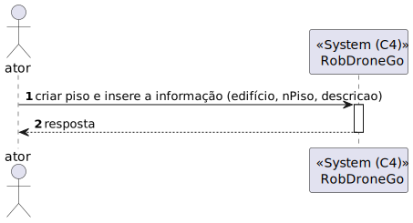

# US 190 - 	Criar piso de edifício


## 1. Context

É a vez primeira que está a ser desenvolvida.
Quer criar um piso do edificio.

## 2. Requirements

**Main actor**

* N/A

**Interested actors (and why)**

* N/A

**Pre conditions**

* O edifício tem de estar criado.

**Post conditions**

* O piso criado tem de estar persistido

**Main scenario**
1. Quer criar piso e insere a informação (edifício, número do piso, descrição do piso) 
2. Sistema diz se a operação foi um sucesso 


**Other scenarios**

**5.a.** O sistema verifica se o piso já existe
1. Avisa que o piso já existe
2. Termina a use case

**5.b.** O sistema verifica se o edifício existe
1. Avisa que o edifício não existe
2. Termina a use case


## 3. Analysis

**Esclarecimentos do cliente:** </br>

> **Questão:** </br>
Boa tarde, caro cliente.
É esperado que seja imposto um limite aquando da criação de um piso? Ex: 0 <= andar piso <= 100, De forma a evitar valores irrealistas.</br>
Relativamente à breve descrição, referida em: https://moodle.isep.ipp.pt/mod/forum/discuss.php?d=25016, existirá alguma restrição quanto ao comprimento da mesma, como é o caso da descrição do edifício?</br>
Cumprimentos.</br>
G05.</br>
**Resposta:** </br>
bom dia,
não existem limites. podem existir pisos subteraneos, ex., piso -1.
a breve descrição é opcional e no máximo terá 250 caracteres


Relevant DM excerpt


## 4. Design

### 4.1. Nível 1

#### 4.1.1 Vista de processos



#### 4.1.2 Vista FÍsica

N/A (Não vai adicionar detalhes relevantes)

#### 4.1.3 Vista Lógica


#### 4.1.4 Vista de Implementação

N/A (Não vai adicionar detalhes relevantes)

#### 4.1.4 Vista de Cenarios


### 4.2 Nível 2

#### 4.2.1 Vista de processos


#### 4.2.2 Vista FÍsica


#### 4.2.3 Vista Lógica


#### 4.2.4 Vista de Implementação


### 4.3. Nível 3 

#### 4.3.1 Vista de processos


#### 4.3.2 Vista FÍsica

N/A (Não vai adicionar detalhes relevantes)

#### 4.3.3 Vista Lógica


#### 4.3.4 Vista de Implementação


### 4.4. Tests

**Test 1:** *Teste do PisoController*

```
 it('criarPiso retorna piso JSON', async function() {
        
        // Arrange
        let body = {
            "codigo": "as1",
            "numeroPiso": 0,
            "descricaoPiso": "ola",
        };
        let req: Partial<Request> = {};
        req.body = body;
        let res: Partial<Response> = {
            json: sinon.spy()
        };
        let next: Partial<NextFunction> = () => {};

        let pisoServiceInstance = Container.get("PisoService");
    
        sinon.stub(pisoServiceInstance, 'criarPiso').returns(Promise.resolve(Result.ok<ICriarPisoDTO>(body as ICriarPisoDTO)));

        const pisoController = new PisoController(pisoServiceInstance as IPisoService);
        
        // Act
        await pisoController.criarPiso(<Request>req, <Response>res, <NextFunction>next);

        //Assert
        sinon.assert.calledOnce(res.json);
        sinon.assert.calledWith(res.json, sinon.match({
            codigo: "as1",
            numeroPiso: 0,
            descricaoPiso: "ola",
        }));     
    });

```


**Test 2:** *Teste do PisoService*

```
 it('Criar o piso com descrição preenchida', async () => {
        
        let body = {
            "codigo": "as1",
            "numeroPiso": 1,
            "descricaoPiso": "ola",
        };
        
        let edificioRepoInstance = Container.get("EdificioRepo");
        let pontoRepoInstance = Container.get("PontoRepo");
        let pisoRepoInstance = Container.get("PisoRepo");
        
        sinon.stub(pisoRepoInstance, "save").returns(Promise.resolve(null));
        sinon.stub(pontoRepoInstance, "save").returns(Promise.resolve(null));
        sinon.stub(edificioRepoInstance, "save").returns(Promise.resolve(null));
        sinon.stub(pisoRepoInstance, "getMaxId").returns(Promise.resolve(1));
        sinon.stub(edificioRepoInstance, "findByDomainId").returns(Promise.resolve(Container.get("edificio")));
        
        const pisoService = new PisoService(pisoRepoInstance as IPisoRepo,edificioRepoInstance as IEdificioRepo,pontoRepoInstance as IPontoRepo);
        
        let answer = await pisoService.criarPiso(body as ICriarPisoDTO);
        
        expect(answer.getValue()).to.equal(body as ICriarPisoDTO);

    });
```

**Test 3:** *Teste do PisoRepo*
```
it('Save deve retornar piso', async () => {

        const pisoDTO = {
            domainID: 1,
            numeroPiso: 1,
            descricaoPiso: "Ola", 
            pontos: []
        } as IPisoPersistence;

        const pisoSchemaInstance = Container.get("PisoSchema");
        const piso = await PisoMap.toDomain(pisoDTO);
        sinon.stub(pisoSchemaInstance, "findOne").returns(null);
        sinon.stub(pisoSchemaInstance, "create").returns(pisoDTO as IPisoPersistence);
        const pisoRepo = new PisoRepo(pisoSchemaInstance as any);
        const answer = await pisoRepo.save(piso);
        expect(answer.returnIdPiso()).to.equal(piso.returnIdPiso());
        expect(answer.returnNumeroPiso()).to.equal(piso.returnNumeroPiso());
        expect(answer.returnDescricaoPiso()).to.equal(piso.returnDescricaoPiso());
        expect(answer.returnListaDeIdDosPontos().length).to.equal(piso.returnListaDeIdDosPontos().length);
        
    });
```

**Test 4:** *Teste da descricaoPiso*
```
it('DescricaoPiso não é criado com uma string com mais de 255 caracteres', async function () {
		// Arrange
		let descricaoPiso = DescricaoPiso.create("qwerqwerqwerqwerqwerqwerqwerqwerqwerqwerqwerqwerqwerqwer"+ "qwerqwerqwerqwerqwerqwerqwerqwerqwerqwerqwerqwerqwerqwerqwerqwerqwerqwerqwerqwerqwerqwerqwerqwer"+ "qwerqwerqwerqwerqwerqwerqwerqwerqwerqwerqwerqwerqwerqwerqwerqwerqwerqwerqwerqwerqwerqwerqwerqwerqwerqwerqwer");
		
        assert.strictEqual(descricaoPiso.isFailure, true);
	});
```

## 5. Observations
N/A