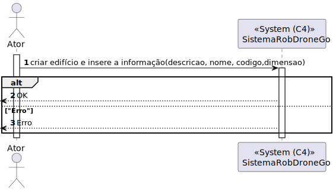
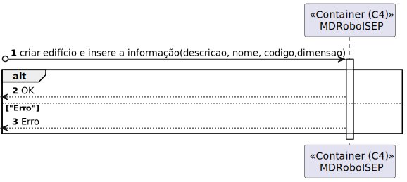
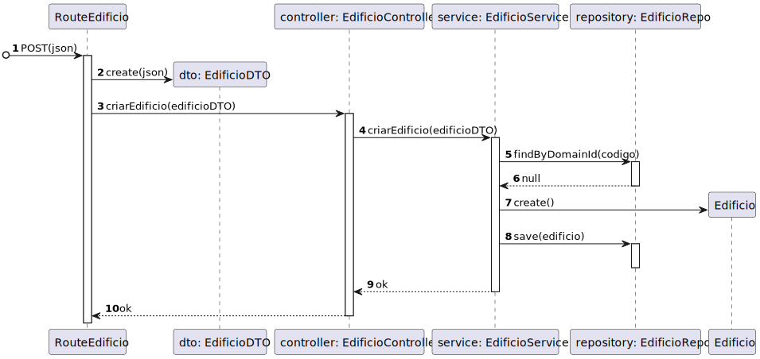

# 150 - Criar Edifício

## 1. Contexto


É a primeira vez que esta US está a ser implementada.

Esta US vai permitir a criação de um Edifício.


## 2. Requisitos
* 150 - Criar Edifício

## 2. Análise

**Ator Principal**

* N/A

**Atores Interessados (e porquê?)**

* N/A

**Pré-condições**

* N/A

**Pós-condições**

* O Edifício será presistido

**Cenário Principal**

1. É inserida a informação sobre o Edifício (Descrição, Nome, Código e Dimensão)
2. O sistema informa do sucesso ou do insucesso
   
### Questões relevantes ao cliente

>**Aluno:**</br>Caro cliente,</br>Relativamente à criação de edifícios é suposto criar-mos um edifício sem nenhum piso inicialmente e depois adicionarmos os pisos?</br>Por exemplo: Criar o edifício A apenas, sem nenhum piso, e só depois na US 190 criar-mos os respetivos pisos do edifício A.</br>Ou é necessário sempre que criarmos um edifício especificar os pisos que o mesmo tem?</br>Por exemplo: Criar o edifício A, com os pisos A1, A2, A3 com as dimensões da grelha para cada um dos pisos.</br>Os melhores cumprimentos,</br>Grupo 002.</br>**Cliente:**</br>boa tarde,</br>são dois requisitos independentes. 150 apenas define o edificio. posteriormente o utilizador invocará o caso de uso correspondete ao requisito 190 para criar cada piso desse edificio


>**Aluno:**</br>Caro cliente,</br>O nome do edifício tem limitações como, por exemplo, tem de ter uma letra e números? E para além do nome do edifício, que mais informação deve ser guardada sobre o edifício.</br></br>Obrigado pela sua atenção,</br>Grupo 3.</br></br>**Cliente:** </br>boa tarde</br>ver https://moodle.isep.ipp.pt/mod/forum/discuss.php?d=25016#p31679</br>o código do edificio é obrigatório, no máximo 5 caracteres, letras e digitos, podendo conter espaços no meio</br> nome do edificio é opcional, no máximo 50 caracteres alfanuméricos</br></br>**Aluno:**</br>Em relação à breve descrição, existe alguma regra em particular?</br></br>**Cliente:**</br>bom dia</br>é opcional, com o máximo de 255 caracteres


### Excerto Relevante do Domínio


## 3. Design
### 3.1.1 Vista Lógica
**Nível 1**


**Nível 2**


**Nível 3**


### 3.1.2. Vista de Processos

**Nível 1**



**Nível 2**



**Nível 3**


### 3.1.3 Vista de Implementação

**Nível 2**


**Nível 3**


### 3.1.4 Vista Física

**Nível 2**


### 3.1.5 Vista de Cenários
**Nível 1**


### 3.2. Testes
Exemplos de Testes Unitários de Domínio
````
    it('Criação de Edifício Válido com atributos não essenciais', () => {
        let edificioProps : any = {
            nome:nome.getValue(),
            listaPisos:[] = [],
            dimensao:dimensao.getValue(),
            descricao:descricao.getValue(),
        };
        const edificio = Edificio.create(edificioProps,codigo.getValue());
        expect(true).to.equal(edificio.isSuccess);
    });

    it('Criação de Edifício Válido apenas com atributos essenciais', () => {
        let edificioProps : any = {
            dimensao:dimensao.getValue(),
            listaPisos:[] = [],
        };
        const edificio = Edificio.create(edificioProps,codigo.getValue());
        expect(true).to.equal(edificio.isSuccess);
    });
    it('Criação de Edifício com Dimensão Null', () => {
        let edificioProps : any = {
            dimensao:null,
        };
        const edificioInvalido = Edificio.create(edificioProps,codigo.getValue());
        expect(false).to.equal(edificioInvalido.isSuccess);
    });
    it('Criação de Edifício com Dimensão Undefined', () => {
        let edificioProps : any = {
            dimensao:undefined,
        };
        const edificioInvalido = Edificio.create(edificioProps,codigo.getValue());
        expect(false).to.equal(edificioInvalido.isSuccess);
    });
    

    it('Edifício não tem elevador', () => {
        let edificioProps : any = {
            dimensao:dimensao.getValue(),
            listaPisos:[] = [],
        };
        const edificio = Edificio.create(edificioProps,codigo.getValue()).getValue();
        expect(false).to.equal(edificio.temElevador());
    });

````
Exemplos testes unitários Service
````

    it('Criação normal de um edificio', async () => {
        let body = {
            "codigo": "as1",
            "dimensaoX": 3,
            "dimensaoY": 4,
            "nome": "Edificio A",
            "descricao": "Edificio A",
        };

        let edificioProps : any = {
            nome: Nome.create('Edificio A').getValue(),
            dimensao:Dimensao.create(3,4).getValue(),
            descricao:DescricaoEdificio.create('Edificio A').getValue(),
            listaPisos: [],
        };

        let edificio = Edificio.create(edificioProps,Codigo.create(body.codigo).getValue()).getValue();
        let edificioRepoInstance = Container.get("EdificioRepo");

        sinon.stub(edificioRepoInstance, "findByDomainId").returns(Promise.resolve(null));
        sinon.stub(edificioRepoInstance, "save").returns(Promise.resolve(edificio));

        const edificioService = new EdificioService(edificioRepoInstance as IEdificioRepo);
        let answer = await edificioService.criarEdificio(body as IEdificioDTO);

        expect(answer.getValue().codigo).to.equal(body.codigo);
        expect(answer.getValue().nome).to.equal(body.nome);
        expect(answer.getValue().dimensaoX).to.equal(body.dimensaoX);
        expect(answer.getValue().dimensaoY).to.equal(body.dimensaoY);
        expect(answer.getValue().descricao).to.equal(body.descricao);
    });

    it('Edifício já existe', async () => {
        
        let body = {
            "codigo": "as1",
            "dimensaoX": 3,
            "dimensaoY": 4,
        };

        let edificioProps : any = {
            nome: Nome.create('Edificio A').getValue(),
            dimensao:Dimensao.create(1,1).getValue(),
            descricao:DescricaoEdificio.create('Edificio A').getValue(),
            listaPisos: [],
        };
        
        let edificio = Edificio.create(edificioProps,Codigo.create('ED01').getValue()).getValue();

        let edificioRepoInstance = Container.get("EdificioRepo");

        sinon.stub(edificioRepoInstance, "findByDomainId").returns(Promise.resolve(edificio));
        const edificioService = new EdificioService(edificioRepoInstance as IEdificioRepo);
        let answer = await edificioService.criarEdificio(body as IEdificioDTO);
        expect(answer.errorValue()).to.equal("Edificio já existe");
    });

    it('Criar o edifício com dimensão errada', async () => {
        
        let body = {
            "codigo": "as1",
            "dimensaoX": -1,
            "dimensaoY": 4,
        };
        
        let edificioRepoInstance = Container.get("EdificioRepo");

        sinon.stub(edificioRepoInstance, "findByDomainId").returns(Promise.resolve(null));
        const edificioService = new EdificioService(edificioRepoInstance as IEdificioRepo);
        let answer = await edificioService.criarEdificio(body as IEdificioDTO);
        expect(answer.errorValue()).to.equal("Erro: A Dimensão tem de ser válida e superior a 0");

    });

    it('Criar o edifício com código errado', async () => {
        
        let body = {
            "codigo": "*___*",
            "dimensaoX": 1,
            "dimensaoY": 4,
        };
        
        let edificioRepoInstance = Container.get("EdificioRepo");

        sinon.stub(edificioRepoInstance, "findByDomainId").returns(Promise.resolve(null));
        const edificioService = new EdificioService(edificioRepoInstance as IEdificioRepo);
        let answer = await edificioService.criarEdificio(body as IEdificioDTO);
        expect(answer.errorValue()).to.equal("Código do Edifício deve ser alfanumérico e pode conter espaços.");

    });

    it('Criar o edifício com nome errado', async () => {
        
        let body = {
            "codigo": "as1",
            "dimensaoX": 1,
            "dimensaoY": 4,
            "nome": "_",
        };
        
        let edificioRepoInstance = Container.get("EdificioRepo");

        sinon.stub(edificioRepoInstance, "findByDomainId").returns(Promise.resolve(null));
        const edificioService = new EdificioService(edificioRepoInstance as IEdificioRepo);
        let answer = await edificioService.criarEdificio(body as IEdificioDTO);
        expect(answer.errorValue()).to.equal("Erro: O nome tem de ser válido, alfanumérico e ter até 50 caratéres.");

    });

    it('Criar o edifício com descricao errada', async () => {
        
        let body = {
            "codigo": "AG",
            "dimensaoX": 1,
            "dimensaoY": 4,
            "descricao": "_",
        };
        
        let edificioRepoInstance = Container.get("EdificioRepo");

        sinon.stub(edificioRepoInstance, "findByDomainId").returns(Promise.resolve(null));
        const edificioService = new EdificioService(edificioRepoInstance as IEdificioRepo);
        let answer = await edificioService.criarEdificio(body as IEdificioDTO);
        expect(answer.errorValue()).to.equal("Erro: A descrição tem de ser válida e até 255 caratéres.");

    });
````
Exemplos Testes Unitários Repos
````
it('Exists deve retornar true se o edificio existir', async () => {
        let listaPiso : number [] = []; 

        const edificioDTO = {
            codigo : "ED01",
            nome : "Edificio A",
            descricao : "Edificio A",
            dimensaoX: 1,
            dimensaoY: 1,
            piso : listaPiso,
        } as IEdificioPersistence

        const edificioSchemaInstance = Container.get("EdificioSchema");

        sinon.stub(edificioSchemaInstance, "findOne").returns(edificioDTO as IEdificioPersistence);
        const edificioRepo = new EdificioRepo(edificioSchemaInstance as any);
        const answer = await edificioRepo.exists(await EdificioMap.toDomain(edificioDTO));
        expect(answer).to.be.true;
    });

    it('Save deve retornar edificio', async () => {
        let listaPiso : number [] = []; 
        const edificioDTO = {
            codigo : "ED01",
            nome : "Edificio A",
            descricao : "Edificio A",
            dimensaoX: 1,
            dimensaoY: 1,
            piso : listaPiso,
        } as IEdificioPersistence

        const edificioSchemaInstance = Container.get("EdificioSchema");
    
        sinon.stub(edificioSchemaInstance, "findOne").returns(null);
        sinon.stub(edificioSchemaInstance, "create").returns(edificioDTO as IEdificioPersistence);
        const edificioRepo = new EdificioRepo(edificioSchemaInstance as any);
        const edificio = await EdificioMap.toDomain(edificioDTO);
        const answer = await edificioRepo.save(edificio);
        expect(answer.returnEdificioId()).to.be.equal(edificio.returnEdificioId());
        expect(answer.returnNome()).to.be.equal(edificio.returnNome());
        expect(answer.returnDescricao()).to.be.equal(edificio.returnDescricao());
        expect(answer.returnDimensaoX()).to.be.equal(edificio.returnDimensaoX());
        expect(answer.returnDimensaoY()).to.be.equal(edificio.returnDimensaoY());
        expect(answer.returnListaPisosId()).to.deep.equal(edificio.returnListaPisosId());
    });

    it('Save dever retorna edificio ao editar', async () => {
        let listaPiso : number [] = []; 
        const edificioDTO = {
            codigo : "ED01",
            nome : "Edificio A",
            descricao : "Edificio A",
            dimensaoX: 1,
            dimensaoY: 1,
            piso : listaPiso,
            save() { return this; }
        } as IEdificioPersistence & Document<any, any, any>;

        const edificioDTO2 = {
            codigo : "ED01",
            nome : "Edificio B",
            descricao : "Edificio B",
            dimensaoX: 1,
            dimensaoY: 1,
            piso : listaPiso,
        } as IEdificioPersistence
        
        const edificioSchemaInstance = Container.get("EdificioSchema");
    
        sinon.stub(edificioSchemaInstance, "findOne").returns(edificioDTO);
        const edificioRepo = new EdificioRepo(edificioSchemaInstance as any);

        const edificio = await EdificioMap.toDomain(edificioDTO2);
        const answer = await edificioRepo.save(edificio);

        expect(answer.returnEdificioId()).to.be.equal(edificio.returnEdificioId());
        expect(answer.returnNome()).to.be.equal(edificio.returnNome());
        expect(answer.returnDescricao()).to.be.equal(edificio.returnDescricao());
        expect(answer.returnDimensaoX()).to.be.equal(edificio.returnDimensaoX());
        expect(answer.returnDimensaoY()).to.be.equal(edificio.returnDimensaoY());
        expect(answer.returnListaPisosId()).to.deep.equal(edificio.returnListaPisosId());
    });

    it('FindbyDomainId deve retornar ediificio', async () => {
        let listaPiso : number [] = []; 
        const edificioDTO = {
            codigo : "ED01",
            nome : "Edificio A",
            descricao : "Edificio A",
            dimensaoX: 1,
            dimensaoY: 1,
            piso : listaPiso,
            save() { return this; }
        } as IEdificioPersistence & Document<any, any, any>;

        const edificioSchemaInstance = Container.get("EdificioSchema");
        sinon.stub(edificioSchemaInstance, "findOne").returns(edificioDTO);
        const edificioRepo = new EdificioRepo(edificioSchemaInstance as any);

        const edificio = await EdificioMap.toDomain(edificioDTO);
        const answer = await edificioRepo.findByDomainId(edificioDTO.codigo);

        expect(answer.returnEdificioId()).to.be.equal(edificio.returnEdificioId());
        expect(answer.returnNome()).to.be.equal(edificio.returnNome());
        expect(answer.returnDescricao()).to.be.equal(edificio.returnDescricao());
        expect(answer.returnDimensaoX()).to.be.equal(edificio.returnDimensaoX());
        expect(answer.returnDimensaoY()).to.be.equal(edificio.returnDimensaoY());
        expect(answer.returnListaPisosId()).to.deep.equal(edificio.returnListaPisosId());
    });

    it('FindByDomainId deve retornar null se não encontrar nada', async () => {
        let listaPiso : number [] = []; 
        const edificioDTO = {
            codigo : "ED01",
            nome : "Edificio A",
            descricao : "Edificio A",
            dimensaoX: 1,
            dimensaoY: 1,
            piso : listaPiso,
            save() { return this; }
        } as IEdificioPersistence & Document<any, any, any>;

        const edificioSchemaInstance = Container.get("EdificioSchema");
        sinon.stub(edificioSchemaInstance, "findOne").returns(null);
        const edificioRepo = new EdificioRepo(edificioSchemaInstance as any);

        const edificio = await EdificioMap.toDomain(edificioDTO);
        const answer = await edificioRepo.findByDomainId(edificioDTO.codigo);

        expect(answer).to.be.equal(null);
    });
````
Exemplo Teste Unitário de Controller
````
 it('Criar edificio retorna edificio JSON', async function() {
            
            // Arrange
            let body = {
                "codigo": "as1",
                "nome": "ola",
                "descricao": "ola",
            };
    
            let req: Partial<Request> = {};
            req.body = body;
    
            let res: Partial<Response> = {
                json: sinon.spy()
            };
    
            let next: Partial<NextFunction> = () => {};
            let edificioServiceInstance = Container.get("EdificioService");
            sinon.stub(edificioServiceInstance, 'criarEdificio').returns(Promise.resolve(Result.ok<IEdificioDTO>(body as IEdificioDTO)));

            let edificioController = new EdificioController(edificioServiceInstance as IEdificioService);
    
            // Act
            await edificioController.criarEdificio(<Request> req,<Response> res, <NextFunction> next);
    
            // Assert
            sinon.assert.calledOnce(res.json as sinon.SinonSpy);
            sinon.assert.calledWith(res.json as sinon.SinonSpy, body);
    });
````
Alguns exemplos de testes de integração:
````
it('EdificioController + EdificioService criar edificio', async function() {
        // Arrange
        let body = {
            "codigo": "as1",
            "nome": "ola",
            "descricao": "ola",
            "dimensaoX": 1,
            "dimensaoY": 1,
        };
        let edificioProps : any = {
            nome : Nome.create(body.nome).getValue(),
            dimensao : Dimensao.create(body.dimensaoX,body.dimensaoY).getValue(),
            descricao : DescricaoEdificio.create(body.descricao).getValue(),
            listaPisos : [],
        }
        let edificio = Edificio.create(edificioProps,Codigo.create(body.codigo).getValue()).getValue();
        let req: Partial<Request> = {};
        req.body = body;

        let res: Partial<Response> = {
            json: sinon.spy()
        };

        let next: Partial<NextFunction> = () => {};
        
        let edificioServiceInstance = Container.get("EdificioService");
        let edificioRepoInstance = Container.get("EdificioRepo");
        const edificioServiceSpy = sinon.spy(edificioServiceInstance, 'criarEdificio');
        
        sinon.stub(edificioRepoInstance, "findByDomainId").returns(Promise.resolve(null));
        sinon.stub(edificioRepoInstance, "save").returns(Promise.resolve(edificio));
        // Act
        let edificioController = new EdificioController(edificioServiceInstance as IEdificioService);
        await edificioController.criarEdificio(<Request> req,<Response> res, <NextFunction> next);

        // Assert
        sinon.assert.calledOnce(edificioServiceSpy);
        sinon.assert.calledWith(edificioServiceSpy, body);
        sinon.assert.calledOnce(res.json as sinon.SinonSpy);
        sinon.assert.calledWith(res.json as sinon.SinonSpy, body);
});

it('EdificioController + EdificioService + EdificioRepo criar edificio', async function() {
    // Arrange
    let body = {
        "codigo": "as1",
        "nome": "ola",
        "descricao": "ola",
        "dimensaoX": 1,
        "dimensaoY": 1,
    };
    let edificioProps : any = {
        nome : Nome.create(body.nome).getValue(),
        dimensao : Dimensao.create(body.dimensaoX,body.dimensaoY).getValue(),
        descricao : DescricaoEdificio.create(body.descricao).getValue(),
        listaPisos : [],
    }

    let listaPiso : [] = [];
    let elevador;
    
    const edificioPersistence = {
        codigo : body.codigo,
        nome : body.nome,
        descricao : body.descricao,
        dimensaoX: body.dimensaoX,
        dimensaoY: body.dimensaoY,
        piso : listaPiso,
        elevador : elevador,
    } as IEdificioPersistence

    let edificio = Edificio.create(edificioProps,Codigo.create(body.codigo).getValue()).getValue();
    let req: Partial<Request> = {};
    req.body = body;

    let res: Partial<Response> = {
        json: sinon.spy()
    };

    let next: Partial<NextFunction> = () => {};
    
    let edificioServiceInstance = Container.get("EdificioService");
    const edificioServiceSpy = sinon.spy(edificioServiceInstance, 'criarEdificio');
    let edificioSchemaInstance = Container.get("EdificioSchema");

    sinon.stub(edificioSchemaInstance, "findOne").returns(null);
    sinon.stub(edificioSchemaInstance, "create").returns(edificioPersistence);
    
    // Act
    let edificioController = new EdificioController(edificioServiceInstance as IEdificioService);
    await edificioController.criarEdificio(<Request> req,<Response> res, <NextFunction> next);

    // Assert
    sinon.assert.calledOnce(edificioServiceSpy);
    sinon.assert.calledWith(edificioServiceSpy, body);
    sinon.assert.calledOnce(res.json as sinon.SinonSpy);
    sinon.assert.calledWith(res.json as sinon.SinonSpy, body);
});
````

## 4. Implementação
Alguns exemplos de implementação:
````
  public async criarEdificio(edificioDTO: IEdificioDTO): Promise<Result<IEdificioDTO>> {
      try{
        const edificioDocument = await this.edificioRepo.findByDomainId(edificioDTO.codigo);
        if(edificioDocument !== null ){
          return Result.fail<IEdificioDTO>("Edificio já existe")
        }else{
          let codigoOrError = Codigo.create(edificioDTO.codigo);
          let dimensaoOrError = Dimensao.create(edificioDTO.dimensaoX,edificioDTO.dimensaoY);
          if(codigoOrError.isFailure){                                        //verificar se o codigo e a dimensão são válidos
            return Result.fail<IEdificioDTO>(codigoOrError.errorValue());
          }else if(dimensaoOrError.isFailure){
            return Result.fail<IEdificioDTO>(dimensaoOrError.errorValue());
          }
          let listaPisos: Piso[] = [];                                            
          let dadosEdificio : any = {
            dimensao:dimensaoOrError.getValue(),                         //adicionar os dados do edificio obrigatórios           
            listaPisos:listaPisos,
          }
          if(edificioDTO.nome){                                         // verifcar se os dados opcionais existem e estão corretos
            let nomeOrError = Nome.create(edificioDTO.nome);            // e adiciona-os se estiverem
            if(nomeOrError.isSuccess){
              dadosEdificio.nome = nomeOrError.getValue();
            }else{
              return Result.fail<IEdificioDTO>(nomeOrError.errorValue());
            }
          }
          if(edificioDTO.descricao){
            let descricaoOrError = DescricaoEdificio.create(edificioDTO.descricao);
            if(descricaoOrError.isSuccess){
              dadosEdificio.descricao = descricaoOrError.getValue();
            }else{
              return Result.fail<IEdificioDTO>(descricaoOrError.errorValue());
            }
          }
          const edificioOrError = Edificio.create(dadosEdificio,codigoOrError.getValue());  //criar o edificio
  
          if (edificioOrError.isFailure) {
              return Result.fail<IEdificioDTO>(edificioOrError.errorValue()); //verificar se o edificio foi criado com sucesso  
          }
          const edificio = edificioOrError.getValue();
          await this.edificioRepo.save(edificio);                            //dar save ao edificio
          return Result.ok<IEdificioDTO>( edificioDTO)
        }
      }catch(e){
        throw e;
      }
  }
````
## 5. Observations
N/A