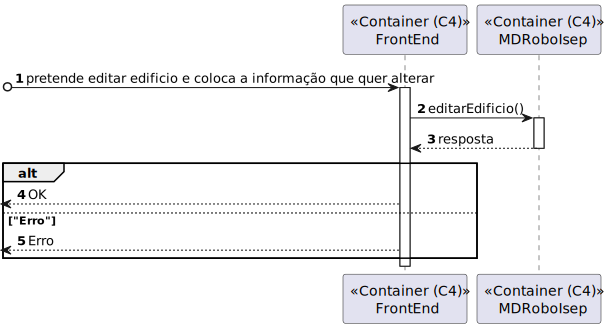
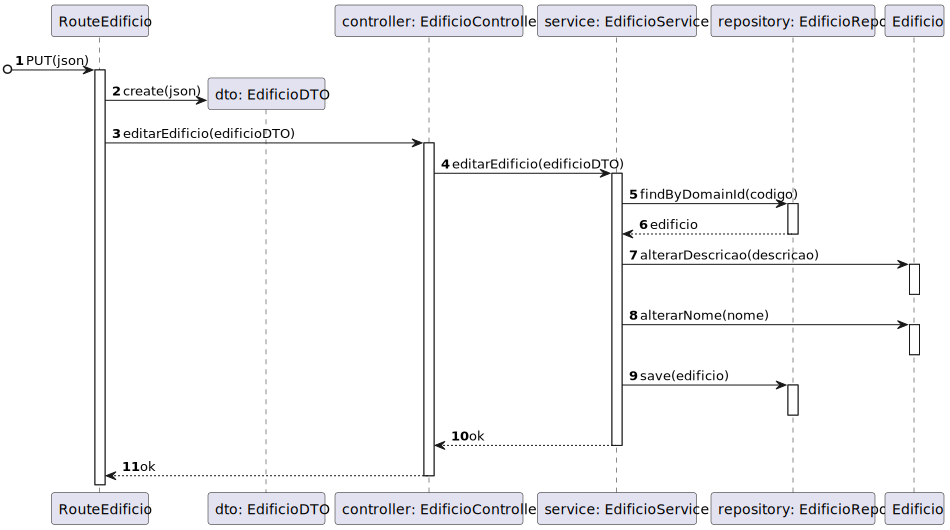

# 160 - Editar Edifício

## 1. Contexto


É a primeira vez que esta US está a ser implementada.

Esta US vai permitir a capacidade de editar edifício. As possíveis alterações são o nome e a descrição.


## 2. Requisitos
* 160 - Editar Edifício

## 2. Análise

**Ator Principal**

* N/A

**Atores Interessados (e porquê?)**

* N/A

**Pré-condições**

* Já deverá existir um Edifício

**Pós-condições**

* O Edifício deve ser atualizado

**Cenário Principal**

1. Pretende editar Edifício e insere a informação pretendida
2. O sistema informa do sucesso ou do insucesso
   
### Questões relevantes ao cliente

* N/A

### Excerto Relevante do Domínio


## 3. Design
### 3.1.1 Vista Lógica
**Nível 1**


**Nível 2**


**Nível 3**


### 3.1.2. Vista de Processos

**Nível 1**


**Nível 2**



**Nível 3**


### 3.1.3 Vista de Implementação

**Nível 2**


**Nível 3**


### 3.1.4 Vista Física

**Nível 2**


### 3.1.5 Vista de Cenários
**Nível 1**


### 3.2. Testes

Exemplos testes unitários Service
````
    it('Editar edificio com sucesso', async () => {
        let bodyNovo = {
            "codigo": "as1",
            "nome" : "Edificio A",
            "descricao" : "Edificio A",
        };

        let edificioRepoInstance = Container.get("EdificioRepo");

        let edificioPropsAntigo : any = {
            nome: Nome.create('Edificio Antigo').getValue(),
            dimensao:Dimensao.create(1,1).getValue(),
            descricao:DescricaoEdificio.create('Edificio Antigo').getValue(),
            listaPisos: [],
        };

        let edificioPropsNovo : any = {
            nome: Nome.create(bodyNovo.nome).getValue(),
            dimensao:Dimensao.create(1,1).getValue(),
            descricao:DescricaoEdificio.create(bodyNovo.descricao).getValue(),
            listaPisos: [],
        };

        let edificioAntigo = Edificio.create(edificioPropsAntigo,Codigo.create(bodyNovo.codigo).getValue()).getValue();
        let edificioNovo = Edificio.create(edificioPropsNovo,Codigo.create(bodyNovo.codigo).getValue()).getValue();

        sinon.stub(edificioRepoInstance, "findByDomainId").returns(Promise.resolve(edificioAntigo));
        sinon.stub(edificioRepoInstance, "save").returns(Promise.resolve(edificioNovo));
        const edificioService = new EdificioService(edificioRepoInstance as IEdificioRepo);
        let answer = await edificioService.editarEdificio(bodyNovo as IEdificioDTO);

        expect(answer.getValue().codigo).to.equal(bodyNovo.codigo);
        expect(answer.getValue().nome).to.equal(bodyNovo.nome);
        expect(answer.getValue().descricao).to.equal(bodyNovo.descricao);

    });

    it('Editar edificio sem esse edificio existir', async () => {
        
        let body = {
            "codigo": "*___*",
            "nome" : "Edificio A",
        };
        
        let edificioRepoInstance = Container.get("EdificioRepo");

        sinon.stub(edificioRepoInstance, "findByDomainId").returns(Promise.resolve(null));
        const edificioService = new EdificioService(edificioRepoInstance as IEdificioRepo);
        let answer = await edificioService.editarEdificio(body as IEdificioDTO);
        expect(answer.errorValue()).to.equal("Edificio não existe");
    });

    it('Editar edificio sem nome nem descricao', async () => {
            let body = {
                "codigo": "as1",
            };
            
            let edificioProps : any = {
                nome: Nome.create('Edificio A').getValue(),
                dimensao:Dimensao.create(1,1).getValue(),
                descricao:DescricaoEdificio.create('Edificio A').getValue(),
                listaPisos: [],
            };
            
            let edificio = Edificio.create(edificioProps,Codigo.create('as1').getValue()).getValue();
            
            let edificioRepoInstance = Container.get("EdificioRepo");
    
            sinon.stub(edificioRepoInstance, "findByDomainId").returns(Promise.resolve(edificio));
            const edificioService = new EdificioService(edificioRepoInstance as IEdificioRepo);
            let answer = await edificioService.editarEdificio(body as IEdificioDTO);
            expect(answer.errorValue()).to.equal("Nome e descrição são obrigatórios");
    });
````

Exemplo Teste Unitário de Controller
````
     it('Editar edificio retorna edificio JSON', async function() {
        let body = {
            "codigo" : "ED01",
            "nome" : "Edificio A",
            "descricao" : "Edificio A",
        }
        
        let req: Partial<Request> = {};
        req.body = body;
        let res: Partial<Response> = {
            json: sinon.spy(),
        };
        let next: Partial<NextFunction> = () => {};
        let edificioServiceInstance = Container.get("EdificioService");
        sinon.stub(edificioServiceInstance, 'editarEdificio').returns(Promise.resolve(Result.ok<IEdificioDTO>(body as IEdificioDTO)));
        let edificioController = new EdificioController(edificioServiceInstance as IEdificioService);

        //Act
        await edificioController.editarEdificio(<Request> req,<Response> res, <NextFunction> next);

        //Assert
        sinon.assert.calledOnce(res.json as sinon.SinonSpy);
        sinon.assert.calledWith(res.json as sinon.SinonSpy, body);
    });
````

Exemplo de testes de intergração:
````
it('EdificioController + EdificioService teste de integração ao método editarEdificio', async function() {
        let body = {
            "codigo" : "ED01",
            "nome" : "Edificio A",
            "descricao" : "Edificio A",
        }
        let req: Partial<Request> = {};
        req.body = body;
        let res: Partial<Response> = {
            json: sinon.spy(),
        };
        let next: Partial<NextFunction> = () => {};
        let propsAnterior : any = {
            nome : Nome.create("velho").getValue(),
            dimensao : Dimensao.create(1,1).getValue(),
            descricao : DescricaoEdificio.create("velho").getValue(),
            listaPisos : [],
        }
        let propsNovo : any = {
            nome : Nome.create(body.nome).getValue(),
            dimensao : Dimensao.create(1,1).getValue(),
            descricao : DescricaoEdificio.create(body.descricao).getValue(),
            listaPisos : [],
        }

        let edificioVelho = Edificio.create(propsAnterior,Codigo.create(body.codigo).getValue()).getValue();
        let edificioNovo = Edificio.create(propsNovo,Codigo.create(body.codigo).getValue()).getValue();

        let edificioServiceInstance = Container.get("EdificioService");
        let edificioServiceSpy = sinon.spy(edificioServiceInstance, 'editarEdificio');
        let edificioRepoInstance = Container.get("EdificioRepo");
        sinon.stub(edificioRepoInstance, "findByDomainId").returns(Promise.resolve(edificioVelho));
        sinon.stub(edificioRepoInstance, "save").returns(Promise.resolve(edificioNovo));

        let edificioController = new EdificioController(edificioServiceInstance as IEdificioService);
        await edificioController.editarEdificio(<Request> req,<Response> res, <NextFunction> next);

        sinon.assert.calledOnce(edificioServiceSpy);
        sinon.assert.calledWith(edificioServiceSpy, body);
        sinon.assert.calledOnce(res.json as sinon.SinonSpy);
        sinon.assert.calledWith(res.json as sinon.SinonSpy, body);
    });

    it('EdificioController + EdificioService + EdificioRepo teste de integração ao método editarEdificio', async function() {
        let body = {
            "codigo" : "ED01",
            "nome" : "Edificio A",
            "descricao" : "Edificio A",
        };
        let req: Partial<Request> = {};
        req.body = body;
        let res: Partial<Response> = {
            json: sinon.spy(),
        };
        let next: Partial<NextFunction> = () => {};
        let propsAnterior : any = {
            nome : Nome.create("velho").getValue(),
            dimensao : Dimensao.create(1,1).getValue(),
            descricao : DescricaoEdificio.create("velho").getValue(),
            listaPisos : [],
        }
        let propsNovo : any = {
            nome : Nome.create(body.nome).getValue(),
            dimensao : Dimensao.create(1,1).getValue(),
            descricao : DescricaoEdificio.create(body.descricao).getValue(),
            listaPisos : [],
        }
        let elevador;
    
        const edificioPersistenceVelho = {
            codigo : "velho",
            nome : "velho",
            descricao : "velho",
            dimensaoX: 1,
            dimensaoY: 1,
            piso : [],
            elevador : elevador,
            save() { return this; }
        } as IEdificioPersistence

        const edificioPersistenceNovo = {
            codigo : body.codigo,
            nome : body.nome,
            descricao : body.descricao,
            dimensaoX: 1,
            dimensaoY: 1,
            piso : [],
            elevador : elevador,      
        } as IEdificioPersistence


        let edificioServiceInstance = Container.get("EdificioService");
        let edificioServiceSpy = sinon.spy(edificioServiceInstance, 'editarEdificio');
        let edificioRepoInstance = Container.get("EdificioRepo");
        let edificioSchemaInstance = Container.get("EdificioSchema");

        sinon.stub(edificioSchemaInstance, "findOne").returns(edificioPersistenceVelho);
        sinon.stub(edificioSchemaInstance, "create").returns(edificioPersistenceNovo);

        let edificioController = new EdificioController(edificioServiceInstance as IEdificioService);
        await edificioController.editarEdificio(<Request> req,<Response> res, <NextFunction> next);

        sinon.assert.calledOnce(edificioServiceSpy);
        sinon.assert.calledWith(edificioServiceSpy, body);
        sinon.assert.calledOnce(res.json as sinon.SinonSpy);
        sinon.assert.calledWith(res.json as sinon.SinonSpy, body);

    });
````
## 4. Implementação
Alguns exemplos de implementação:
````
 public async editarEdificio(edificioDTO:IEdificioDTO): Promise<Result<IEdificioDTO>>{                                                                                   
    try{
      const edificio = await this.edificioRepo.findByDomainId(edificioDTO.codigo);
      if(edificio === null ){
        return Result.fail<IEdificioDTO>("Edificio não existe")
      }
      if(!!edificioDTO.descricao === false || !!edificioDTO.nome === false){
        return Result.fail<IEdificioDTO>("Nome e descrição são obrigatórios");
      }
      if(edificioDTO.descricao){
        let descricaoOrError = DescricaoEdificio.create(edificioDTO.descricao);
        if(descricaoOrError.isFailure){
          return Result.fail<IEdificioDTO>(descricaoOrError.errorValue());
        }else{
          edificio.alterarDescricao(descricaoOrError.getValue());
        }
      }
      if(edificioDTO.nome){
        let nomeOrError = Nome.create(edificioDTO.nome);
        if(nomeOrError.isFailure){
          return Result.fail<IEdificioDTO>(nomeOrError.errorValue());
        }else{
          edificio.alterarNome(nomeOrError.getValue());
        }
      }
      await this.edificioRepo.save(edificio);
      return Result.ok<IEdificioDTO>(edificioDTO);
    }catch(e){
      throw e;
    }
  }
````
## 5. Observations
N/A