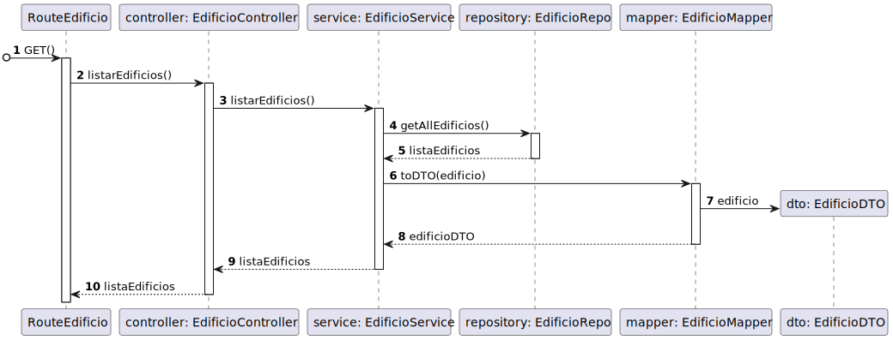

# 170 - Listar todos os Edifícios

## 1. Contexto

É a primeira vez que esta US está a ser implementada.

Esta US criará a funcionalidade de listar todos os Edifícios que estão persistidos no sistema.


## 2. Requisitos
* 170 - Listar todos os Edifícios

## 2. Análise

**Ator Principal**

* N/A

**Atores Interessados (e porquê?)**

* N/A

**Pré-condições**

* Deverão haver edifícios persistidos

**Pós-condições**

* Os Edifícios serão listados

**Cenário Principal**

1. É requisitada a lista de todos os edifícios
2. O sistema lista todos os edifícios
   
### Questões relevantes ao cliente

Não existem perguntas relevantes

### Excerto Relevante do Domínio


## 3. Design
### 3.1.1 Vista Lógica
**Nível 1**


**Nível 2**


**Nível 3**


### 3.1.2. Vista de Processos

**Nível 1**


**Nível 2**


**Nível 3**


### 3.1.3 Vista de Implementação

**Nível 2**


**Nível 3**


### 3.1.4 Vista Física

**Nível 2**


### 3.1.5 Vista de Cenários
**Nível 1**


### 3.2. Testes

Exemplos testes unitários Service
````

    it('Listar Edificios sem existirem edificios', async () => {
        let edificioRepoInstance = Container.get("EdificioRepo");
        sinon.stub(edificioRepoInstance, "getAllEdificios").returns(Promise.resolve([]));
        const edificioService = new EdificioService(edificioRepoInstance as IEdificioRepo);
        let answer = await edificioService.listarEdificios();
        expect(answer.errorValue()).to.equal("Não existem edificios");
    });

    it('Listar Edificios com edificios existentes', async () => {
        let edificioProps : any = {
            nome: Nome.create('Edificio A').getValue(),
            dimensao:Dimensao.create(1,1).getValue(),
            descricao:DescricaoEdificio.create('Edificio A').getValue(),
            listaPisos: [],
        };


        let edificio = Edificio.create(edificioProps,Codigo.create('ED01').getValue()).getValue();
        let edificioRepoInstance = Container.get("EdificioRepo");
        sinon.stub(edificioRepoInstance, "getAllEdificios").returns(Promise.resolve([edificio]));
        const edificioService = new EdificioService(edificioRepoInstance as IEdificioRepo);
        let answer = await edificioService.listarEdificios();
        expect(answer.getValue()[0].nome).to.equal(edificioProps.nome.props.nome);
        expect(answer.getValue()[0].dimensaoX).to.equal(edificioProps.dimensao.props.x);
        expect(answer.getValue()[0].dimensaoY).to.equal(edificioProps.dimensao.props.y);
        expect(answer.getValue()[0].descricao).to.equal(edificioProps.descricao.props.descricao);
    });
````
Exemplos Testes Unitários Repos
````
    it('GetAllEdificios deve retornar lista vazia se não encontrar nada', async () => {
        const edificioSchemaInstance = Container.get("EdificioSchema");
        sinon.stub(edificioSchemaInstance, "find").returns([]);
        const edificioRepo = new EdificioRepo(edificioSchemaInstance as any);

        const answer = await edificioRepo.getAllEdificios();

        expect(answer).to.be.deep.equal([]);
    });

    it('GetAllEdificios deve retornar lista de edificios', async () => {
        let listaPiso : number [] = []; 
        const edificioDTO = {
            codigo : "ED01",
            nome : "Edificio A",
            descricao : "Edificio A",
            dimensaoX: 1,
            dimensaoY: 1,
            piso : listaPiso,
            save() { return this; }
        } as IEdificioPersistence & Document<any, any, any>;

        const edificioSchemaInstance = Container.get("EdificioSchema");
        sinon.stub(edificioSchemaInstance, "find").returns([edificioDTO]);
        const edificioRepo = new EdificioRepo(edificioSchemaInstance as any);

        const answer = await edificioRepo.getAllEdificios();

        expect(answer[0].returnEdificioId()).to.be.equal(edificioDTO.codigo);
        expect(answer[0].returnNome()).to.be.equal(edificioDTO.nome);
        expect(answer[0].returnDescricao()).to.be.equal(edificioDTO.descricao);
        expect(answer[0].returnDimensaoX()).to.be.equal(edificioDTO.dimensaoX);
        expect(answer[0].returnDimensaoY()).to.be.equal(edificioDTO.dimensaoY);
        expect(answer[0].returnListaPisosId()).to.deep.equal(edificioDTO.piso);
    });
````
Exemplo Teste Unitário de Controller
````
 it('Criar edificio retorna edificio JSON', async function() {
            
            // Arrange
            let body = {
                "codigo": "as1",
                "nome": "ola",
                "descricao": "ola",
            };
    
            let req: Partial<Request> = {};
            req.body = body;
    
            let res: Partial<Response> = {
                json: sinon.spy()
            };
    
            let next: Partial<NextFunction> = () => {};
            let edificioServiceInstance = Container.get("EdificioService");
            sinon.stub(edificioServiceInstance, 'criarEdificio').returns(Promise.resolve(Result.ok<IEdificioDTO>(body as IEdificioDTO)));

            let edificioController = new EdificioController(edificioServiceInstance as IEdificioService);
    
            // Act
            await edificioController.criarEdificio(<Request> req,<Response> res, <NextFunction> next);
    
            // Assert
            sinon.assert.calledOnce(res.json as sinon.SinonSpy);
            sinon.assert.calledWith(res.json as sinon.SinonSpy, body);
    });
````

Exemplos de testes de integração:

````
it('EdificioController + EdificioService teste de integração ao método listarEdificios', async function() {

        let body = {
            "codigo": "as1",
            "nome": "ola",
            "descricao": "ola",
            "dimensaoX": 1,
            "dimensaoY": 1,
        };
        
        
        let edificioProps : any ={
            nome : Nome.create(body.nome).getValue(),
            dimensao : Dimensao.create(body.dimensaoX,body.dimensaoY).getValue(),
            descricao : DescricaoEdificio.create(body.descricao).getValue(),
            listaPisos : [],
        }
        let edificio = Edificio.create(edificioProps,Codigo.create(body.codigo).getValue()).getValue();

        let req: Partial<Request> = {};
        let res: Partial<Response> = {
            json: sinon.spy()
        };
        let next: Partial<NextFunction> = () => {};
        let edificioServiceInstance = Container.get("EdificioService");
        let edificioServiceSpy = sinon.spy(edificioServiceInstance, 'listarEdificios');
        let edificioRepoInstance = Container.get("EdificioRepo");
        sinon.stub(edificioRepoInstance, "getAllEdificios").returns(Promise.resolve([edificio]));
        let edificioController = new EdificioController(edificioServiceInstance as IEdificioService);
        await edificioController.listarEdificios(<Request> req,<Response> res, <NextFunction> next);

        sinon.assert.calledOnce(edificioServiceSpy);
        sinon.assert.calledWith(edificioServiceSpy);
        sinon.assert.calledOnce(res.json as sinon.SinonSpy);
        sinon.assert.calledWith(res.json as sinon.SinonSpy, [body]);
    });

    it('EdificioController + EdificioService + EdificioRepo teste de integração ao método listarEdificios', async function() {
        let body = {
            "codigo": "as1",
            "nome": "ola",
            "descricao": "ola",
            "dimensaoX": 1,
            "dimensaoY": 1,
        };
        let edificioProps : any ={
            nome : Nome.create(body.nome).getValue(),
            dimensao : Dimensao.create(body.dimensaoX,body.dimensaoY).getValue(),
            descricao : DescricaoEdificio.create(body.descricao).getValue(),
            listaPisos : [],
        }
        let listaPiso : number [] = []; 
        const edificioPersistence = {
            codigo : body.codigo,
            nome : body.nome,
            descricao : body.descricao,
            dimensaoX: body.dimensaoX,
            dimensaoY: body.dimensaoY,
            piso : listaPiso,
        } as IEdificioPersistence & Document<any, any, any>;

        let req: Partial<Request> = {};
        let res: Partial<Response> = {
            json: sinon.spy()
        };
        let next: Partial<NextFunction> = () => {};

        let edificioServiceInstance = Container.get("EdificioService");
        let edificioServiceSpy = sinon.spy(edificioServiceInstance, 'listarEdificios');
        let edificioRepoInstance = Container.get("EdificioRepo");
        let edificioSchemaInstance = Container.get("EdificioSchema");

        sinon.stub(edificioSchemaInstance, "find").returns([edificioPersistence]);
        let edificioController = new EdificioController(edificioServiceInstance as IEdificioService);
        await edificioController.listarEdificios(<Request> req,<Response> res, <NextFunction> next);

        sinon.assert.calledOnce(edificioServiceSpy);
        sinon.assert.calledWith(edificioServiceSpy);
        sinon.assert.calledOnce(res.json as sinon.SinonSpy);
        sinon.assert.calledWith(res.json as sinon.SinonSpy, [body]);
    });
````
## 4. Implementação
Alguns exemplos de implementação:
````
  public async listarEdificios(): Promise<Result<IEdificioDTO[]>>{
    try{
      const edificioDocument = await this.edificioRepo.getAllEdificios();
      let listaEdificiosDTO: IEdificioDTO[] = [];
      for (let edificio of edificioDocument) {
        listaEdificiosDTO.push(EdificioMap.toDTO(edificio));
      }
      if(listaEdificiosDTO.length === 0){
        return Result.fail<IEdificioDTO[]>("Não existem edificios");
      }
      return Result.ok<IEdificioDTO[]>(listaEdificiosDTO);
    }catch(e){
      throw e;
    }
  }
````
## 5. Observations
N/A