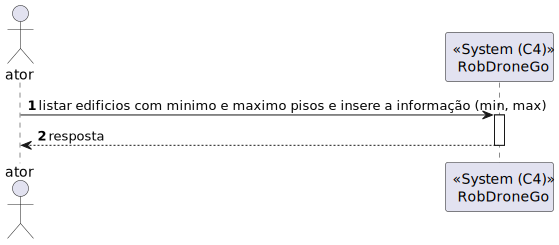

# US 180 - 	Listar edifícios com min e max de pisos	


## 1. Context

É a vez primeira que está a ser desenvolvida.
Quer criar um piso do edificio.

## 2. Requirements

**Main actor**

* N/A

**Interested actors (and why)**

* N/A

**Pre conditions**

* Tem de existir edificios com pisos

**Post conditions**

* O uma lista de edificios

**Main scenario**
1. Recebe um pedido get Listar edifícios com min e max de pisos  
2. Sistema retorna uma lista de edificios


## 3. Analysis

**Esclarecimentos do cliente:** </br>

> **Questão:** </br>
Bom dia, </br>
pode, por favor, explicar o que se pretende com esta US ? </br>
**Resposta:** </br>
bom dia,</br>
permitir pesquisar que edificios tem no minimo X pisos e no máximo Y piso


Relevant DM excerpt


## 4. Design

### 4.1. Nível 1

#### 4.1.1 Vista de processos



#### 4.1.2 Vista FÍsica

N/A (Não vai adicionar detalhes relevantes)

#### 4.1.3 Vista Lógica


#### 4.1.4 Vista de Implementação

N/A (Não vai adicionar detalhes relevantes)

#### 4.1.5 Vista de Cenarios


### 4.2 Nível 2

#### 4.2.1 Vista de processos


#### 4.2.2 Vista FÍsica


#### 4.2.3 Vista Lógica


#### 4.2.4 Vista de Implementação


### 4.3. Nível 3 

#### 4.3.1 Vista de processos


#### 4.3.2 Vista FÍsica

N/A (Não vai adicionar detalhes relevantes)

#### 4.3.3 Vista Lógica


#### 4.3.4 Vista de Implementação


### 4.4. Tests

**Test 1:** *Teste do EdificioController*

```
  it('listarEdificioMinEMaxPisos retorna lista de edificios em JSON', async function() {

        let listaDTO : IEdificioDTO[] = [];
        let edificioDTO = {
            codigo : "ED01",
            nome : "Edificio A",
            descricao : "Edificio A",
            dimensaoX: 1,
            dimensaoY: 1,
            piso : [],
        } as IEdificioDTO
        listaDTO.push(edificioDTO);
           // Arrange
        let body = {
            "minPisos": 0,
            "maxPisos": 1,
        };

        let req: Partial<Request> = {};req.body = body;
        let res: Partial<Response> = {
            json: sinon.spy()
        };
        let next: Partial<NextFunction> = () => {};
        let edificioServiceInstance = Container.get("EdificioService");
        sinon.stub(edificioServiceInstance, 'listarEdificioMinEMaxPisos').returns(Promise.resolve(Result.ok<IEdificioDTO[]>(listaDTO)));

        let edificioController = new EdificioController(edificioServiceInstance as IEdificioService);

        // Act
        await edificioController.listarEdificioMinEMaxPisos(<Request> req,<Response> res, <NextFunction> next);

        // Assert
        sinon.assert.calledOnce(res.json as sinon.SinonSpy);
        sinon.assert.calledWith(res.json as sinon.SinonSpy, listaDTO);
    });

```

**Test 2:** *Teste do EdificioService*

```
 it('listarEdificioMinEMaxPisos retorna edificio', async () => {
        let body = {
            "minPisos": 0,
            "maxPisos": 5,
        };  

        let edificioProps : any = {
            nome: Nome.create('Edificio A').getValue(),
            dimensao:Dimensao.create(1,1).getValue(),
            descricao:DescricaoEdificio.create('Edificio A').getValue(),
            listaPisos: [Piso.create({numeroPiso: NumeroPiso.create(1).getValue(),
                                    descricaoPiso: DescricaoPiso.create("ola").getValue(),
                                    mapa: [[]]}, IdPiso.create(1).getValue()).getValue()],
                                
        };

        let edificioRepoInstance = Container.get("EdificioRepo");
        let edificio = Edificio.create(edificioProps,Codigo.create('ED01').getValue()).getValue();
        sinon.stub(edificioRepoInstance, "getAllEdificios").returns(Promise.resolve([edificio]));        
        const edificioService = new EdificioService(edificioRepoInstance as IEdificioRepo);
        let answer = await edificioService.listarEdificioMinEMaxPisos(body as IListarEdMinEMaxPisosDTO);
        expect(answer.getValue()[0].nome).to.equal(edificioProps.nome.props.nome);
        expect(answer.getValue()[0].dimensaoX).to.equal(edificioProps.dimensao.props.x);
        expect(answer.getValue()[0].dimensaoY).to.equal(edificioProps.dimensao.props.y);
        expect(answer.getValue()[0].descricao).to.equal(edificioProps.descricao.props.descricao);
    });
```

**Test 3:** *Teste do EdificioRepo*
```
it('GetAllEdificios deve retornar lista de edificios', async () => {
        let listaPiso : number [] = []; 
        const edificioDTO = {
            codigo : "ED01",
            nome : "Edificio A",
            descricao : "Edificio A",
            dimensaoX: 1,
            dimensaoY: 1,
            piso : listaPiso,
            save() { return this; }
        } as IEdificioPersistence & Document<any, any, any>;

        const edificioSchemaInstance = Container.get("EdificioSchema");
        sinon.stub(edificioSchemaInstance, "find").returns([edificioDTO]);
        const edificioRepo = new EdificioRepo(edificioSchemaInstance as any);

        const answer = await edificioRepo.getAllEdificios();

        expect(answer[0].returnEdificioId()).to.be.equal(edificioDTO.codigo);
        expect(answer[0].returnNome()).to.be.equal(edificioDTO.nome);
        expect(answer[0].returnDescricao()).to.be.equal(edificioDTO.descricao);
        expect(answer[0].returnDimensaoX()).to.be.equal(edificioDTO.dimensaoX);
        expect(answer[0].returnDimensaoY()).to.be.equal(edificioDTO.dimensaoY);
        expect(answer[0].returnListaPisosId()).to.deep.equal(edificioDTO.piso);
    });
```


**Test 4:** *Teste do EdificioController + EdificioService + EdificioRepo*
```
   it('EdificioController + EdificioService + EdificioRepo teste de integração ao método listarEdificioMinEMaxPisos', async function() {

        let listaDTO : IEdificioDTO[] = [];
        let edificioDTO = {
            codigo : "ED01",
            nome : "Edificio A",
            descricao : "Edificio A",
            dimensaoX: 1,
            dimensaoY: 1,
        } as IEdificioDTO
        listaDTO.push(edificioDTO);
        // Arrange
        let body = {
            "minPisos": 0,
            "maxPisos": 1,
        };


        let listaPiso : number [] = []; 
        
        const edificioDTO2 = {
            codigo : "ED01",
            nome : "Edificio A",
            descricao : "Edificio A",
            dimensaoX: 1,
            dimensaoY: 1,
            piso : listaPiso,
            save() { return this; }
        } as IEdificioPersistence & Document<any, any, any>;

        let req: Partial<Request> = {};req.body = body;
        let res: Partial<Response> = {
            json: sinon.spy()
        };
        let next: Partial<NextFunction> = () => {};

        const edificioSchemaInstance = Container.get("EdificioSchema");
        sinon.stub(edificioSchemaInstance, "find").returns([edificioDTO2]);

        let edificioServiceInstance = Container.get("EdificioService");
        const edificioServiceSpy = sinon.spy(edificioServiceInstance, 'listarEdificioMinEMaxPisos');
        const pisoController =  new EdificioController(edificioServiceInstance as IEdificioService); 
        // Act
        await pisoController.listarEdificioMinEMaxPisos(<Request> req,<Response> res, <NextFunction> next);

        // Assert
        sinon.assert.calledOnce(edificioServiceSpy);
        sinon.assert.calledWith(edificioServiceSpy, body);
    });
```


## 5. Observations
N/A