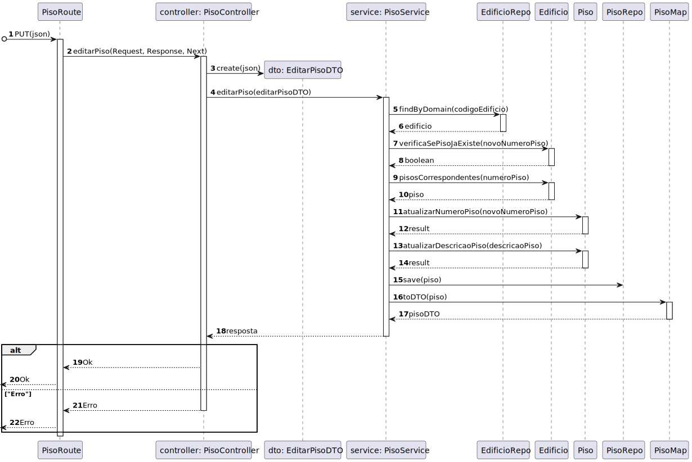

# US 200 - 	Editar informação de piso de edifício


## 1. Context

É a vez primeira que está a ser desenvolvida.
Quer editar a informação do piso

## 2. Requirements

**Main actor**

* N/A

**Interested actors (and why)**

* N/A

**Pre conditions**

* O piso tem de já estar criado

**Post conditions**

* O piso criado tem de estar persistido

**Main scenario**
1. Quer editar a informação do piso e insere a informação para atualizar
2. Sistema diz se a operação foi um sucesso 


**Other scenarios**

**5.a.** O sistema verifica se o edifício NÃO existe
1. Avisa que o edifício não existe
2. Termina a use case

**5.b.** O sistema verifica se o piso não existe
1. Avisa que o piso não existe
2. Termina a use case


## 3. Analysis

**Esclarecimentos do cliente:** </br>

> **Questão:** </br>
Caro cliente,</br>
Em relação às User Stories de edição, temos já uma ideia das informações que são opcionais, mas queremos ter a certeza daquilo que é editável ou não. </br>Posto isto, poderia indicar que informações pretende editar nas US160, US200, US250 e US280?</br>
Obrigado pela atenção,</br>
Grupo 77.</br>
**Resposta:** </br>
bom dia </br>
(...)</br>
requisito 200 - editar piso - todas as informações à exceção do edificio a que o piso se refere</br>
(...)</br>


Relevant DM excerpt


## 4. Design

### 4.1. Nível 1

#### 4.1.1 Vista de processos


#### 4.1.2 Vista FÍsica

N/A (Não vai adicionar detalhes relevantes)

#### 4.1.3 Vista Lógica


#### 4.1.4 Vista de Implementação

N/A (Não vai adicionar detalhes relevantes)

#### 4.1.4 Vista de Cenarios


### 4.2 Nível 2

#### 4.2.1 Vista de processos


#### 4.2.2 Vista FÍsica


#### 4.2.3 Vista Lógica


#### 4.2.4 Vista de Implementação


### 4.3. Nível 3 

#### 4.3.1 Vista de processos




#### 4.3.2 Vista FÍsica

N/A (Não vai adicionar detalhes relevantes)

#### 4.3.3 Vista Lógica


#### 4.3.4 Vista de Implementação


### 4.4. Tests

**Test 1:** *Teste do método atualizarNumeroPiso*

```
it('atualizarNumeroPiso falha se for undefined', async function () {
		// Arrange
		let piso = Container.get("piso2x2") as Piso;
		let numeroPiso;
		let pisoOuErro = piso.atualizarNumeroPiso(numeroPiso);
		assert.strictEqual(pisoOuErro.isFailure, true);
	});
```

**Test 2:** *Teste PisoController*

```
 it('editarPiso retorna piso JSON', async function() {
        
        // Arrange
        let body = {
            "codigoEdificio": "ED01",
	        "numeroPiso": 0,
            "novoNumeroPiso": 1,
	        "descricaoPiso": "ola"
        }
        const pisoDTO = {
            id: 1,
            numeroPiso: 1,
            descricaoPiso: "ola",
        } as IPisoDTO;

        let req: Partial<Request> = {};
        req.body = body;
        let res: Partial<Response> = {
            json: sinon.spy()
        };
        let next: Partial<NextFunction> = () => {};

        let pisoServiceInstance = Container.get("PisoService");
        sinon.stub(pisoServiceInstance, 'editarPiso').returns(Promise.resolve(Result.ok<IPisoDTO>((pisoDTO))));
        const pisoController = new PisoController(pisoServiceInstance as IPisoService);
        
        // Act
        await pisoController.editarPiso(<Request>req, <Response>res, <NextFunction>next);

        //Assert
        sinon.assert.calledOnce(res.json);
        sinon.assert.calledWith(res.json, sinon.match({
            id: 1,
            numeroPiso: 1,
            descricaoPiso: "ola",
        }));
    });
```

**Test 3:** *Teste PisoService*
```
it('editarPiso falha porque o novo numero de piso já existe', async () => {

        let body = {
            codigoEdificio: "ED01",
	        numeroPiso: 0,
            novoNumeroPiso: 0,
	        descricaoPiso: "ola"
        }

        let edificioRepoInstance = Container.get("EdificioRepo");
        let pontoRepoInstance = Container.get("PontoRepo");
        let pisoRepoInstance = Container.get("PisoRepo");
        sinon.stub(edificioRepoInstance, "findByDomainId").returns(Promise.resolve(Container.get("edificio")));
        const pisoService = new PisoService(pisoRepoInstance as IPisoRepo,edificioRepoInstance as IEdificioRepo,pontoRepoInstance as IPontoRepo);
        let answer = (await pisoService.editarPiso(body as IEditarPisoDTO));
        expect(answer.isFailure).to.equal(true);
        expect(answer.errorValue()).to.equal("Já existe o piso numero " + body.novoNumeroPiso);
    });
```
**Test 4:** *Teste PisoController + PisoService + PisoRepo + EdificioRepo*
```
it('PisoController + PisoService + PisoRepo + EdificioRepo editarPiso retorna piso json', async function() {
        
        // Arrange
        let body = {
            "codigoEdificio": "ED01",
	        "numeroPiso": 0,
            "novoNumeroPiso": 1,
	        "descricaoPiso": "ola"
        }
        let req: Partial<Request> = {};
        req.body = body;

        let res: Partial<Response> = {
            json: sinon.spy()
        };
        let next: Partial<NextFunction> = () => {};

        const pisoPersistence = {
            domainID: 1,
            numeroPiso: 0,
            descricaoPiso: "Ola",
            pontos: [],
            save() { return this; }
        } as unknown as IPisoPersistence & Document<any, any, any>;

        const edificioPersistence = {
            codigo : "ED01",
            nome : "Edificio A",
            descricao : "Edificio A",
            dimensaoX: 1,
            dimensaoY: 1,
            piso : [1],
        } as IEdificioPersistence ;

        
        const edificioSchemaInstance = Container.get("EdificioSchema");
        const pisoSchemaInstance = Container.get("PisoSchema");
        let pisoServiceInstance = Container.get("PisoService");
        sinon.stub(edificioSchemaInstance, "findOne").returns(edificioPersistence);
        sinon.stub(pisoSchemaInstance, "findOne").returns(pisoPersistence);


        const pisoServiceSpy = sinon.spy(pisoServiceInstance, 'editarPiso');
        const pisoController = new PisoController(pisoServiceInstance as IPisoService);
                
        // Act
        await pisoController.editarPiso(<Request>req, <Response>res, <NextFunction>next);

        sinon.assert.calledOnce(pisoServiceSpy);
        sinon.assert.calledWith(pisoServiceSpy, body as IEditarPisoDTO);
        sinon.assert.calledOnce(res.json as sinon.SinonSpy);
        sinon.assert.calledWith(res.json as sinon.SinonSpy, {
            id: 1,
            numeroPiso: 1,
            descricaoPiso: "ola",
        });
    });

```

## 5. Observations
N/A