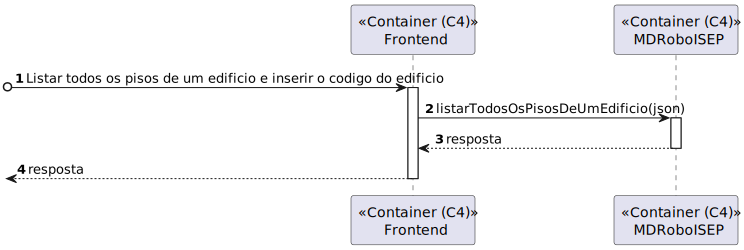

# US 210 - 	Listar todos os pisos de um edifício	


## 1. Context

É a vez primeira que está a ser desenvolvida.

## 2. Requirements

**Main actor**

* N/A

**Interested actors (and why)**

* N/A

**Pre conditions**

* Tem de existir o edificio

**Post conditions**

* Tem de ser listado todos os pisos de um edificio

**Main scenario**
1. Listar todos os pisos de um edificio e inserir o codigo do edificio
2. Sistema retorna uma lista de pisos

**Other scenarios**

**a.** O sistema verifica que o edificio não existe
1. Avisa que o edificio nao existe

## 3. Analysis

Relevant DM excerpt


## 4. Design

### 4.1. Nível 1

#### 4.1.1 Vista de processos


#### 4.1.2 Vista FÍsica

N/A (Não vai adicionar detalhes relevantes)

#### 4.1.3 Vista Lógica


#### 4.1.4 Vista de Implementação

N/A (Não vai adicionar detalhes relevantes)

#### 4.1.5 Vista de Cenarios


### 4.2 Nível 2

#### 4.2.1 Vista de processos



#### 4.2.2 Vista FÍsica


#### 4.2.3 Vista Lógica


#### 4.2.4 Vista de Implementação


### 4.3. Nível 3 

#### 4.3.1 Vista de processos


#### 4.3.2 Vista FÍsica

N/A (Não vai adicionar detalhes relevantes)

#### 4.3.3 Vista Lógica


#### 4.3.4 Vista de Implementação


### 4.4. Tests

**Test 1:** *Teste do PisoController*

```
  it('listarTodosOsPisosDeUmEdificio retorna piso JSON', async function() {
        
        // Arrange
        let body = {
            "codigo": "as1",
        };

        const pisoDTO = {
            id: 1,
            numeroPiso: 1,
            descricaoPiso: "Ola",
        } as IPisoDTO;

        let req: Partial<Request> = {};
        req.body = body;

        let res: Partial<Response> = {
            json: sinon.spy()
        };

        let next: Partial<NextFunction> = () => {};

        let pisoServiceInstance = Container.get("PisoService");

        sinon.stub(pisoServiceInstance, 'listarTodosOsPisosDeUmEdificio').returns(Promise.resolve(Result.ok<IPisoDTO>((pisoDTO))));

        const pisoController = new PisoController(pisoServiceInstance as IPisoService);
        
        // Act
        await pisoController.listarTodosOsPisosDeUmEdificio(<Request>req, <Response>res, <NextFunction>next);

        //Assert
        sinon.assert.calledOnce(res.json);
        sinon.assert.calledWith(res.json, sinon.match({
            id: 1,
            numeroPiso: 1,
            descricaoPiso: "Ola",
        }));
    });

```

**Test 2:** *Teste do PisoService*

```
    it('listarTodosOsPisosDeUmEdificio tem sucesso', async () => {

        let codigo = "ED01";

        let edificioRepoInstance = Container.get("EdificioRepo");
        let pontoRepoInstance = Container.get("PontoRepo");
        let pisoRepoInstance = Container.get("PisoRepo");
        sinon.stub(edificioRepoInstance, "findByDomainId").returns(Promise.resolve(Container.get("edificio")));
        const pisoService = new PisoService(pisoRepoInstance as IPisoRepo,edificioRepoInstance as IEdificioRepo,pontoRepoInstance as IPontoRepo);
        let answer = (await pisoService.listarTodosOsPisosDeUmEdificio(codigo)).getValue();
        expect(answer[0].descricaoPiso).to.equal("Ola");
        expect(answer[0].numeroPiso).to.equal(0);
        expect(answer[0].id).to.equal(1);

    });
```

**Test 3:** *Teste do EdificioRepo*
```
it('findByDomainId deve retornar edificio', async () => {
        let listaPiso : number [] = []; 
        const edificioDTO = {
            codigo : "ED01",
            nome : "Edificio A",
            descricao : "Edificio A",
            dimensaoX: 1,
            dimensaoY: 1,
            piso : listaPiso,
            save() { return this; }
        } as IEdificioPersistence & Document<any, any, any>;

        const edificioSchemaInstance = Container.get("EdificioSchema");
        sinon.stub(edificioSchemaInstance, "findOne").returns(edificioDTO);
        const edificioRepo = new EdificioRepo(edificioSchemaInstance as any);

        const edificio = await EdificioMap.toDomain(edificioDTO);
        const answer = await edificioRepo.findByDomainId(edificioDTO.codigo);

        expect(answer.returnEdificioId()).to.be.equal(edificio.returnEdificioId());
        expect(answer.returnNome()).to.be.equal(edificio.returnNome());
        expect(answer.returnDescricao()).to.be.equal(edificio.returnDescricao());
        expect(answer.returnDimensaoX()).to.be.equal(edificio.returnDimensaoX());
        expect(answer.returnDimensaoY()).to.be.equal(edificio.returnDimensaoY());
        expect(answer.returnListaPisosId()).to.deep.equal(edificio.returnListaPisosId());
    });

```

**Test 4:** *Teste do PisoController + PisoService + EdificioRepo*
```
it('PisoController + PisoService + EdificioRepo listarTodosOsPisosDeUmEdificio retorna piso json', async function() {
    
        // Arrange
        let body = {
            "codigo": "as1",
        };
        let req: Partial<Request> = {};
        req.body = body;
    
        let res: Partial<Response> = {
            json: sinon.spy()
        };
        let next: Partial<NextFunction> = () => {};

        const pisoPersistence = {
            domainID: 1,
            numeroPiso: 1,
            descricaoPiso: "Ola",
            pontos: []
        } as IPisoPersistence;

        const edificioPersistence = {
            codigo : "as1",
            nome : "Edificio A",
            descricao : "Edificio A",
            dimensaoX: 1,
            dimensaoY: 1,
            piso : [1],
        } as IEdificioPersistence ;

        const edificioSchemaInstance = Container.get("EdificioSchema");
        const pisoSchemaInstance = Container.get("PisoSchema");
        sinon.stub(edificioSchemaInstance, "findOne").returns(edificioPersistence);
        sinon.stub(pisoSchemaInstance, "findOne").returns(pisoPersistence);

            
        let pisoServiceInstance = Container.get("PisoService");
        const pisoServiceSpy = sinon.spy(pisoServiceInstance, 'listarTodosOsPisosDeUmEdificio');
        const pisoController = new PisoController(pisoServiceInstance as IPisoService);
                
        // Act
        await pisoController.listarTodosOsPisosDeUmEdificio(<Request>req, <Response>res, <NextFunction>next);
    
        sinon.assert.calledOnce(pisoServiceSpy);
        sinon.assert.calledWith(pisoServiceSpy, "as1");
        sinon.assert.calledOnce(res.json as sinon.SinonSpy);
        sinon.assert.calledWith(res.json as sinon.SinonSpy, [{
            id: 1,
            numeroPiso: 1,
            descricaoPiso: "Ola",
        }]);
        
    });
```
## 5. Observations
N/A