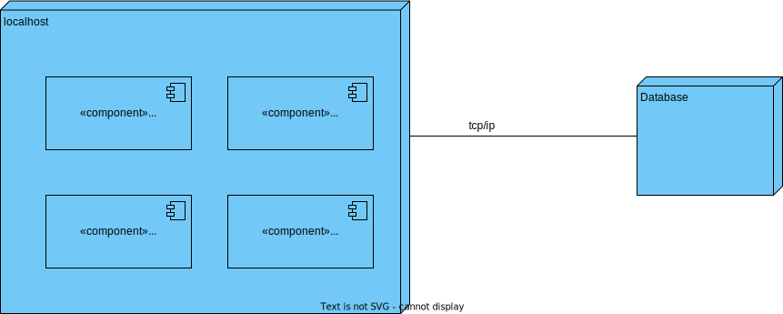

# Documentação de Análise e Design da User Story

- **ID da User Story**: 220 
- **Sprint**: A
- **Responsável**: David Dias

## Índice

1. [Descrição da User Story](#descrição-da-user-story)
2. [Questões relevantes ao cliente](#questões-ao-cliente)
3. [Criterios de Aceitação](#criterios-de-aceitação)  
4. [Requisitos](#requisitos)  
    4.1. [Funcionais](#funcionais)  
    4.2. [Não Funcionais](#não-funcionais)
5. [Padrões Utilizados](#padrões-utilizados)
6. [Design](#design)
7. [Código de Exemplo](#código-de-exemplo)
8. [Testes](#testes)

## Descrição da User Story

> Como um administrador de sistema da gestão do Campus, quero ser capaz de listar pisos de edifícios com passagem para outros edifícios

## Questões ao Cliente

> Questão: Relativamente a esta funcionalidade do sistema, seria expectável incluir informação relativa a onde a(s) passagem(ns) de cada piso vão ter; ou o pretendido é simplesmente ser possível saber quais dos pisos de um dado edifício possuem passagens para outros?

> Resposta: esta listagem deve mostrar a informação sobre o piso (edificio, piso, descrição) e a que outros edificios/pisos tem passagem

## Criterios de Aceitação

- O sistema deve fornecer uma interfaz onde possa visualizar a lista de pisos com passagem para outros edificios, indicando o numero do piso, o edificio associado, a sua descrição e a que pisos está ligada.
- O sistema deve validar se existem edificios, pisos e passagens para outros edificios antes de apresentar a lista.

## Requisitos

### Ator principal

- Administrador de sistema da gestão do Campus

### Atores interessados

- Utilizadores do sistema

### Pré-condições

- Deve existir pelo meenos dois edifícios criados e persistidos no sistema
- Deve existir pelo menos um piso adicionado a cada edificio e persistidos no sistema
- Deve existir um mapa de piso criado para cada piso e este mesmo deve estar persistido no sistema
- Deve existir pelo menos uma passagem entre pisos de edificios diferentes

### Pós-condições

N/A

### Cenário de sucesso principal

1. O administrador seleciona a opção de listar pisos com passagem para outros edificios
2. O sistema apresenta a lista de pisos com passagem para outros edificios

### Cenários alternativos

**2.a.** O administrador seleciona a opção de listar pisos com passagem para outros edificios

1. Ocorre um erro no sistema
2. O sistema informa o administrador que a sala não foi criada com sucesso e mostra o erro

### Funcionais
- RF1: Implementar um método que permita a listagem de pisos com passagem para outros edificios.
- RF2: Implementar um método que permita obter a informação de um piso com passagem para outros edificios (especificamente os edificios).

### Não Funcionais

- RFN1: O sistema deve ser capaz de processar a listagem de pisos com passagem para outros edificios em menos de 10 segundos.

- RFN3: A interface para listar pisos com passagem deve ser intuitiva e requerer não mais do que três etapas para completar a ação.

- RFN4 O sistema tem que ser capaz de processar multiplas requisições de listagem em simultâneo.

- RFN6 A funcionalidade de listagem de pisos com passagem deve ser acessível em diferentes sistemas operativos e navegadores web.

## Padrões Utilizados

### Padrões de Design e Princípios:
- SOLID: Os princípios SOLID serão seguidos para garantir um código orientado a objetos bem projetado e de fácil manutenção.

- GRASP: Os padrões GRASP serão aplicados para melhorar a coesão e reduzir o acoplamento entre os componentes do sistema.

- Gang of Four: Padrões de design clássicos como Factory serão considerados, conforme apropriado, para resolver problemas de design específicos.

### Arquitetura:
- Clean Architecture: Será adotada para separar as responsabilidades e tornar o sistema mais testável e manutenível.

- Onion Architecture: Utilizada em conjunto com a Clean Architecture para garantir que a lógica de domínio seja o centro do design do sistema.

- REST: O estilo arquitetural REST será adotado para expor uma API HTTP que permita a comunicação entre o frontend e o backend.

### Documentação e Modelagem:
- Modelo C4: Utilizado para a documentação arquitetural, facilitando a compreensão da estrutura e do comportamento do sistema tanto para as equipas técnicas quanto para as partes interessadas.

- UML: Utilizado para modelar o design do sistema e facilitar a comunicação.

## Design

A documentação foi estruturada em três níveis de granularidade e quatro vistas diferentes.

### Nivel de Granularidade 1:

#### Vista Lógica: 

Esta vista encontra-se localizada numa pasta mais abrangente, pois é comum a todas as User Stories. 

  
*Vista lógica nível 1 - Diagrama de classes* 

Para ver as imagens com mais detalhe consulte o ficheiro [Nível 1](../N1)


#### Vista de Processo: 

Nesta vista podemos ver a sequência que representa o processo de listagem de pisos com passagem.

  
*Vista de Processos nível 1 - Diagrama de sequência*  

Para ver as imagens com mais detalhe consulte o ficheiro [Nível 1](N1)

#### Vista de Implementação: 

Esta vista é obviada no nível de granularidade 1 pois não é relevante para o design do sistema e não acrescenta valor à documentação.

#### Vista Física: 

Esta vista é obviada no nível de granularidade 1 pois não é relevante para o design do sistema e não acrescenta valor à documentação.

### Nivel de Granularidade 2:

#### Vista Lógica: 

Esta vista encontra-se localizada numa pasta mais abrangente, pois é comum a todas as User Stories. 

  
*Vista lógica nível 2 - Diagrama de classes* 

Para ver as imagens com mais detalhe consulte o ficheiro [Nível 2](../N2)

#### Vista de Processo: 

Nesta vista já encontramos mais informação relevante a esta US em específico, neste caso é a sequência que representa o processo de listagem de pisos com passagem entre o sistema e a base de dados.

  
*Vista de Processos nível 1 - Diagrama de sequência*  

Para ver as imagens com mais detalhe consulte o ficheiro [Nível 2](N2)


#### Vista de Implementação: 

Esta vista encontra-se localizada numa pasta mais abrangente, pois é comum a todas as User Stories.

  
*Vista de Implementação nível 2 - Diagrama de pacotes*   

Para ver as imagens com mais detalhe consulte o ficheiro [Nível 2](N2)

#### Vista Física: 

Esta vista encontra-se localizada numa pasta mais abrangente, pois é comum a todas as User Stories. 

  
*Vista Física nível 2 - Diagrama de deployment*

Para ver as imagens com mais detalhe consulte o ficheiro [Nível 2](../../N2/VL.svg)

### Nivel de Granularidade 3:

#### Vista Lógica: 

Esta vista encontra-se localizada numa pasta mais abrangente, pois é comum a todas as User Stories. 

  
*Vista lógica nível 3 - Diagrama de classes* 

Para ver as imagens com mais detalhe consulte o ficheiro [Nível 3](N3/)

#### Vista de Processo: 

Nesta vista já encontramos mais informação relevante a esta US em específico, neste caso é a sequência que representa o processo de listagem de pisos com passagens entre os diferentes componentes do sistema e a base de dados.

  
*Vista de Processos nível 3 - Diagrama de sequência*  

Para ver as imagens com mais detalhe consulte o ficheiro [Nível 3](N3)

#### Vista de Implementação: 

Esta vista encontra-se localizada numa pasta mais abrangente, pois é comum a todas as User Stories.

  
*Vista de Implementação nível 2 - Diagrama de pacotes*   

Para ver as imagens com mais detalhe consulte o ficheiro [Nível 3](N3)

#### Vista Física: 

Esta vista é obviada no nível de granularidade 3 pois não é relevante para o design do sistema e não acrescenta valor à documentação.

## Código de Exemplo

```typescript
//Código exemplo da camada de Infraestrutura (Route)

const route = Router();

export default (app: Router) => {
  app.use('/passagem', route);

  const ctrl = Container.get(config.controllers.passagem.name) as IPassagemController;

  route.get('/listarPisosComPassagens',
    celebrate({
      body: Joi.object({
      })
    }),
    (req, res, next) => ctrl.listarPisosComPassagens(req, res, next));
}
```

### Camada de Interface

```typescript
//Código exemplo da camada de Interface (Controller)
 public async listarPisosComPassagens(req: Request, res: Response, next: NextFunction) {
    try{
      const passagemOrError = await this.passagemServiceInstance.listarPisosComPassagens();
      if (passagemOrError.isFailure) {
        return res.status(400).json(passagemOrError.errorValue());
      }
      const passagemDTO = passagemOrError.getValue();
      res.status(200);
      return res.json( passagemDTO );
    }catch(e){
      return next(e);
    }
  }
```

### Camada de Aplicação

```typescript
//Código exemplo da camada de AppService (Service)
  public async listarPisosComPassagens(): Promise<Result<IListarPisoComPassagensDTO>> {
        try {

            type Pair<K, V> = {
                first: K;
                second: V;
            };

            let passagemList = await this.passagemRepo.findAll();

            if (passagemList == null) {
                return Promise.resolve(Result.fail<IListarPisoComPassagensDTO>("Não existem passagens"));
            }

            let idPisoSet: Set<number> = new Set();
            let pisoSet: Set<Piso> = new Set();
            let mapPassagemPairPiso: Map<Passagem, Pair<Piso, Piso>> = new Map();

            for (let passagem of passagemList) {
                mapPassagemPairPiso.set(passagem, { first: passagem.props.pisoA, second: passagem.props.pisoB });
            }

            for (let passagem of passagemList) {
                //Colocar só os pisos sem repetir
                idPisoSet.add(Number(passagem.props.pisoA.id.toValue()));
                idPisoSet.add(Number(passagem.props.pisoB.id.toValue()));
                pisoSet.add(passagem.props.pisoA);
                pisoSet.add(passagem.props.pisoB);
            }

            let idPisoList = Array.from(idPisoSet);
            let edificioList: Edificio[] = [];

            for (let piso of idPisoList) {
                //procurar edificio no repo
                let edificio = await this.edificioRepo.findByPiso(piso);
                if (edificio != null) {
                    edificioList.push(edificio);
                }
                else {
                    return Promise.resolve(Result.fail<IListarPisoComPassagensDTO>
                        ("Não existe edificio para o piso com id: " + piso));
                }
            }
            let pisoList = Array.from(pisoSet);
            let pairNumeroIdPisoPairDescricao: Pair<Pair<number, number>, string>[] = [];
        
            for (let piso of pisoList){
                const pair: Pair<Pair<number, number>, string> = {
                    first: {first: piso.returnIdPiso(), second: piso.returnNumeroPiso()},
                    second: piso.props.descricaoPiso.props.descricao.toString()
                  };
                pairNumeroIdPisoPairDescricao.push(pair);
            }

            if (edificioList.length != idPisoList.length) {
                return Promise.resolve(Result.fail<IListarPisoComPassagensDTO>("Não existe edificio para um dos pisos"));
            }
            let edificioPisoPair: Pair<number, Edificio>[] = [];
            for (let index = 0; index < edificioList.length; index++) {
                let pair: Pair<number, Edificio> = {
                    first: idPisoList[index],
                    second: edificioList[index]
                };
                edificioPisoPair.push(pair);
            }

            let passagensDTO: IListarPisoComPassagensDTO;
            passagensDTO = PassagemMap.toListarPisoComPassagensDTO(mapPassagemPairPiso,pairNumeroIdPisoPairDescricao,edificioPisoPair);

            return Promise.resolve(Result.ok<IListarPisoComPassagensDTO>(passagensDTO));
        } catch (e) {
            throw e;
        }
    }
```

## Testes

> Só foram implementados testes de sistema para esta user story. Podem ser consultados na pasta [/tests/postman](/MDRoboISEP/tests/postman/PassagemTest.postman_collection.json)

