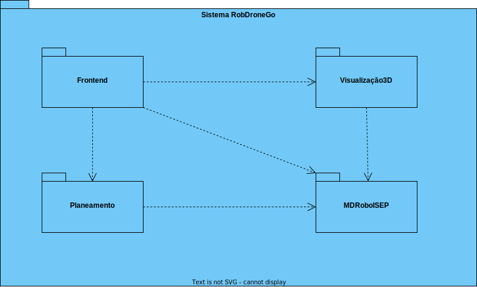

# 230 - Carregar mapa de piso

## 1. Contexto


É a primeira vez que esta US está a ser implementada.

Esta US vai permitir a capacidade de carregar um mapa de um piso com elementos que já existam no piso desejado, mas que não têm localização.
Sendo estes elementos salas, elevador e passagens.

## 2. Requisitos
* 230 - Carregar mapa de piso

## 2. Análise

**Ator Principal**

* N/A

**Atores Interessados (e porquê?)**

* N/A

**Pré-condições**

* Os objetos já devem estar presistidos no sistema para o piso que deseja carregar

**Pós-condições**

* O mapa do piso será persistido

**Cenário Principal**

1. É inserido um ficheiro JSON com as informções do piso
2. O sistema informa do sucesso ou do insucesso
   
### Questões relevantes ao cliente
>**Aluno**</br>Caro cliente,</br>Será possível esclarecer como funcionarão estas user stories? Com a 230 (Carregar mapa do piso) o nosso entendimento foi que as células seriam carregadas já com a criação de salas e pisos, e assim sendo não faria sentido as outras duas user stories, onde é pedido para criar um piso de um edifício e uma sala. Não entendemos o que é pretendido  com as us's 190 e 310.</br>Atentamente,</br>Grupo 63</br></br>**Cliente**</br>boa tarde,</br>o requisito 150 Criar edificio permite criar um edificio, exemplo, edificio "B", com um nome opcional e com uma breve descrição (ex., "departamento de engenharia informática") indicando a dimensão máxima de cada piso em termos de células (ex., 10 x 10)
o requisito 190 Criar piso permite definir um piso para um dos edificios criados anteriormente, por exemplo, o piso 1 do edificio B com uma breve descrição (ex., "salas TP")</br>
o requisito 230 Carregar mapa de piso permite ao utlizador fazer upload de um ficheiro descrevendo o mapa de um dado piso. esse ficheiro deve ser validado se tem a estrutura correta e se obdece ao tamanho máximo definido aquando da criação do edificio</br>
o requisito 310 Criar sala permite definir um sala num dado piso de um edificio, exemplo sala "B310" no 3º piso do edificio B, com uma categorização dessa sala (Gabinete, Anfiteatro, Laboratório, Outro) e uma breve descrição, ex., "Laboratório de Engenharia de Qualidade"</br></br>**Aluno**</br>
Caro cliente,
</br>
Segundo o que já foi respondido no forum para carregar o mapa é necessário que já exista o edifício e o piso. Será necessário também ter os elevadores, as salas e as passagens já criadas?.</br>
Assim dessa forma existiria um ficheiro só com as dimensões para a grelha.
````
Algo do genero:

{
   "floorId":"1",
   "walls":[
        {
         "positionX":0,
         "positionY":0,
         "direction":"Oeste"
      },
      {
         "positionX":0,
         "positionY":1,
         "direction":"Oeste"
      }
   ],
   "rooms":[
      {
         "roomId":"1",
         "dimensions":{
            "positionX":4,
            "positionY":4,
            "width":3,
            "height":2
         }
      },
      {
         "roomId":"2",
         "dimensions":{
            "positionX":0,
            "positionY":0,
            "width":2,
            "height":2
         }
      }
   ],
   "elevator":{
      "elevatorId":"1",
      "positionX":10,
      "positionY":9,
      "direction":"Oeste"
   },
   "halls":[
      {
         "hallId":"1",
         "positionX":10,
         "positionY":6,
         "direction":"Oeste"
      },
      {
         "hallId":"2",
         "positionX":0,
         "positionY":6,
         "direction":"Oeste"
      }
   ]
}
````
>Os melhores cumprimentos,</br>Grupo 002.</br></br>**Cliente**</br>bom dia,</br>
sim, é necessário que essa informação já esteja presente no sistema. quanto ao formato do mapa, será fornecido um projeto exemplo em SGRAI para desenho de labirintos que podme utilizar como base para o módulo de visualização. poderão adaptar o código e o formato de mapa de acordo com o que acharem mais adequado aos requisitos e às vossas decisões de design.


### Excerto Relevante do Domínio


## 3. Design
### 3.1.1 Vista Lógica
**Nível 1**


**Nível 2**


**Nível 3**


### 3.1.2. Vista de Processos

**Nível 1**


**Nível 2**


**Nível 3**


### 3.1.3 Vista de Implementação

**Nível 2**



**Nível 3**


### 3.1.4 Vista Física

**Nível 2**


### 3.1.5 Vista de Cenários
**Nível 1**


### 3.2. Testes

Exemplos testes unitários Service:
````
it('CarregarMapa', async () => {
        let body = {
            "codigoEdificio": "ED01",
            "numeroPiso" : 0,
            "passagens" : [{
                "id": 1,
                "abcissa": 3,
                "ordenada": 2,
                "orientacao": "Norte"
            }],
            "elevador" : {
                "xCoord" : 3,
                "yCoord" : 3,
                "orientacao": "Norte"   
            },
            "salas": [{
                "nome": "B203",
                "abcissaA": 0,
                "ordenadaA": 0,
                "abcissaB": 2,
                "ordenadaB": 2,
                "abcissaPorta" : 1,
                "ordenadaPorta" : 0,
                "orientacaoPorta" : "Norte"
            }]
        }

        let edificioProps : any = {
            nome: Nome.create('ED01 A').getValue(),
            dimensao: Dimensao.create(4,4).getValue(),
            listaPisos: [Container.get('piso5x5Vazio'), Container.get('piso5x5_2')],
        };    
        
        
        let edificio = Edificio.create(edificioProps, Codigo.create(body.codigoEdificio).getValue()).getValue();
        edificio.adicionarElevador(Container.get('elevador'));

        let salaProps : any = {
            piso : edificio.returnListaPisos()[0],
            categoria : Categorizacao.create("Gabinete").getValue(),
            descricao : DescricaoSala.create("B203").getValue(),
            listaPontos : [undefined, undefined],
        }
        let sala = Sala.create(salaProps, NomeSala.create(body.salas[0].nome).getValue()).getValue();

        let edificioRepoInstance = Container.get("EdificioRepo");
        let salaRepoInstance = Container.get("SalaRepo");
        let passagemRepoInstance = Container.get("PassagemRepo");
        let pontoRepoInstance = Container.get("PontoRepo");
        let elevadorRepoInstance = Container.get("ElevadorRepo");

        let passagemProps : any = {
            listaPontos : [undefined, undefined, undefined, undefined],
            pisoA : edificio.returnListaPisos()[0],
            pisoB : Container.get('piso5x5_3'),
        }
        let passagem = Passagem.create(passagemProps, IdPassagem.create(1).getValue()).getValue();

        let pontoStub = Ponto.create({coordenadas: Coordenadas.create({abscissa: 5 , ordenada: 2 }).getValue(),tipoPonto:TipoPonto.create(" ").getValue()},IdPonto.create(1).getValue()).getValue();

        sinon.stub(edificioRepoInstance, 'findByDomainId').returns(Promise.resolve(edificio));
        sinon.stub(salaRepoInstance, 'findSalasByPiso').returns(Promise.resolve([sala]));
        sinon.stub(passagemRepoInstance, 'listarPassagensComUmPiso').returns(Promise.resolve([passagem]));
        sinon.stub(pontoRepoInstance, 'save').returns(Promise.resolve(pontoStub));
        sinon.stub(elevadorRepoInstance, 'save').returns(Promise.resolve(Container.get('elevador')));
        sinon.stub(salaRepoInstance, 'save').returns(Promise.resolve(sala));
        sinon.stub(passagemRepoInstance, 'save').returns(Promise.resolve(passagem));
        

        const pontoService = new PontoService(pontoRepoInstance as IPontoRepo, edificioRepoInstance as IEdificioRepo, elevadorRepoInstance as IElevadorRepo , salaRepoInstance as ISalaRepo, passagemRepoInstance as IPassagemRepo);
        let answer = await pontoService.carregarMapa(body as ICarregarMapaDTO);

        expect(answer.getValue().codigoEdificio).to.equal(body.codigoEdificio);
        expect(answer.getValue().numeroPiso).to.equal(body.numeroPiso);
        expect(answer.getValue().passagens[0].id).to.equal(body.passagens[0].id);
        expect(answer.getValue().passagens[0].abcissa).to.equal(body.passagens[0].abcissa);
        expect(answer.getValue().passagens[0].ordenada).to.equal(body.passagens[0].ordenada);
        expect(answer.getValue().passagens[0].orientacao).to.equal(body.passagens[0].orientacao);
        expect(answer.getValue().elevador.xCoord).to.equal(body.elevador.xCoord);
        expect(answer.getValue().elevador.yCoord).to.equal(body.elevador.yCoord);
        expect(answer.getValue().elevador.orientacao).to.equal(body.elevador.orientacao);
        expect(answer.getValue().salas[0].nome).to.equal(body.salas[0].nome);
        expect(answer.getValue().salas[0].abcissaA).to.equal(body.salas[0].abcissaA);
        expect(answer.getValue().salas[0].ordenadaA).to.equal(body.salas[0].ordenadaA);
        expect(answer.getValue().salas[0].abcissaB).to.equal(body.salas[0].abcissaB);
        expect(answer.getValue().salas[0].ordenadaB).to.equal(body.salas[0].ordenadaB);
        expect(answer.getValue().salas[0].abcissaPorta).to.equal(body.salas[0].abcissaPorta);
        expect(answer.getValue().salas[0].ordenadaPorta).to.equal(body.salas[0].ordenadaPorta);
        expect(answer.getValue().salas[0].orientacaoPorta).to.equal(body.salas[0].orientacaoPorta);
    });

    it('CarregarMapa - Edificio não existe', async () => {
        let body = {
            "codigoEdificio": "ED01",
            "numeroPiso" : 0,
            "passagens" : [{
                "id": 1,
                "abcissa": 3,
                "ordenada": 2,
                "orientacao": "Norte"
            }],
            "elevador" : {
                "xCoord" : 3,
                "yCoord" : 3,
                "orientacao": "Norte"   
            },
            "salas": [{
                "nome": "B203",
                "abcissaA": 0,
                "ordenadaA": 0,
                "abcissaB": 2,
                "ordenadaB": 2,
                "abcissaPorta" : 1,
                "ordenadaPorta" : 0,
                "orientacaoPorta" : "Norte"
            }]
        }


        let edificioRepoInstance = Container.get("EdificioRepo");
        let salaRepoInstance = Container.get("SalaRepo");
        let passagemRepoInstance = Container.get("PassagemRepo");
        let pontoRepoInstance = Container.get("PontoRepo");
        let elevadorRepoInstance = Container.get("ElevadorRepo");

        sinon.stub(edificioRepoInstance, 'findByDomainId').returns(Promise.resolve(null));

        const pontoService = new PontoService(pontoRepoInstance as IPontoRepo, edificioRepoInstance as IEdificioRepo, elevadorRepoInstance as IElevadorRepo , salaRepoInstance as ISalaRepo, passagemRepoInstance as IPassagemRepo);
        let answer = await pontoService.carregarMapa(body as ICarregarMapaDTO);

        expect(answer.isFailure).to.equal(true);
        expect(answer.errorValue()).to.equal("O Edifício que inseriu não existe.");
    });

    it('CarregarMapa - Piso não existe', async () => {
        let body = {
            "codigoEdificio": "ED01",
            "numeroPiso" : 7,
            "passagens" : [{
                "id": 1,
                "abcissa": 3,
                "ordenada": 2,
                "orientacao": "Norte"
            }],
            "elevador" : {
                "xCoord" : 3,
                "yCoord" : 3,
                "orientacao": "Norte"   
            },
            "salas": [{
                "nome": "B203",
                "abcissaA": 0,
                "ordenadaA": 0,
                "abcissaB": 2,
                "ordenadaB": 2,
                "abcissaPorta" : 1,
                "ordenadaPorta" : 0,
                "orientacaoPorta" : "Norte"
            }]
        }

        let edificioProps : any = {
            nome: Nome.create('ED01 A').getValue(),
            dimensao: Dimensao.create(4,4).getValue(),
            listaPisos: [Container.get('piso5x5Vazio'), Container.get('piso5x5_2')],
        };    
        
        
        let edificio = Edificio.create(edificioProps, Codigo.create(body.codigoEdificio).getValue()).getValue();

        let edificioRepoInstance = Container.get("EdificioRepo");
        let salaRepoInstance = Container.get("SalaRepo");
        let passagemRepoInstance = Container.get("PassagemRepo");
        let pontoRepoInstance = Container.get("PontoRepo");
        let elevadorRepoInstance = Container.get("ElevadorRepo");

        sinon.stub(edificioRepoInstance, 'findByDomainId').returns(Promise.resolve(edificio));

        const pontoService = new PontoService(pontoRepoInstance as IPontoRepo, edificioRepoInstance as IEdificioRepo, elevadorRepoInstance as IElevadorRepo , salaRepoInstance as ISalaRepo, passagemRepoInstance as IPassagemRepo);
        let answer = await pontoService.carregarMapa(body as ICarregarMapaDTO);

        expect(answer.isFailure).to.equal(true);
        expect(answer.errorValue()).to.equal("O piso que inseriu não existe.");

    });

    it('CarregarMapa - Passagem não existe', async () => {
        let body = {
            "codigoEdificio": "ED01",
            "numeroPiso" : 0,
            "passagens" : [{
                "id": 1,
                "abcissa": 3,
                "ordenada": 2,
                "orientacao": "Norte"
            }],
            "elevador" : {
                "xCoord" : 3,
                "yCoord" : 3,
                "orientacao": "Norte"   
            },
            "salas": [{
                "nome": "B203",
                "abcissaA": 0,
                "ordenadaA": 0,
                "abcissaB": 2,
                "ordenadaB": 2,
                "abcissaPorta" : 1,
                "ordenadaPorta" : 0,
                "orientacaoPorta" : "Norte"
            }]
        }

        let edificioProps : any = {
            nome: Nome.create('ED01 A').getValue(),
            dimensao: Dimensao.create(4,4).getValue(),
            listaPisos: [Container.get('piso5x5Vazio'), Container.get('piso5x5_2')],
        };    
        
        
        let edificio = Edificio.create(edificioProps, Codigo.create(body.codigoEdificio).getValue()).getValue();
        edificio.adicionarElevador(Container.get('elevador'));

        let salaProps : any = {
            piso : edificio.returnListaPisos()[0],
            categoria : Categorizacao.create("Gabinete").getValue(),
            descricao : DescricaoSala.create("B203").getValue(),
            listaPontos : [undefined, undefined],
        }
        let sala = Sala.create(salaProps, NomeSala.create(body.salas[0].nome).getValue()).getValue();

        let edificioRepoInstance = Container.get("EdificioRepo");
        let salaRepoInstance = Container.get("SalaRepo");
        let passagemRepoInstance = Container.get("PassagemRepo");
        let pontoRepoInstance = Container.get("PontoRepo");
        let elevadorRepoInstance = Container.get("ElevadorRepo");

        let passagemProps : any = {
            listaPontos : [undefined, undefined, undefined, undefined],
            pisoA : edificio.returnListaPisos()[0],
            pisoB : Container.get('piso5x5_3'),
        }
        sinon.stub(edificioRepoInstance, 'findByDomainId').returns(Promise.resolve(edificio));
        sinon.stub(salaRepoInstance, 'findSalasByPiso').returns(Promise.resolve([sala]));
        sinon.stub(passagemRepoInstance, 'listarPassagensComUmPiso').returns(Promise.resolve([]));        

        const pontoService = new PontoService(pontoRepoInstance as IPontoRepo, edificioRepoInstance as IEdificioRepo, elevadorRepoInstance as IElevadorRepo , salaRepoInstance as ISalaRepo, passagemRepoInstance as IPassagemRepo);
        let answer = await pontoService.carregarMapa(body as ICarregarMapaDTO);

        expect(answer.isFailure).to.equal(true);
        expect(answer.errorValue()).to.equal("Não existem passagens que satisfaçam os dados inseridos");
        
    });

    it('CarregarMapa - Elevador não existe', async () => {
        let body = {
            "codigoEdificio": "ED01",
            "numeroPiso" : 0,
            "passagens" : [{
                "id": 1,
                "abcissa": 3,
                "ordenada": 2,
                "orientacao": "Norte"
            }],
            "elevador" : {
                "xCoord" : 3,
                "yCoord" : 3,
                "orientacao": "Norte"   
            },
            "salas": [{
                "nome": "B203",
                "abcissaA": 0,
                "ordenadaA": 0,
                "abcissaB": 2,
                "ordenadaB": 2,
                "abcissaPorta" : 1,
                "ordenadaPorta" : 0,
                "orientacaoPorta" : "Norte"
            }]
        }

        let edificioProps : any = {
            nome: Nome.create('ED01 A').getValue(),
            dimensao: Dimensao.create(4,4).getValue(),
            listaPisos: [Container.get('piso5x5Vazio'), Container.get('piso5x5_2')],
        };    
        
        
        let edificio = Edificio.create(edificioProps, Codigo.create(body.codigoEdificio).getValue()).getValue();

        let edificioRepoInstance = Container.get("EdificioRepo");
        let salaRepoInstance = Container.get("SalaRepo");
        let passagemRepoInstance = Container.get("PassagemRepo");
        let pontoRepoInstance = Container.get("PontoRepo");
        let elevadorRepoInstance = Container.get("ElevadorRepo");

        sinon.stub(edificioRepoInstance, 'findByDomainId').returns(Promise.resolve(edificio));
        
        const pontoService = new PontoService(pontoRepoInstance as IPontoRepo, edificioRepoInstance as IEdificioRepo, elevadorRepoInstance as IElevadorRepo , salaRepoInstance as ISalaRepo, passagemRepoInstance as IPassagemRepo);
        let answer = await pontoService.carregarMapa(body as ICarregarMapaDTO);

        expect(answer.isFailure).to.equal(true);
        expect(answer.errorValue()).to.equal("Não existe elevador neste edifício.");

    });

    it('CarregarMapa - Sala não existe', async () => {
        let body = {
            "codigoEdificio": "ED01",
            "numeroPiso" : 0,
            "passagens" : [{
                "id": 1,
                "abcissa": 3,
                "ordenada": 2,
                "orientacao": "Norte"
            }],
            "elevador" : {
                "xCoord" : 3,
                "yCoord" : 3,
                "orientacao": "Norte"   
            },
            "salas": [{
                "nome": "B203",
                "abcissaA": 0,
                "ordenadaA": 0,
                "abcissaB": 2,
                "ordenadaB": 2,
                "abcissaPorta" : 1,
                "ordenadaPorta" : 0,
                "orientacaoPorta" : "Norte"
            }]
        }

        let edificioProps : any = {
            nome: Nome.create('ED01 A').getValue(),
            dimensao: Dimensao.create(4,4).getValue(),
            listaPisos: [Container.get('piso5x5Vazio'), Container.get('piso5x5_2')],
        };    
        
        
        let edificio = Edificio.create(edificioProps, Codigo.create(body.codigoEdificio).getValue()).getValue();
        edificio.adicionarElevador(Container.get('elevador'));

        let edificioRepoInstance = Container.get("EdificioRepo");
        let salaRepoInstance = Container.get("SalaRepo");
        let passagemRepoInstance = Container.get("PassagemRepo");
        let pontoRepoInstance = Container.get("PontoRepo");
        let elevadorRepoInstance = Container.get("ElevadorRepo");

        sinon.stub(edificioRepoInstance, 'findByDomainId').returns(Promise.resolve(edificio));
        sinon.stub(salaRepoInstance, 'findSalasByPiso').returns(Promise.resolve([]));

        const pontoService = new PontoService(pontoRepoInstance as IPontoRepo, edificioRepoInstance as IEdificioRepo, elevadorRepoInstance as IElevadorRepo , salaRepoInstance as ISalaRepo, passagemRepoInstance as IPassagemRepo);
        let answer = await pontoService.carregarMapa(body as ICarregarMapaDTO);

        expect(answer.isFailure).to.equal(true);
        expect(answer.errorValue()).to.equal("Não existem salas que satisfaçam os dados inseridos");
    });

    it('CarregarMapa - Elevador não serve o piso atual', async () => {
        let body = {
            "codigoEdificio": "ED01",
            "numeroPiso" : 0,
            "passagens" : [{
                "id": 1,
                "abcissa": 3,
                "ordenada": 2,
                "orientacao": "Norte"
            }],
            "elevador" : {
                "xCoord" : 3,
                "yCoord" : 3,
                "orientacao": "Norte"   
            },
            "salas": [{
                "nome": "B203",
                "abcissaA": 0,
                "ordenadaA": 0,
                "abcissaB": 2,
                "ordenadaB": 2,
                "abcissaPorta" : 1,
                "ordenadaPorta" : 0,
                "orientacaoPorta" : "Norte"
            }]
        }

        let edificioProps : any = {
            nome: Nome.create('ED01 A').getValue(),
            dimensao: Dimensao.create(4,4).getValue(),
            listaPisos: [Container.get('piso5x5Vazio'), Container.get('piso5x5_2'), Container.get('piso5x5_3')],
        };    
        
        
        let edificio = Edificio.create(edificioProps, Codigo.create(body.codigoEdificio).getValue()).getValue();
        edificio.adicionarElevador(Container.get('elevadorNaoServePisoAtual'));

        let edificioRepoInstance = Container.get("EdificioRepo");
        let salaRepoInstance = Container.get("SalaRepo");
        let passagemRepoInstance = Container.get("PassagemRepo");
        let pontoRepoInstance = Container.get("PontoRepo");
        let elevadorRepoInstance = Container.get("ElevadorRepo");

        sinon.stub(edificioRepoInstance, 'findByDomainId').returns(Promise.resolve(edificio));

        

        const pontoService = new PontoService(pontoRepoInstance as IPontoRepo, edificioRepoInstance as IEdificioRepo, elevadorRepoInstance as IElevadorRepo , salaRepoInstance as ISalaRepo, passagemRepoInstance as IPassagemRepo);
        let answer = await pontoService.carregarMapa(body as ICarregarMapaDTO);

        expect(answer.isFailure).to.equal(true);
        expect(answer.errorValue()).to.equal("O elevador não serve este piso.");
    });
````
Teste ao controller
````
    it('Carregar mapa retorna carregarMapaDTO', async function(){
        let body = {
            "codigoEdificio": "ED01",
            "numeroPiso" : 0,
            "passagens" : [{
                "id": 1,
                "abcissa": 3,
                "ordenada": 2,
                "orientacao": "Norte"
            }],
            "elevador" : {
                "xCoord" : 3,
                "yCoord" : 3,
                "orientacao": "Norte"   
            },
            "salas": [{
                "nome": "B203",
                "abcissaA": 0,
                "ordenadaA": 0,
                "abcissaB": 2,
                "ordenadaB": 2,
                "abcissaPorta" : 1,
                "ordenadaPorta" : 0,
                "orientacaoPorta" : "Norte"
            }]
        }

        let req: Partial<Request> = {};
        req.body = body;

        let res: Partial<Response> = {
            status: sinon.spy(),
            json: sinon.spy()
        };

        let next: Partial<NextFunction> = () => {};

        let pontoServiceInstance = Container.get("PontoService");
        sinon.stub(pontoServiceInstance, "carregarMapa").returns(Promise.resolve(Result.ok<ICarregarMapaDTO>(body as ICarregarMapaDTO)));

        const pontoController = new PontoController(pontoServiceInstance as IPontoService);
        await pontoController.carregarMapa(req as Request, res as Response, next as NextFunction);

        sinon.assert.calledOnce(res.status as sinon.SinonSpy);
        sinon.assert.calledWith(res.status as sinon.SinonSpy, 201);
        sinon.assert.calledOnce(res.json as sinon.SinonSpy);
        sinon.assert.calledWith(res.json as sinon.SinonSpy, body);
    });
````

Testes de integração
`````
it('PontoController + PontoService carregarMapa', async function(){
        let body = {
            "codigoEdificio": "ED01",
            "numeroPiso" : 0,
            "passagens" : [{
                "id": 1,
                "abcissa": 3,
                "ordenada": 2,
                "orientacao": "Norte"
            }],
            "elevador" : {
                "xCoord" : 3,
                "yCoord" : 3,
                "orientacao": "Norte"   
            },
            "salas": [{
                "nome": "B203",
                "abcissaA": 0,
                "ordenadaA": 0,
                "abcissaB": 2,
                "ordenadaB": 2,
                "abcissaPorta" : 1,
                "ordenadaPorta" : 0,
                "orientacaoPorta" : "Norte"
            }]
        }
        
        console.log(body as ICarregarMapaDTO);
        let req: Partial<Request> = {};
        req.body = body;
        let res: Partial<Response> = {
            status : sinon.spy(),
            json: sinon.spy()
        };
        let next: Partial<NextFunction> = () => {};


        let edificioProps : any = {
            nome: Nome.create('ED01 A').getValue(),
            dimensao: Dimensao.create(4,4).getValue(),
            listaPisos: [Container.get('piso5x5Vazio'), Container.get('piso5x5_2')],
        };   
        
        let edificio = Edificio.create(edificioProps, Codigo.create(body.codigoEdificio).getValue()).getValue();
        edificio.adicionarElevador(Container.get('elevador'));

        let salaProps : any = {
            piso : edificio.returnListaPisos()[0],
            categoria : Categorizacao.create("Gabinete").getValue(),
            descricao : DescricaoSala.create("B203").getValue(),
            listaPontos : [undefined, undefined],
        }
        let sala = Sala.create(salaProps, NomeSala.create(body.salas[0].nome).getValue()).getValue();

        let edificioRepoInstance = Container.get("EdificioRepo");
        let salaRepoInstance = Container.get("SalaRepo");
        let passagemRepoInstance = Container.get("PassagemRepo");
        let pontoRepoInstance = Container.get("PontoRepo");
        let elevadorRepoInstance = Container.get("ElevadorRepo");

        let passagemProps : any = {
            listaPontos : [undefined, undefined, undefined, undefined],
            pisoA : edificio.returnListaPisos()[0],
            pisoB : Container.get('piso5x5Vazio'),
        }
        let passagem = Passagem.create(passagemProps, IdPassagem.create(1).getValue()).getValue();

        let pontoStub = Ponto.create({coordenadas: Coordenadas.create({abscissa: 5 , ordenada: 2 }).getValue(),tipoPonto:TipoPonto.create(" ").getValue()},IdPonto.create(1).getValue()).getValue();


        sinon.stub(edificioRepoInstance, 'findByDomainId').returns(Promise.resolve(edificio));
        sinon.stub(salaRepoInstance, 'findSalasByPiso').returns(Promise.resolve([sala]));
        sinon.stub(passagemRepoInstance, 'listarPassagensComUmPiso').returns(Promise.resolve([passagem]));
        sinon.stub(pontoRepoInstance, 'save').returns(Promise.resolve(pontoStub));
        sinon.stub(elevadorRepoInstance, 'save').returns(Promise.resolve(Container.get('elevador')));
        sinon.stub(salaRepoInstance, 'save').returns(Promise.resolve(sala));
        sinon.stub(passagemRepoInstance, 'save').returns(Promise.resolve(passagem));
        
        let pontoServiceInstance = Container.get("PontoService");
        const pontoController = new PontoController(pontoServiceInstance as IPontoService);
        
        let result = await pontoController.carregarMapa(req as Request, res as Response, next as NextFunction);

        sinon.assert.calledOnce(res.status as sinon.SinonSpy);
        sinon.assert.calledWith(res.status as sinon.SinonSpy, 201);
        sinon.assert.calledOnce(res.json as sinon.SinonSpy);
        sinon.assert.calledWith(res.json as sinon.SinonSpy, body as ICarregarMapaDTO);
    });
``````


## 4. Observations
N/A