# Documentação de Análise e Design da User Story

- **ID da User Story**: 240 
- **Sprint**: A
- **Responsável**: David Dias

## Índice

1. [Descrição da User Story](#descrição-da-user-story)
2. [Questões relevantes ao cliente](#questões-ao-cliente)
3. [Criterios de Aceitação](#criterios-de-aceitação)  
4. [Requisitos](#requisitos)  
    4.1. [Funcionais](#funcionais)  
    4.2. [Não Funcionais](#não-funcionais)
5. [Padrões Utilizados](#padrões-utilizados)
6. [Design](#design)
7. [Código de Exemplo](#código-de-exemplo)
8. [Testes](#testes)

## Descrição da User Story

> Como um administrador de sistema da gestão do Campus, quero ser capaz de criar passagens entre diferentes edifícios para facilitar a circulação de pessoas e o acesso a diferentes serviços ou instalações.

## Questões ao Cliente

> Questão: No mesmo edifício é possível ter duas passagens para outro edifício, em pisos diferentes? Por exemplo, do edifício B existir uma passagem para o edifício G no piso 2 e outra no piso 3 também para o G. 

> Resposta: Sim. Em cada piso podem existir várias passagens, cada uma para outro edificio, e no mesmo edificio podem existir várias passagens para um outro edificio desde que em pisos diferentes 

## Criterios de Aceitação

- O sistema deve fornecer uma interface onde o administrador possa selecionar dois pisos de edificios diferentes que sejam existentes no sistema e criar uma passagem entre eles.
- O sistema deve validar se os pisos selecionados são elegíveis para uma passagem (por exemplo, se existem no sistema ou se não possuem já uma passagem entre si registada).
- O sistema deve permitir que o administrador especifique em que posição está localizada a passagem.
- Uma vez criada, a passagem deve ser visível em qualquer representação gráfica ou listagem.
- O sistema deve fornecer uma opção para o administrador editar passagens existentes.

## Requisitos

### Ator principal

- Administrador de sistema da gestão do Campus

### Atores interessados

- Utilizadores do sistema

### Pré-condições

- Deve existir mais do que um edifício criado e persistido no sistema
- Devem existir pisos adicionados a cada edificio e persistidos no sistema
- Deve existir um mapa de piso criado para cada piso de cada edificio e persistido no sistema

### Pós-condições

- A passagem deve ser persistida no sistema
- A passagem deve ser adicionada ao mapa do piso de origem e destino
- A passagem deve ser adicionada à lista de passagens dos pisos de origem e destino

### Cenário de sucesso principal

1. O administrador seleciona dois pisos de edificios diferentes que sejam existentes no sistema
2. O administrador seleciona a posição da passagem
3. O sistema cria a passagem entre os dois pisos selecionados
4. O sistema informa o administrador que a passagem foi criada com sucesso

### Cenários alternativos

**2.a.** O administrador seleciona dois pisos de edificios diferentes que sejam existentes no sistema e a posição da passagem  

1. O sistema informa o administrador que o edificio selecionado não é elegível para uma passagem

**2.b.** O administrador seleciona dois pisos de edificios diferentes que sejam existentes no sistema e a posição da passagem  

1. O sistema informa o administrador que o piso selecionado não é elegível para uma passagem

**2.c.** O administrador seleciona dois pisos de edificios diferentes que sejam existentes no sistema e a posição da passagem  

1. O sistema informa o administrador que a posição selecionada não é elegível para uma passagem

**2.d.** O administrador seleciona dois pisos de edificios diferentes que não sejam existentes no sistema e a posição da passagem  

1. O sistema informa o administrador que o edificio selecionado não existe no sistema

**2.e.** O administrador seleciona dois pisos de edificios diferentes que não sejam existentes no sistema e a posição da passagem  

1. O sistema informa o administrador que os pisos selecionados não existem no sistema

**2.f.** O administrador seleciona dois pisos de edificios diferentes que não sejam existentes no sistema e a posição da passagem  

1. O sistema informa o administrador que a posição  selecionados não existem no sistema

**2.g.** O administrador seleciona dois pisos de edificios diferentes que sejam existentes no sistema e a posição da passagem

1. O sistema informa o administrador que já existe uma passagem entre os dois pisos selecionados

**2.h.** O administrador seleciona dois pisos de edificios diferentes que sejam existentes no sistema e a posição da passagem

1. Ocorre um erro no sistema
2. O sistema informa o administrador que a passagem não foi criada com sucesso

### Funcionais
- RF1: Implementar um método que permita a criação de uma passagem entre dois pisos de edificios diferentes.
- RF2: Implementar um método que permita a validação de passages existentes no piso 

### Não Funcionais

- RFN1: O sistema deve ser capaz de processar a criação de uma nova passagem em menos de 20 segundos, garantindo uma experiência de usuário ágil.

- RFN2: Apenas administradores autenticados devem ter permissão para criar, editar ou visualizar passagens entre edifícios.

- RFN3: A interface para criar passagens deve ser intuitiva e requerer não mais do que três etapas para completar a ação.

- RFN4 O sistema tem que ser capaz de processar multiplas requisições de criação de passagens em simultâneo.

- RFN5 Todas as transações que envolvem a criação ou edição de passagens devem ser atómicas para manter a integridade dos dados.

- RFN6 A funcionalidade de criação de passagens deve ser acessível em diferentes sistemas operativos e navegadores web.

## Padrões Utilizados

### Padrões de Design e Princípios:
- SOLID: Os princípios SOLID serão seguidos para garantir um código orientado a objetos bem projetado e de fácil manutenção.

- GRASP: Os padrões GRASP serão aplicados para melhorar a coesão e reduzir o acoplamento entre os componentes do sistema.

- Gang of Four: Padrões de design clássicos como Factory serão considerados, conforme apropriado, para resolver problemas de design específicos.

### Arquitetura:
- Clean Architecture: Será adotada para separar as responsabilidades e tornar o sistema mais testável e manutenível.

- Onion Architecture: Utilizada em conjunto com a Clean Architecture para garantir que a lógica de domínio seja o centro do design do sistema.

- REST: O estilo arquitetural REST será adotado para expor uma API HTTP que permita a comunicação entre o frontend e o backend.

### Documentação e Modelagem:
- Modelo C4: Utilizado para a documentação arquitetural, facilitando a compreensão da estrutura e do comportamento do sistema tanto para as equipas técnicas quanto para as partes interessadas.

- UML: Utilizado para modelar o design do sistema e facilitar a comunicação.

## Design

A documentação foi estruturada em três níveis de granularidade e quatro vistas diferentes.

### Nivel de Granularidade 1:

#### Vista Lógica: 

Esta vista encontra-se localizada numa pasta mais abrangente, pois é comum a todas as User Stories. 

  
*Vista lógica nível 1 - Diagrama de classes* 

Para ver as imagens com mais detalhe consulte o ficheiro [Nível 1](../N1)


#### Vista de Processo: 

Nesta vista podemos ver a sequência que representa o processo de criação de uma passagem entre dois pisos de edifícios diferentes.

  
*Vista de Processos nível 1 - Diagrama de sequência*  

Para ver as imagens com mais detalhe consulte o ficheiro [Nível 1](N1)

#### Vista de Implementação: 

Esta vista é obviada no nível de granularidade 1 pois não é relevante para o design do sistema e não acrescenta valor à documentação.

#### Vista Física: 

Esta vista é obviada no nível de granularidade 1 pois não é relevante para o design do sistema e não acrescenta valor à documentação.

### Nivel de Granularidade 2:

#### Vista Lógica: 

Esta vista encontra-se localizada numa pasta mais abrangente, pois é comum a todas as User Stories. 

  
*Vista lógica nível 2 - Diagrama de classes* 

Para ver as imagens com mais detalhe consulte o ficheiro [Nível 2](../N2)

#### Vista de Processo: 

Nesta vista já encontramos mais informação relevante a esta US em específico, neste caso é a sequência que representa o processo de criação de uma passagem entre dois pisos de edifícios diferentes entre o sistema e a base de dados.

  
*Vista de Processos nível 1 - Diagrama de sequência*  

Para ver as imagens com mais detalhe consulte o ficheiro [Nível 2](N2)


#### Vista de Implementação: 

Esta vista encontra-se localizada numa pasta mais abrangente, pois é comum a todas as User Stories.

  
*Vista de Implementação nível 2 - Diagrama de pacotes*   

Para ver as imagens com mais detalhe consulte o ficheiro [Nível 2](N2)

#### Vista Física: 

Esta vista encontra-se localizada numa pasta mais abrangente, pois é comum a todas as User Stories. 

  
*Vista Física nível 2 - Diagrama de deployment*

Para ver as imagens com mais detalhe consulte o ficheiro [Nível 2](../../N2/VL.svg)

### Nivel de Granularidade 3:

#### Vista Lógica: 

Esta vista encontra-se localizada numa pasta mais abrangente, pois é comum a todas as User Stories. 

  
*Vista lógica nível 3 - Diagrama de classes* 

Para ver as imagens com mais detalhe consulte o ficheiro [Nível 3](../N3)

#### Vista de Processo: 

Nesta vista já encontramos mais informação relevante a esta US em específico, neste caso é a sequência que representa o processo de criação de uma passagem entre dois pisos de edifícios diferentes entre os diferentes componentes do sistema e a base de dados.

  
*Vista de Processos nível 3 - Diagrama de sequência*  

Para ver as imagens com mais detalhe consulte o ficheiro [Nível 3](N3)

#### Vista de Implementação: 

Esta vista encontra-se localizada numa pasta mais abrangente, pois é comum a todas as User Stories.

  
*Vista de Implementação nível 2 - Diagrama de pacotes*   

Para ver as imagens com mais detalhe consulte o ficheiro [Nível 3](N3)

#### Vista Física: 

Esta vista é obviada no nível de granularidade 3 pois não é relevante para o design do sistema e não acrescenta valor à documentação.

## Código de Exemplo

### Camada de Infraestrutura 

```typescript
//Código exemplo da camada de Infraestrutura (Route)

const route = Router();

export default (app: Router) => {
  app.use('/passagem', route);

  const ctrl = Container.get(config.controllers.passagem.name) as IPassagemController;

  route.post('',
    celebrate({
      body: Joi.object({
        id: Joi.number().required(),
        codigoEdificioA: Joi.string().required(),
        codigoEdificioB: Joi.string().required(),
        numeroPisoA: Joi.number().required(),
        numeroPisoB: Joi.number().required(),
      })
    }),
    (req, res, next) => ctrl.criarPassagem(req, res, next));
}
```

### Camada de Interface

```typescript
//Código exemplo da camada de Interface (Controller)
 public async criarPassagem(req: Request, res: Response, next: NextFunction) {
    try{
      const passagemOrError = await this.passagemServiceInstance.criarPassagem(req.body as IPassagemDTO) as Result<IPassagemDTO>;
      if (passagemOrError.isFailure) {
        let message = String(passagemOrError.errorValue());
        if (message === "Edificio A não existe" || message === "Edificio B não existe" || message === "Piso A não existe" || message === "Piso B não existe") {
          res.status(404);
          return res.json(passagemOrError.errorValue());
        }
        return res.status(400).json(passagemOrError.errorValue());
      }
      const passagemDTO = passagemOrError.getValue();
      res.status(201);
      return res.json( passagemDTO );
    }catch(e){
      return next(e);
    }
  } 
```

### Camada de Aplicação

```typescript
//Código exemplo da camada de AppService (Service)
public async criarPassagem(passagemDTO: IPassagemDTO): Promise<Result<IPassagemDTO>> {
        try {
            const validacaoResultado = await this.validarDados(passagemDTO);

            if (validacaoResultado.isFailure) {
                return Result.fail<IPassagemDTO>(validacaoResultado.errorValue());
            }

            const { pontoA, pontoB, pontoA1, pontoB1, pisoA, pisoB, id }
                = validacaoResultado.getValue();

            const listaPontosOrErr = [pontoA, pontoA1, pontoB, pontoB1]

            const passagemOrError = await this.criarObjetoPassagem(listaPontosOrErr, pisoA, pisoB, id);
            if (passagemOrError.isFailure) {
                return Result.fail<IPassagemDTO>(passagemOrError.errorValue());
            }

            let okouErro = await this.salvarDados(passagemOrError.getValue());

            if (okouErro.isFailure) {
                return Result.fail<IPassagemDTO>(okouErro.errorValue());
            }

            return Result.ok<IPassagemDTO>(passagemDTO);
        } catch (e) {
            throw e;
        }
    }
```

### Camada de Domínio

```typescript
// Código exemplo da camada de Domínio (Model)

interface PassagemProps {
  listaPontos: Ponto[];
  pisoA: Piso;
  pisoB: Piso;
}

export class Passagem extends AggregateRoot<PassagemProps> {
  private constructor(props: PassagemProps, id: IdPassagem) {
    super(props, id);
  }

  public static create(props: PassagemProps, idPassagem: IdPassagem): Result<Passagem> {
    const guardedProps = [ 
      { argument: props.listaPontos, argumentName: 'listaPontos'},
      { argument: props.pisoA, argumentName: 'pisoA'},
      { argument: props.pisoB, argumentName: 'pisoB' },
    ];

    let guard1 = Guard.arrayHasSpecificLength(guardedProps[0].argument as any[], 4, guardedProps[0].argumentName);
    let guard2 = Guard.againstNullOrUndefined(guardedProps[1].argument, guardedProps[1].argumentName);
    let guard3 = Guard.againstNullOrUndefined(guardedProps[2].argument, guardedProps[2].argumentName);
    
    let guardResult = Guard.combine([guard1,guard2,guard3]);
    //chamar ao ponto uma função que verifica se dois pontos são do mesmo edificio

    if (guardResult.succeeded === false) {
      return Result.fail<Passagem>(guardResult.message);
    } else {
      const passagem = new Passagem({ ...props }, idPassagem);
      return Result.ok<Passagem>(passagem);
    }
  }
}
```

## Testes

### Testes Unitários

```typescript
// Código exemplo de testes unitários
async function newDummyPonto(x: number, y: number, id: number) {
	let idPonto = IdPonto.create(id).getValue();
	let tipoPonto = TipoPonto.create(" ").getValue();
	let coordenadas = Coordenadas.create({ abscissa: x, ordenada: y }).getValue();
	return Ponto.create({ coordenadas: coordenadas, tipoPonto: tipoPonto }, idPonto).getValue();
}
describe('passagem domain', function () {

	it('passagem é criado com sucesso', async function () {
		let idPassagem = IdPassagem.create(1).getValue();
		let pontoArray: Ponto[] = [];
		let ponto = await newDummyPonto(0, 0, 1);
		pontoArray[0] = ponto;
		ponto = await newDummyPonto(1, 1, 2);
		pontoArray[1] = ponto;
		ponto = await newDummyPonto(2, 2, 3);
		pontoArray[2] = ponto;
		ponto = await newDummyPonto(3, 3, 4);
		pontoArray[3] = ponto;

		let pontoMatriz: Ponto[][] = [];
		pontoMatriz[0] = pontoArray;

		let pisoA = Piso.create(
			{
				numeroPiso: NumeroPiso.create(0).getValue(),
				descricaoPiso: DescricaoPiso.create("Ola").getValue(), mapa: pontoMatriz
			},
			IdPiso.create(1).getValue()
		).getValue();

		let pisoB = Piso.create(
			{
				numeroPiso: NumeroPiso.create(0).getValue(),
				descricaoPiso: DescricaoPiso.create("Ola").getValue(), mapa: pontoMatriz
			},
			IdPiso.create(2).getValue()
		).getValue();

		let passagemOuErro = Passagem.create({
			listaPontos: pontoArray,
			pisoA: pisoA,
			pisoB: pisoB,
		}, idPassagem);

		assert.equal(passagemOuErro.isSuccess, true);
	});
```
### Testes de Integração

```typescript
// Código exemplo de testes de integração

it('PassagemController + PassagemService integration test criar passagem', async function () {
        // Arrange	
        let body = {
            "id": 1,
            "codigoEdificioA": "COD1",
            "codigoEdificioB": "COD2",
            "numeroPisoA": 1,
            "numeroPisoB": 2,
        };

        let req: Partial<Request> = {};
        req.body = body;

        let res: Partial<Response> = {
            json: sinon.spy(),
            status: sinon.spy(),
        };

        let next: Partial<NextFunction> = () => { };

        let metadata = {
            id: 1,
            abcissaA: 0,
            ordenadaA: 0,
            abcissaB: 0,
            ordenadaB: 0,
            orientacao: "Norte",
            codigoEdificioA: "COD1",
            codigoEdificioB: "COD2",
            numeroPisoA: 1,
            numeroPisoB: 2,
        }

        let data = await createAllData(metadata.codigoEdificioA, metadata.numeroPisoA, metadata.codigoEdificioB, metadata.numeroPisoB,
            metadata.abcissaA, metadata.ordenadaA, metadata.abcissaB, metadata.ordenadaB);

        const edificioA = data.getValue().edificioA
        const edificioB = data.getValue().edificioB

        let edificioRepo = Container.get("EdificioRepo") as IEdificioRepo;
        let stubRepo = sinon.stub(edificioRepo, 'findByDomainId');
        stubRepo.onCall(0).returns(Promise.resolve(edificioA));
        stubRepo.onCall(1).returns(Promise.resolve(edificioB));
        let passagemRepo = Container.get("PassagemRepo") as IPassagemRepo;
        let stubPassagemRepo = sinon.stub(passagemRepo, 'findByDomainId');
        stubPassagemRepo.onCall(0).returns(null);
        let stubRepo2 = sinon.stub(passagemRepo, 'save');
        stubRepo2.onCall(0).returns(Promise.resolve(Passagem));
        stubRepo2 = sinon.stub(passagemRepo, 'getMaxId');
        stubRepo2.onCall(0).returns(Promise.resolve(1));
        let stubRepoo = sinon.stub(edificioRepo, 'save');
        stubRepoo.onCall(0).returns(Promise.resolve(edificioA));
        stubRepoo.onCall(1).returns(Promise.resolve(edificioB));

        let passagemServiceInstance = Container.get("PassagemService");
        const passagemServiceSpy = sinon.spy(passagemServiceInstance, 'criarPassagem');

        const passagemController = new PassagemController(passagemServiceInstance as IPassagemService);

        // Act
        await passagemController.criarPassagem(<Request>req, <Response>res, <NextFunction>next);

        // Assert
        sinon.assert.calledOnce(res.json as sinon.SinonSpy);
        sinon.assert.calledOnce(res.status as sinon.SinonSpy);
        sinon.assert.calledWith(res.status as sinon.SinonSpy, 201);
        sinon.assert.calledWith(passagemServiceSpy, body as IPassagemDTO);

    });
```

### Testes de Aceitação

```typescript
// Código exemplo de testes de aceitação
 it('Passagem não pode ser criada porque edificio não existe', async () => {

        let body = {
            id: 2,
            codigoEdificioA: "1",
            codigoEdificioB: "2",
            numeroPisoA: 1,
            numeroPisoB: 1,
        }

        let data = await createAllData(body.codigoEdificioA, body.numeroPisoA, body.codigoEdificioB, body.numeroPisoB);

        const edificioA = data.getValue().edificioA
        const edificioB = data.getValue().edificioB

        let edificioRepo = Container.get("EdificioRepo") as IEdificioRepo;
        let stubRepo = sinon.stub(edificioRepo, 'findByDomainId');
        stubRepo.onCall(0).returns(Promise.resolve(edificioA));
        stubRepo.onCall(1).returns(Promise.resolve(null));
        let passagemRepo = Container.get("PassagemRepo") as IPassagemRepo;
        let stubPassagemRepo = sinon.stub(passagemRepo, 'findByDomainId');
        stubPassagemRepo.onCall(0).returns(null);
        let stubRepo2 = sinon.stub(passagemRepo, 'save');
        stubRepo2.onCall(0).returns(Promise.resolve(Passagem));
        stubRepo2 = sinon.stub(passagemRepo, 'getMaxId');
        stubRepo2.onCall(0).returns(Promise.resolve(1));
        let stubRepoo = sinon.stub(edificioRepo, 'save');
        stubRepoo.onCall(0).returns(Promise.resolve(edificioA));
        stubRepoo.onCall(1).returns(Promise.resolve(edificioB));

        const passagemService = new PassagemService(passagemRepo, edificioRepo);

        let answer = await passagemService.criarPassagem(body as IPassagemDTO);

        answer = await passagemService.criarPassagem(body as IPassagemDTO);
        expect(answer.errorValue()).to.equal("Edificio A não existe")
    });

```

### Testes de Sistema

> Pode ver os testes de sistema usando a aplicação Post-Man [aqui](/MDRoboISEP/tests/postman/PassagemTest.postman_collection.json)


