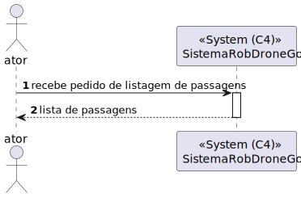
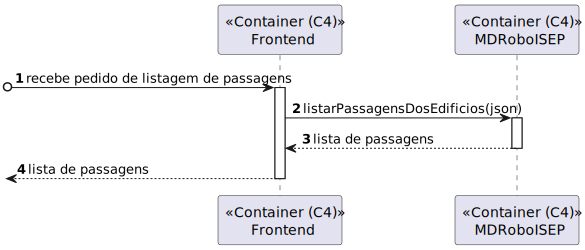
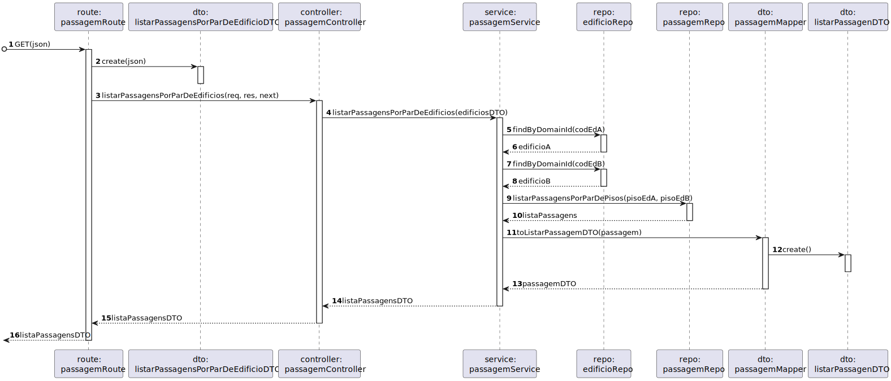
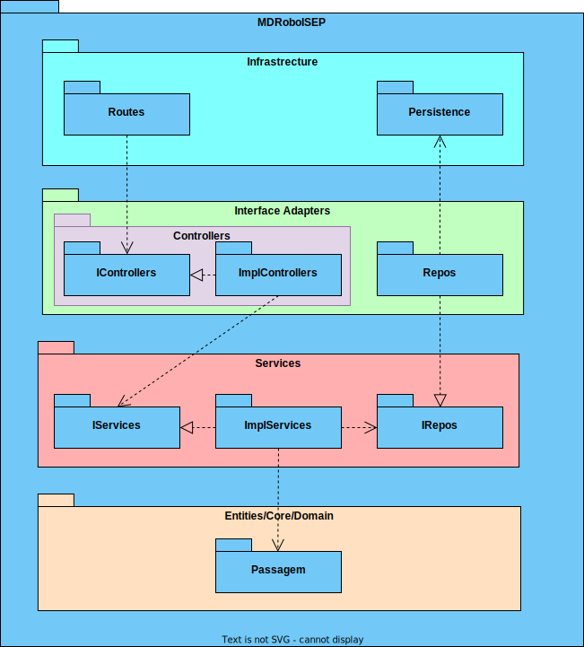

# US 260 - Listar passagens entre 2 Edifícios

## 1. Contexto
É a primeira vez que esta US foi atribuída  
Esta US vai permitir a listar todas as passagens entre 2 edifícios 

## 2. Requisitos

**Ator principal**
N/A

**Atores interessados (e porquê)**
N/A

**Condições anteriores**
* Deve existir pelo menos uma passagem no sistema 

**Condições posteriores**
N/A

**Cenário principal**
1. Sistema recebe um pedido com o par códigos dos edifícios
2. Sistema devolve a lista de passagens entre os dois edifício

**Outros cenários**

**1.a.** Sistema recebe um pedido sem o par de códigos dos edifícios
1. Sistema devolve a lista de passagens entre todos edifício

**1.b.** Sistema recebe um pedido com código(s) inválido(s)
1. Sistema notifica que este problema ocorreu
2. O UC termina.

**Requisitos especiais**
N/A

## 3. Análise

Excerto do modelo de domínio relevante

**Esclarecimentos do cliente:**  

> **Questão:**  
Caro cliente, 
A US 260 (listar passagens entre 2 edifícios) deixou-me com uma dúvida: haverão múltiplas passagens entre 2 edifícios, isto é (por exemplo),  haverá múltiplas passagens entre os edifícios A e B em pisos diferentes ou até no mesmo piso? 
Caso a resposta seja "Sim", surgiram-me as seguintes opções para desenvolver esta US:  
-esta listagem refere-se a uma lista de passagens entre (por exemplo) o edifício A e B;  
-esta listagem refere-se a uma lista de passagens entre todos os edifícios;  
-esta listagem necessita de uma questão ao utilizador para fazer uma das duas opções anteriormente referidas e, após, fazer a listagem.  
Qual destas seria a esperada por si? 
Os melhores cumprimentos, 
Grupo 002.   
**Resposta:**  
Bom dia, 
Sim podem existir várias passagens entre edificios. Por exemplo, no edificio B do ISEP existe uma passagem no piso 2 para o edificio G, uma passagem no piso 3 para o edificio G e uma passagem no piso 3 para o edificio I 
O objetivo deste requisito é permitir consultar quais as passagens existentes entre dois edificios. se nada for indicado devem ser devolvidas todas as passagens entre todos os edificios. se for indicado um par de edificos devem apenas ser devolvidas as passagens entre esses dois edifcios. 
Notem que uma vez que as passagens são bidirecionais, uma passagem entre o edificio B e o I, significa que se pode atravessar de B para I ou de I para B. o par de edificios utilizado para filtrar esta consulta não implica nenyum tipo de restrição no sentido da passagem. 

## 4. Design

### 4.1 Nível 1

#### 4.1.1 Vista Lógica

#### 4.1.2 Vista Processos

#### 4.1.3 Vista Física
N/A (não vai adicionar detalhes relevantes)
#### 4.1.4 Vista Implementação
N/A (não vai adicionar detalhes relevantes)
#### 4.1.5 Vista Cenários

### 4.2 Nível 2

#### 4.2.1 Vista Lógica

#### 4.2.2 Vista Processos

#### 4.2.3 Vista Física

#### 4.2.4 Vista Implementação

#### 4.2.5 Vista Cenários
N/A (não vai adicionar detalhes relevantes)

### 4.3 Nível 3

#### 4.3.1 Vista Lógica

#### 4.3.2 Vista Processos

#### 4.3.3 Vista Física
N/A (não vai adicionar detalhes relevantes)
#### 4.3.4 Vista Implementação

#### 4.3.5 Vista Cenários
N/A (não vai adicionar detalhes relevantes)

### 4.4. Testes

**Teste 1:** O serviço retorna erro quando pelo menos um dos códigos do edifício não é válido  
**Teste 2:** O serviço retorna erro quando não existem passagens  
**Teste 3:** O serviço retorna a lista correta quando são fornecidos 2 códigos válidos  
**Teste 4:** O serviço retorna a lista correta quando não são fornecidos códigos 

## 5. Observações
N/A