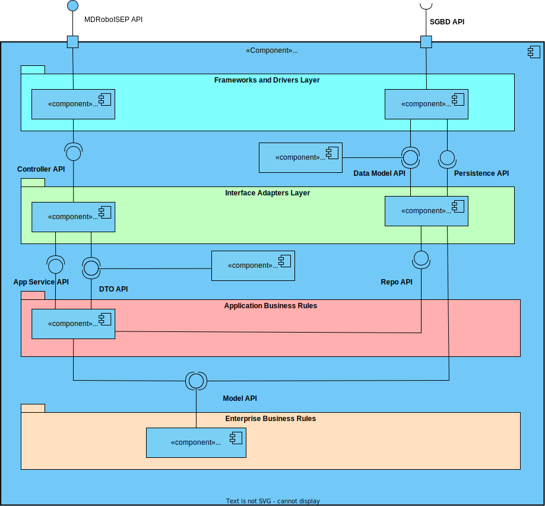

# US 270 - 	Criar um elevador num edifício

## 1. Contexto

É a primeira vez que esta US foi atribuída.  
Esta US vai permitir a criação de um elevador num edifício já existente. 

## 2. Requisitos

**Ator principal**

N/A

**Atores interessados (e porquê)**

N/A

**Condições anteriores**
* Deve existir um edifício criado

**Condições posteriores**
* O elevador deve ser persistido no sistema

**Cenário principal**
1. Sistema recebe a informação necessária para criar o elevador
2. Sistema informa o sucesso da operação

**Outros cenários**

**2.a.** O sistema verifica um dos parâmetros não é válido
1. Sistema notifica que este problema ocorreu
2. O UC termina.

**Requisitos especiais** 
N/A

## 3. Análise

Excerto do modelo de domínio relevante

**Esclarecimentos do cliente:**  

> **Questão:**  
Caro cliente, 
Dentro do ficheiro RFP-LAPR5-2023-2024, este excerto está presente: 
Elevadores de cada piso e sua localização na grelha do mapa: 
• (a, a1, elevador(2, 8, oeste)) 
• … 
Passagens entre piso e sua localização na grelha do mapa: 
• (a, j, a1, j2, passagem(5, 8, oeste)) 
• (a, h, a1, h2, passagem(2, 0, oeste)) 
• … 
São representados os elevadores e as passagens, respetivamente, e dentro de "elevador(...)" ou "passagem(...)" estão indicadas as coordenadas mais a Norte das duas células onde o elevador e as passagens estão presentes (pois estão encostadas lateralmente). 
O elevador e/ou a passagem têm 2 espaços na grelha sempre (no caso de ter o atributo oeste, assumir que há mais uma célula a baixo, e com o atributo norte, assumir que há mais uma célula à direita) ou teremos que mencionar a existência de uma segunda célula numa nova descrição (como, no caso dos elevadores, (a, a1, elevador(2, 8, oeste)) e (a, a1, elevador(3, 8, oeste)))?  
Os melhores cumprimentos, 
Grupo 002   
**Resposta:**  
Boa tarde,  
(...) de um ponto de vista de requisitos o importante é que o utilizador possa definir a localização da passagem ou do elevador (...) de momento podem optar por assumir que as passagens e os elevadores ocupam sempre duas células e que apenas é necessário indicar a célula de "topo" dessas duas

>**Questão:**  
Caro cliente, 
Dentro de uma discussão do fórum, encontrei esta informação quanto ao requisito 280: 
"requisito 280 - editar elevador - todas as informações à exceção do edificio a que o piso se refere" 
Como tal, gostaria de saber que atributos deveria ter o elevador, para além de uma lista de pisos aos quais consegue aceder dentro do seu edifício. Algumas das ideias que me surgiram foram o piso em que estava localizado naquele momento, número de série, fabricante ou descrição. 
Obrigado desde já,  
Grupo 002.   
**Resposta:**  
bom dia, 
edificio (obrigatório) 
número identificativo (obrigatório, único no edificio) 
lista de pisos do edificio servidos pelo elevador (obrigatório) 
marca (opcional, alfanumerico, 50 caracteres) 
modelo (opcional, mas obrigatório se marca for introduzido, alfanumerico, 50 caracteres) 
número de série do fabricante (opcional, alfanumerico, 50 caracteres) 
breve descrição (opcional, alfanumerico, 250 caracteres) 

## 4. Design

### 4.1 Nível 1

#### 4.1.1 Vista Lógica

#### 4.1.2 Vista Processos

#### 4.1.3 Vista Física
N/A (não vai adicionar detalhes relevantes)
#### 4.1.4 Vista Implementação
N/A (não vai adicionar detalhes relevantes)
#### 4.1.5 Vista Cenários

### 4.2 Nível 2

#### 4.2.1 Vista Lógica

#### 4.2.2 Vista Processos

#### 4.2.3 Vista Física

#### 4.2.4 Vista Implementação

#### 4.2.5 Vista Cenários
N/A (não vai adicionar detalhes relevantes)

### 4.3 Nível 3

#### 4.3.1 Vista Lógica

#### 4.3.2 Vista Processos

#### 4.3.3 Vista Física
N/A (não vai adicionar detalhes relevantes)
#### 4.3.4 Vista Implementação

#### 4.3.5 Vista Cenários
N/A (não vai adicionar detalhes relevantes)

### 4.4. Testes

* **Teste 1:** Marca, Modelo, Número de Série e Descrição só podem ter carateres alfanuméricos  
* **Teste 2:** Marca, Modelo, Número de Série têm de ter tamanho menor que 50 carateres  
* **Teste 3:** Descrição tem de ter tamanho menor que 250 carateres  
* **Teste 4:** Se o edifício não exitir serviço retorna erro  
* **Teste 5:** Se os pisos escolhidos não forem válidos serviço retorna erro 

## 5. Observações
N/A