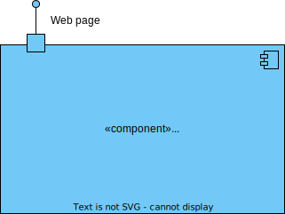
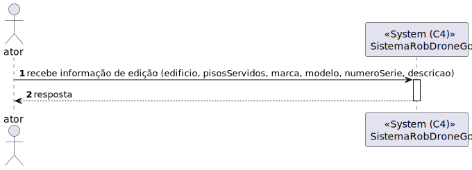
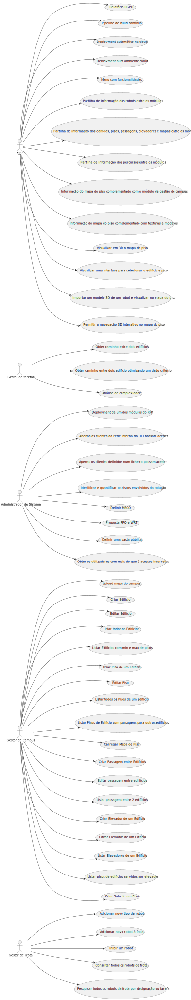
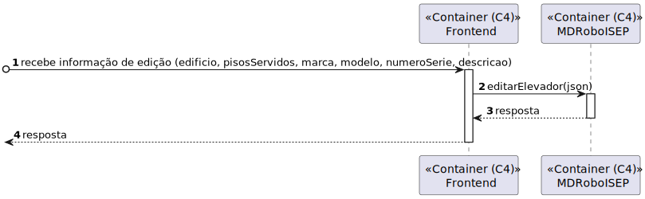
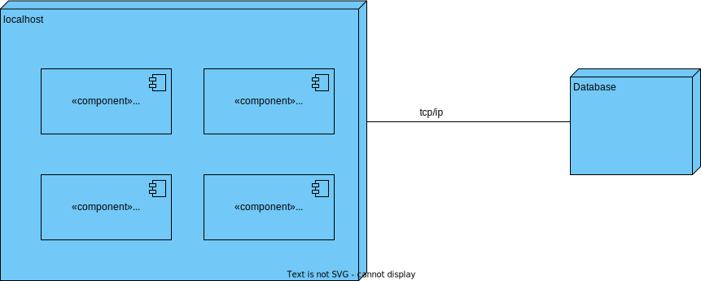
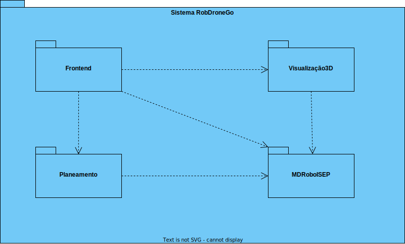
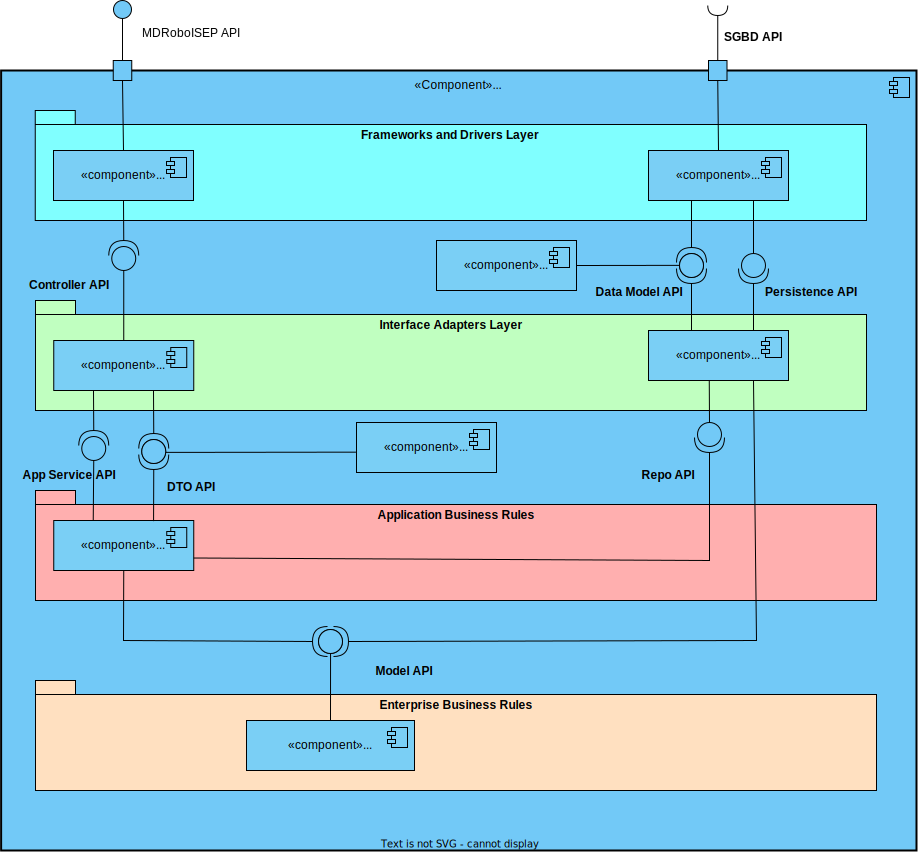
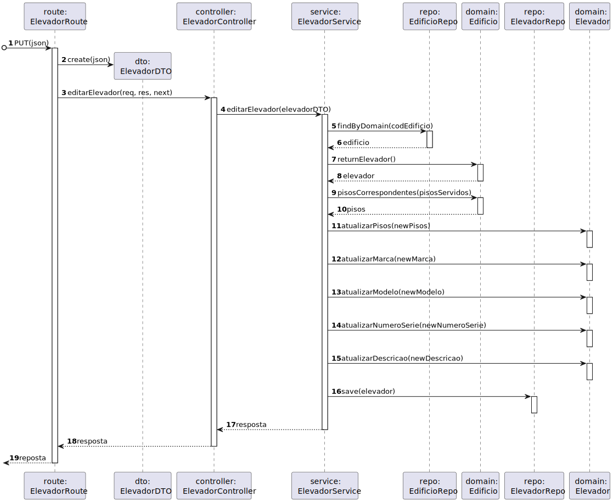
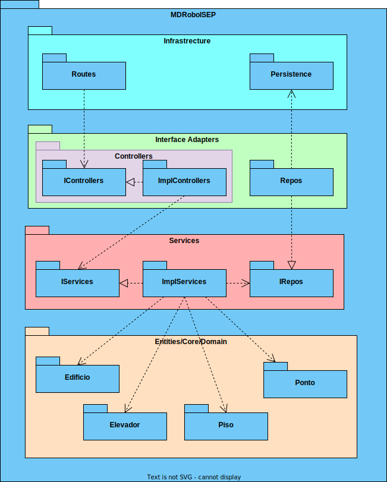

# US 280 - Editar elevador em Edifício

## 1. Contexto

É a primeira vez que esta US foi atribuída.  
Esta US vai permitir a edição dos dados de um elevador já existente. 

## 2. Requisitos

**Ator principal**
N/A

**Atores interessados (e porquê)**
N/A

**Condições anteriores**
* O elevador que se pretende editar já deve existir no sistema

**Condições posteriores**
* As mudanças devem ser persistidas no sistema

**Cenário principal**
1. Sistema recebe o código do edifício do elevador a atualizar e os novos dados
2. Sistema informa o sucesso da operação

**Outros cenários**

**2.a.** O sistema verifica que o elevador não existe
1. Sistema notifica que este problema ocorreu
2. O UC termina.

**2.b.** O sistema verifica um dos parâmetros não é válido
1. Sistema notifica que este problema ocorreu
2. O UC termina.

**Requisitos especiais**
N/A

## 3. Análise

Excerto do modelo de domínio relevante

**Esclarecimentos do cliente:**  
Não foram encontrados esclarecimentos relevantes

## 4. Design

### 4.1 Nível 1

#### 4.1.1 Vista Lógica

#### 4.1.2 Vista Processos

#### 4.1.3 Vista Física
N/A (não vai adicionar detalhes relevantes)
#### 4.1.4 Vista Implementação
N/A (não vai adicionar detalhes relevantes)
#### 4.1.5 Vista Cenários

### 4.2 Nível 2

#### 4.2.1 Vista Lógica

#### 4.2.2 Vista Processos

#### 4.2.3 Vista Física

#### 4.2.4 Vista Implementação

#### 4.2.5 Vista Cenários
N/A (não vai adicionar detalhes relevantes)

### 4.3 Nível 3

#### 4.3.1 Vista Lógica

#### 4.3.2 Vista Processos

#### 4.3.3 Vista Física
N/A (não vai adicionar detalhes relevantes)
#### 4.3.4 Vista Implementação

#### 4.3.5 Vista Cenários
N/A (não vai adicionar detalhes relevantes)

### 4.4. Testes
**Teste 1:** Serviço retorna erro quando o edifício não existe 
**Teste 2:** Serviço retorna erro quando o elevador não existe  
**Teste 3:** Serviço retorna erro quando um dos novos parâmetros não é válido  

## 5. Observações
N/A