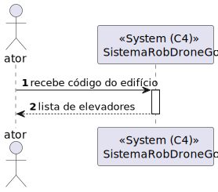
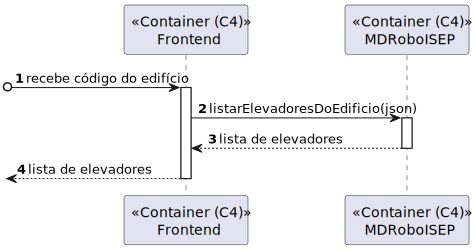
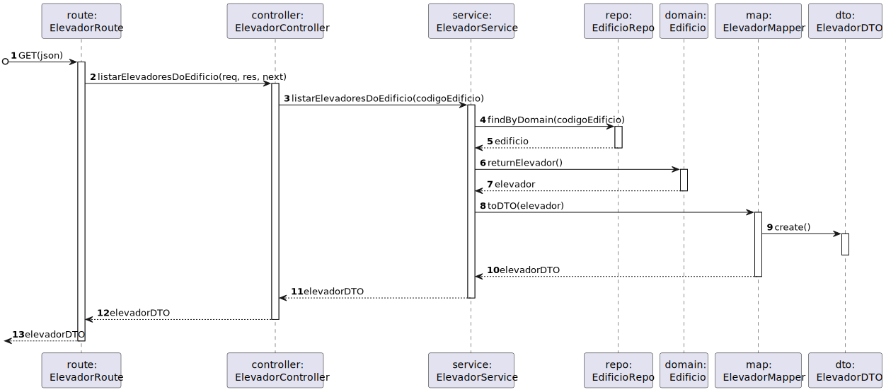
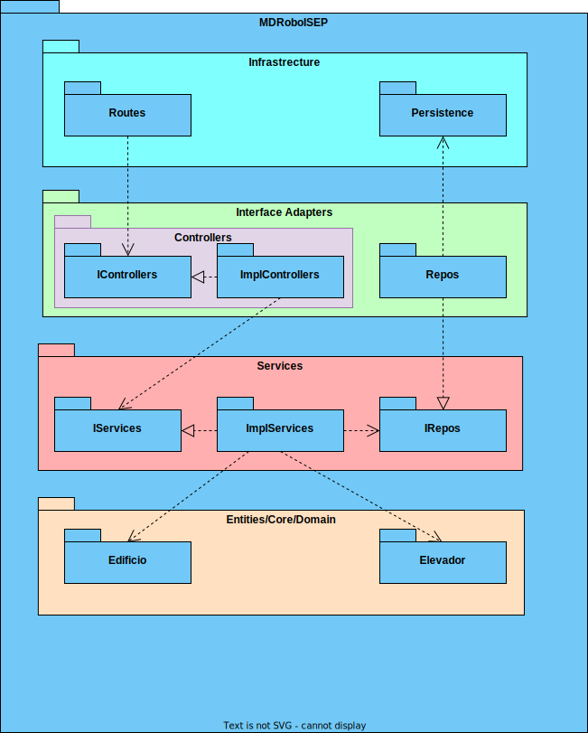

# US 290 - Listar elevadores em Edifício

## 1. Contexto

É a primeira vez que esta US foi atribuída  
Esta US vai permitir listar elevadores de um edifíco 

## 2. Requisitos

**Ator principal**
N/A

**Atores interessados (e porquê)**
N/A

**Condições anteriores**
* Deve existir um edifício com um elevador no sistema

**Condições posteriores**
* N/A

**Cenário principal**
1. Sistema recebe o código do edifício
2. Sistema devolve a lista de elevadores desse edifício

**Outros cenários**

**1.a.** O sistema verifica que o elevador não existe
1. Sistema notifica que este problema ocorreu
2. O UC termina.

**Requisitos especiais**
N/A

## 3. Análise

Excerto do modelo de domínio relevante

**Esclarecimentos do cliente:**  

Não existe nenhum esclarecimento relevante

## 4. Design

### 4.1 Nível 1

#### 4.1.1 Vista Lógica

#### 4.1.2 Vista Processos

#### 4.1.3 Vista Física
N/A (não vai adicionar detalhes relevantes)
#### 4.1.4 Vista Implementação
N/A (não vai adicionar detalhes relevantes)
#### 4.1.5 Vista Cenários

### 4.2 Nível 2

#### 4.2.1 Vista Lógica

#### 4.2.2 Vista Processos

#### 4.2.3 Vista Física

#### 4.2.4 Vista Implementação

#### 4.2.5 Vista Cenários
N/A (não vai adicionar detalhes relevantes)

### 4.3 Nível 3

#### 4.3.1 Vista Lógica

#### 4.3.2 Vista Processos

#### 4.3.3 Vista Física
N/A (não vai adicionar detalhes relevantes)
#### 4.3.4 Vista Implementação

#### 4.3.5 Vista Cenários
N/A (não vai adicionar detalhes relevantes)

### 4.4. Testes

**Teste 1:** O serviço retorna erro quando não existem elevadores  
**Teste 2:** O serviço retorna erro quando não existe o edifício  

## 5. Observações
N/A