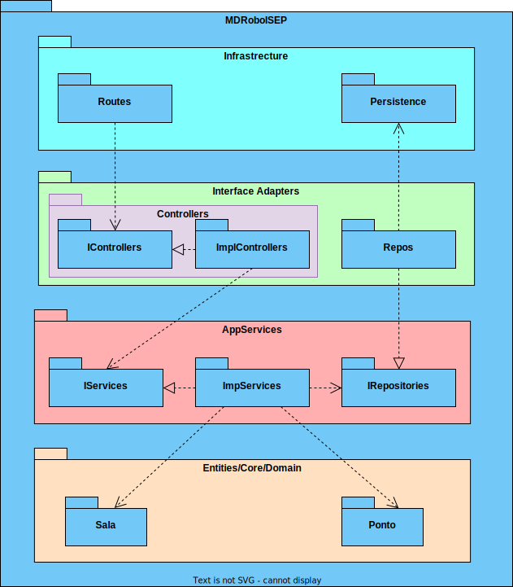

# Documentação de Análise e Design da User Story

- **ID da User Story**: 310 
- **Sprint**: A
- **Responsável**: David Dias

## Índice

1. [Descrição da User Story](#descrição-da-user-story)
2. [Questões relevantes ao cliente](#questões-ao-cliente)
3. [Criterios de Aceitação](#criterios-de-aceitação)  
4. [Requisitos](#requisitos)  
    4.1. [Funcionais](#funcionais)  
    4.2. [Não Funcionais](#não-funcionais)
5. [Padrões Utilizados](#padrões-utilizados)
6. [Design](#design)
7. [Código de Exemplo](#código-de-exemplo)
8. [Testes](#testes)

## Descrição da User Story

> Como um administrador de sistema da gestão do Campus, quero ser capaz de criar uma sala no piso de um edifício para persistir a informação da mesma no sistema.

## Questões ao Cliente

> Questão: Em relação ao requisito 310, para além do que foi dito, devem também ser especificadas as dimensões e posições das salas dentro do piso? Isso ajudaria a evitar a sobreposição de salas com elevadores e até mesmo com outras salas.

> Resposta: O requisito 310 Criar sala permite definir um sala num dado piso de um edificio, exemplo sala "B310" no 3º piso do edificio B, com uma categorização dessa sala (Gabinete, Anfiteatro, Laboratório, Outro) e uma breve descrição, ex., "Laboratório de Engenharia de Qualidade". Essa informação é necessária para o sistema como indicado no RFP. pode ser recolhida ao criar a sala no requisito 310 ou pode fazer parte do ficheiro que é carregado no requisito 230

> Questão: No requisito 310, quando diz "com uma categorização dessa sala (Gabinete, Anfiteatro, Laboratório, Outro)", devemos tratar a categorização como algo que possa ser criado independentemente da sala, para poder ser gerido, como o nível de acesso de um utilizador, ou é apenas informativo e introduzido livremente pelo utilizador?

> Resposta As categorias são de uma lista especifica. neste momento não é necessário existir manutenção dessa lista devendo apenas existir os 4 valores indicados, no entanto será interessante deixarem o sistema "aberto" para essa possibilidade no futuro

> Questão: Em relação aos atributos que definem uma sala, quais são os limites desejados para o seu nome e descrição, existe algum tamanho mínimo para criar uma sala?

> Resposta: nome - max 50 caracteres; descrição - max 250 caracteres; tamanho minimo da sala - 1 célula

> Questão: Deveria o nome da sala ser único?

> Resposta: Sim, o nome da sala deve ser único

> Questão: Relativamente à informação fornecida pelo cliente referente à US310, ele diz "o requisito 310 Criar sala permite definir um sala num dado piso de um edifício, exemplo sala "B310" no 3º piso do edifício B", este nome da sala é suposto ser criado automaticamente uma vez que a sala saberá o piso em que se encontra e o piso sabe o edifício em que está, sendo apenas preciso verificar o número de salas que esse piso já  tem para saber o número da nova sala ou somos nós que introduzimos o nome da sala e colocamos onde queremos conforme o nome que lhe demos?

> Resposta: Esse nome é introduzido pelo utilizador. não existe semantica prédefinida conhecido do sistema


## Criterios de Aceitação

- O sistema deve fornecer uma interface onde o administrador possa selecionar um edificio que sejam existentes no sistema e criar um edificio num piso específico e numa posição específica do edificio.
- O sistema deve validar se o numero de piso selecionados é elegivel para uma sala (por exemplo, se existem no sistema ou se não possuem já uma sala, parede ou passagem registada nessa posição).
- O sistema deve permitir que o administrador especifique em que posição está localizada a sala.
- Uma vez criada, a sala deve ser visível em qualquer representação gráfica ou listagem.
- O sistema deve fornecer uma opção para o administrador editar salas existentes.

## Requisitos

### Ator principal

- Administrador de sistema da gestão do Campus

### Atores interessados

- Utilizadores do sistema

### Pré-condições

- Deve existir pelo menos um edifício criado e persistido no sistema
- Deve existir pelo menos um piso adicionados ao edificio e persistidos no sistema
- Deve existir um mapa de piso criado para o piso selecionado do edificio e este mesmo deve estar persistido no sistema
- Não deve existir uma passagem na mesma localização do mapa do piso em que se pretende criar uma nova sala
- Não deve existir uma parede na mesma localização do mapa do piso em que se pretende criar uma nova sala
- Não deve existir uma porta na mesma localização do mapa do piso em que se pretende criar uma nova sala
- Não deve existir um elevador na mesma localização do mapa do piso em que se pretende criar uma nova sala

### Pós-condições

- A sala deve ser persistida no sistema
- A sala deve ser adicionada ao mapa do piso
- A sala deve ser adicionada à lista de salas do piso

### Cenário de sucesso principal

1. O administrador seleciona um piso de um edificio que seja existente no sistema
2. O administrador seleciona a posição da sala
3. O sistema cria a sala no pisos selecionado
4. O sistema informa o administrador que a sala foi criada com sucesso

### Cenários alternativos

**2.a.** O administrador seleciona um piso de um edificio que ñao seja existente no sistema

1. O sistema informa o administrador que o edificio selecionado não é elegível para uma sala

**2.b.** O administrador seleciona um piso não existente de um edificio que seja existente no sistema 

1. O sistema informa o administrador que o piso selecionado não é elegível para uma sala

**2.c.** O administrador seleciona um piso de um edificio que seja existente no sistema 

1. O sistema informa o administrador que a posição selecionada não é elegível para uma sala

**2.d.** O administrador seleciona um piso de um edificio que seja existente no sistema

1. O sistema informa o administrador que já existe uma sala no piso selecionado

**2.h.** O administrador seleciona um piso de um edificio que seja existente no sistema

1. Ocorre um erro no sistema
2. O sistema informa o administrador que a sala não foi criada com sucesso e mostra o erro

### Funcionais
- RF1: Implementar um método que permita a criação de uma sala num piso do edificio.
- RF2: Implementar um método que permita a validação do piso e a posição selecionada para a criação da sala.
- RF3: Implementar um método que permita a validação da sala.

### Não Funcionais

- RFN1: O sistema deve ser capaz de processar a criação de uma nova sala em menos de 20 segundos, garantindo uma experiência de usuário ágil.

- RFN2: Apenas administradores autenticados devem ter permissão para criar, editar ou visualizar salas entre edifícios.

- RFN3: A interface para criar salas deve ser intuitiva e requerer não mais do que três etapas para completar a ação.

- RFN4 O sistema tem que ser capaz de processar multiplas requisições de criação de sala em simultâneo.

- RFN5 Todas as transações que envolvem a criação ou edição de salas devem ser atómicas para manter a integridade dos dados.

- RFN6 A funcionalidade de criação de salas deve ser acessível em diferentes sistemas operativos e navegadores web.

## Padrões Utilizados

### Padrões de Design e Princípios:
- SOLID: Os princípios SOLID serão seguidos para garantir um código orientado a objetos bem projetado e de fácil manutenção.

- GRASP: Os padrões GRASP serão aplicados para melhorar a coesão e reduzir o acoplamento entre os componentes do sistema.

- Gang of Four: Padrões de design clássicos como Factory serão considerados, conforme apropriado, para resolver problemas de design específicos.

### Arquitetura:
- Clean Architecture: Será adotada para separar as responsabilidades e tornar o sistema mais testável e manutenível.

- Onion Architecture: Utilizada em conjunto com a Clean Architecture para garantir que a lógica de domínio seja o centro do design do sistema.

- REST: O estilo arquitetural REST será adotado para expor uma API HTTP que permita a comunicação entre o frontend e o backend.

### Documentação e Modelagem:
- Modelo C4: Utilizado para a documentação arquitetural, facilitando a compreensão da estrutura e do comportamento do sistema tanto para as equipas técnicas quanto para as partes interessadas.

- UML: Utilizado para modelar o design do sistema e facilitar a comunicação.

## Design

A documentação foi estruturada em três níveis de granularidade e quatro vistas diferentes.

### Nivel de Granularidade 1:

#### Vista Lógica: 

Esta vista encontra-se localizada numa pasta mais abrangente, pois é comum a todas as User Stories. 

  
*Vista lógica nível 1 - Diagrama de classes* 

Para ver as imagens com mais detalhe consulte o ficheiro [Nível 1](../N1)


#### Vista de Processo: 

Nesta vista podemos ver a sequência que representa o processo de criação de uma sala no piso de um edifício.

  
*Vista de Processos nível 1 - Diagrama de sequência*  

Para ver as imagens com mais detalhe consulte o ficheiro [Nível 1](N1/US_310_VP.svg)

#### Vista de Implementação: 

Esta vista é obviada no nível de granularidade 1 pois não é relevante para o design do sistema e não acrescenta valor à documentação.

#### Vista Física: 

Esta vista é obviada no nível de granularidade 1 pois não é relevante para o design do sistema e não acrescenta valor à documentação.

### Nivel de Granularidade 2:

#### Vista Lógica: 

Esta vista encontra-se localizada numa pasta mais abrangente, pois é comum a todas as User Stories. 

  
*Vista lógica nível 2 - Diagrama de classes* 

Para ver as imagens com mais detalhe consulte o ficheiro [Nível 2](../N2)

#### Vista de Processo: 

Nesta vista já encontramos mais informação relevante a esta US em específico, neste caso é a sequência que representa o processo de criação de uma sala no piso de um edifício entre o sistema e a base de dados.

  
*Vista de Processos nível 1 - Diagrama de sequência*  

Para ver as imagens com mais detalhe consulte o ficheiro [Nível 2](N2)


#### Vista de Implementação: 

Esta vista encontra-se localizada numa pasta mais abrangente, pois é comum a todas as User Stories.

  
*Vista de Implementação nível 2 - Diagrama de pacotes*   

Para ver as imagens com mais detalhe consulte o ficheiro [Nível 2](N2)

#### Vista Física: 

Esta vista encontra-se localizada numa pasta mais abrangente, pois é comum a todas as User Stories. 

  
*Vista Física nível 2 - Diagrama de deployment*

Para ver as imagens com mais detalhe consulte o ficheiro [Nível 2](../../N2/VL.svg)

### Nivel de Granularidade 3:

#### Vista Lógica: 

Esta vista encontra-se localizada numa pasta mais abrangente, pois é comum a todas as User Stories. 

  
*Vista lógica nível 3 - Diagrama de classes* 

Para ver as imagens com mais detalhe consulte o ficheiro [Nível 3](/docs/Sprint_A/US_310/N3/US_310_VL.svg)

#### Vista de Processo: 

Nesta vista já encontramos mais informação relevante a esta US em específico, neste caso é a sequência que representa o processo de criação de uma sala no piso de um edifício entre os diferentes componentes do sistema e a base de dados.

  
*Vista de Processos nível 3 - Diagrama de sequência*  

Para ver as imagens com mais detalhe consulte o ficheiro [Nível 3](N3/US_310_VP.svg)

#### Vista de Implementação: 

Esta vista encontra-se localizada numa pasta mais abrangente, pois é comum a todas as User Stories.

  
*Vista de Implementação nível 2 - Diagrama de pacotes*   

Para ver as imagens com mais detalhe consulte o ficheiro [Nível 3](N3/US_310_VI.svg)

#### Vista Física: 

Esta vista é obviada no nível de granularidade 3 pois não é relevante para o design do sistema e não acrescenta valor à documentação.

## Código de Exemplo

### Camada de Infraestrutura 

```typescript
//Código exemplo da camada de Infraestrutura (Route)

const route = Router();

export default (app: Router) => {
  app.use('/passagem', route);

  const ctrl = Container.get(config.controllers.passagem.name) as IPassagemController;

  route.put('/editarPassagens',
    celebrate({
      body: Joi.object({
        id: Joi.number().required(),
        codigoEdificioA: Joi.string().required(),
        codigoEdificioB: Joi.string().required(),
        numeroPisoA: Joi.number().required(),
        numeroPisoB: Joi.number().required(),
      })
    }),
    (req, res, next) => ctrl.editarPassagens(req, res, next));
}
```

### Camada de Interface

```typescript
//Código exemplo da camada de Interface (Controller)
  public async criarSala(req: Request, res: Response, next: NextFunction) {
    try{
      const salaOrError = await this.salaServiceInstance.criarSala(req.body as ISalaDTO) as Result<ISalaDTO>;
      if (salaOrError.isFailure) {
        let message = String(salaOrError.errorValue());
        if (message === "Edificio não existe" || message === "Piso não existe") {
          res.status(404);
          return res.json(salaOrError.errorValue());
        }
        return res.status(400).json(salaOrError.errorValue());
      }
      const salaDTO = salaOrError.getValue();
      res.status(201);
      return res.json( salaDTO );
    }catch(e){
      return next(e);
    }
  }
```

### Camada de Aplicação

```typescript
//Código exemplo da camada de AppService (Service)
    
public async criarSala(salaDTO: ISalaDTO): Promise<Result<ISalaDTO>> {
        try {
            const validacaoResultado = await this.validarDados(salaDTO);

            if (validacaoResultado.isFailure) {
                return Result.fail<ISalaDTO>(validacaoResultado.errorValue());
            }

            let {pontoA, pontoB, piso }
                = validacaoResultado.getValue();

            let listaPontosOrErr: any[] = [];
            listaPontosOrErr[0] = pontoA;
            listaPontosOrErr[1] = pontoB;

            const salaOrError = await this.criarObjetoSala(listaPontosOrErr, salaDTO.categoria, salaDTO.descricao, piso, salaDTO.id);
            if (salaOrError.isFailure) {
                return Result.fail<ISalaDTO>(salaOrError.errorValue());
            }

            let okouErro = await this.salvarDados(salaOrError.getValue());

            if (okouErro.isFailure) {
                return Result.fail<ISalaDTO>(okouErro.errorValue());
            }

            return Result.ok<ISalaDTO>(salaDTO);
        } catch (e) {
            throw e;
        }
    }
```
### Camada de Domínio

```typescript
interface SalaProps {
    categoria: CategorizacaoSala;
    descricao?: DescricaoSala;
    piso: Piso;
    listaPontos: Ponto[];
}

export class Sala extends AggregateRoot<SalaProps> {
  private constructor(props: SalaProps, id: NomeSala) {
    super(props, id);
  }

  public static create(props: SalaProps, idPassagem: NomeSala): Result<Sala> {
    const guardedProps = [
      { argument: props.categoria, argumentName: 'categoria' },
      { argument: props.descricao, argumentName: 'descricao' },
      { argument: props.listaPontos, argumentName: 'listaPontos' },
      { argument: props.piso, argumentName: 'piso' },
    ];

    const guard = Guard.againstNullOrUndefined(guardedProps[0].argument,guardedProps[0].argumentName);
    const guard2 = Guard.againstNullOrUndefined(guardedProps[1].argument,guardedProps[1].argumentName);
    const guard3 = Guard.arrayHasSpecificLength(guardedProps[2].argument as any[], 2, guardedProps[2].argumentName);
    const guard4 = Guard.againstNullOrUndefined(guardedProps[3].argument,guardedProps[3].argumentName);

    let guardResult = Guard.combine([guard,guard2,guard3,guard4]);
    
    if (!guardResult.succeeded) {
      return Result.fail<Sala>(guardResult.message);
    }
    else {
      const sala = new Sala({ ...props }, idPassagem);
      return Result.ok<Sala>(sala);
    }
  }
```

## Testes

> todos os testes podem ser encontrados na pasta [testes](/MDRoboISEP/tests/)