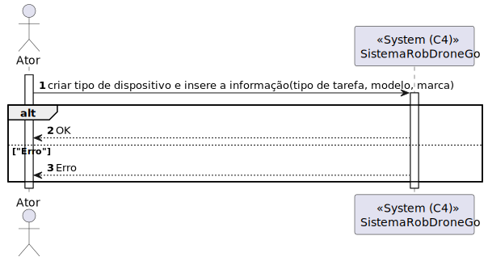
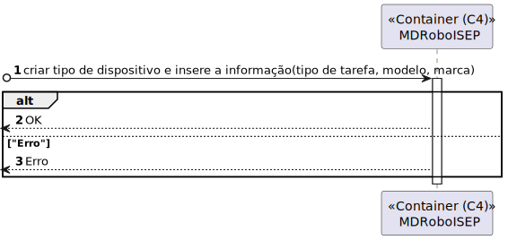
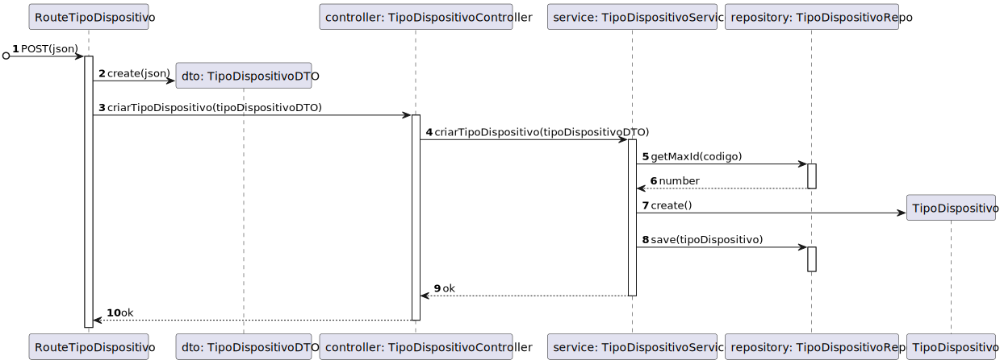
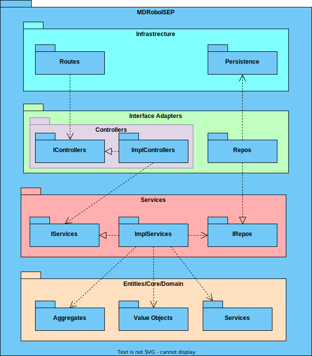

# 350 - Como gestor de frota pretendo adicionar um novo tipo de robot 

## 1. Contexto


É a primeira vez que esta US está a ser desenvolvida.

Esta US cria a funcionalidade de podermos adicionar um novo tipo de robot

## 2. Requisitos
* 350 - Como gestor de frota pretendo adicionar um novo tipo de robot indicando a sua designação e que tipos de tarefas pode executar da lista prédefinida de tarefas

## 2. Análise

**Ator Principal**

* Gestor de frota

**Atores Interessados (e porquê?)**

* Gestor de frota

**Pré-condições**

* N/A

**Pós-condições**

* O tipo de dispositivo será presisitido

**Cenário Principal**

1. É inserida a informação sobre o Tipo de Dispositivo (Tipo de Tarefa, Modelo, Marca)
2. O sistema informa do sucesso ou do insucesso
   
### Questões relevantes ao cliente

>**Aluno:**</br>Bom dia,</br>Relativamente à US350 foi referido numa resposta anterior "o requisito 350 permite definir que tipos de robots existem. por exemplo "Tipo A: Robot marca X modelo Y com capacidade de executar tarefas de vigilância"</br>Pretende alguma regra de negócio para o limite de caracteres para o tipo, marca e modelo?</br>Cumprimentos</br></br>**Cliente:**</br>bom dia,</br></br>tipo de robot: obrigatório, alfanum+ericos, maximo 25 caracteres</br>marca: obrigatório, maximo 50 caracteres</br>modelo: obrigatório, máximo 100 caracteres


>**Aluno:**</br>Olá,</br>pode, por favor, explicar um pouco melhor?
A US 350 (Como gestor de frota pretendo adicionar um novo tipo de robot indicando a sua designação e que tipos de tarefas pode executar da lista prédefinida de tarefas) - adicionar um tipo é indicar qual é a marca, o modelo e as tarefas que pode desempenhar um robot?</br>A US 360 (Como gestor de frota pretendo adicionar um novo robot à frota indicando o seu tipo, designação, etc.) é associar as caracteristicas de um tipo a um robot?
</br>Pode, por favor, clarificar as diferenças entre estas duas US?</br>Obrigada</br>**Cliente:**</br>bom dia,</br>
no requisito 350 definimos tipos de robots e no requisito 360 definimos robots desses tipos.
se ajudar, fica aqui uma analogia.
</br></br>definir tipos de viaturas:
</br> -tipo 1: renault clio 5 portas gasolina
</br>-tipo 2: renault megane 5 portas diesel
</br>
</br>definir viaturas
</br>-viatura com matricula AA-00-01 do tipo 1
</br>-viatura com matricula BB-10-CC do tipo 2


### Excerto Relevante do Domínio


## 3. Design
### 3.1.1 Vista Lógica
**Nível 1**


**Nível 2**


**Nível 3**


### 3.1.2. Vista de Processos
**Nível 1**



**Nível 2**



**Nível 3**


### 3.1.3 Vista de Implementação

**Nível 2**


**Nível 3**



### 3.1.4 Vista Física

**Nível 2**


### 3.1.5 Vista de Cenários


### 3.2. Testes
Exemplos testes unitário de domínio:

````
it('Criação de Tipo de Dispositivo', () => {
        let tipoDispositivoProps : any = {
            tipoTarefa: listaTipoTarefa,
            marca: marca,
            modelo: modelo,
        }
        const tipoDispositivo = TipoDispositivo.create(tipoDispositivoProps,idTipoDispositivo.getValue());
        expect(true).to.equal(tipoDispositivo.isSuccess);
    });

    it('Criação de Tipo de Dispositivo com tipo de tarefa a Null', () => {
        let tipoDispositivoProps : any = {
            tipoTarefa: null,
            marca: marca,
            modelo: modelo,
        };
        const tipoDispositivo = TipoDispositivo.create(tipoDispositivoProps,idTipoDispositivo.getValue());
        expect(false).to.equal(tipoDispositivo.isSuccess);
    });
    it('Criação de Tipo de Dispositivo com tipo de tarefa Undefined', () => {
        let tipoDispositivoProps : any = {
            tipoTarefa: undefined,
            marca: marca,
            modelo: modelo,
        };
        const tipoDispositivo = TipoDispositivo.create(tipoDispositivoProps,idTipoDispositivo.getValue());
        expect(false).to.equal(tipoDispositivo.isSuccess);
    });
    it('Criação de Tipo de Dispositivo com Marca a Null', () => {
        let tipoDispositivoProps : any = {
            tipoTarefa: listaTipoTarefa,
            marca: null,
            modelo: modelo,
        };
        const tipoDispositivo = TipoDispositivo.create(tipoDispositivoProps,idTipoDispositivo.getValue());
        expect(false).to.equal(tipoDispositivo.isSuccess);
    });
    it('Criação de Tipo de Dispositivo com Marca Undefined', () => {
        let tipoDispositivoProps : any = {
            tipoTarefa: listaTipoTarefa,
            marca: undefined,
            modelo: modelo,
        };
        const tipoDispositivo = TipoDispositivo.create(tipoDispositivoProps,idTipoDispositivo.getValue());
        expect(false).to.equal(tipoDispositivo.isSuccess);
    });
    it('Criação de Tipo de Dispositivo com Modelo a Null', () => {
        let tipoDispositivoProps : any = {
            tipoTarefa: listaTipoTarefa,
            marca: marca,
            modelo: null,
        };
        const tipoDispositivo = TipoDispositivo.create(tipoDispositivoProps,idTipoDispositivo.getValue());
        expect(false).to.equal(tipoDispositivo.isSuccess);
    });
    it('Criação de Tipo de Dispositivo com Modelo Undefined', () => {
        let tipoDispositivoProps : any = {
            tipoTarefa: listaTipoTarefa,
            marca: marca,
            modelo: undefined,
        };
        const tipoDispositivo = TipoDispositivo.create(tipoDispositivoProps,idTipoDispositivo.getValue());
        expect(false).to.equal(tipoDispositivo.isSuccess);
    });
````

Exemplos testes unitários de serviço:
````
it('Criar tipo de dispositivo com sucesso', async () => {

        let body = {
            "tipoTarefa": ["Vigilancia"],
            "marca": "as1",
            "modelo": "as1",
        };

        let tipoDispositivoProps = {
            tipoTarefa: [TipoTarefa.create(body.tipoTarefa[0]).getValue()],
            marca: Marca.create(body.marca).getValue(),
            modelo: Modelo.create(body.modelo).getValue(),
        };

        let tipoDispositivoRepoInstance = Container.get("TipoDispositivoRepo");
        let tipoDispositivo = TipoDispositivo.create(tipoDispositivoProps, IdTipoDispositivo.create(3).getValue()).getValue();

        sinon.stub(tipoDispositivoRepoInstance, "getMaxId").returns(Promise.resolve(2));
        sinon.stub(tipoDispositivoRepoInstance, "save").returns(Promise.resolve(tipoDispositivo));

        const tipoDispositivoService = new TipoDispositivoService(tipoDispositivoRepoInstance as ITipoDispositivoRepo);

        let answer = await tipoDispositivoService.criarTipoDispositivo(body as ITipoDispositivoDTO);
        expect(answer.getValue().tipoTarefa[0]).to.equal(body.tipoTarefa[0]);
        expect(answer.getValue().marca).to.equal(body.marca);
        expect(answer.getValue().modelo).to.equal(body.modelo);

    });

    it('Criar tipo de dispositivo com marca incorreta', async () => {
        
        let body = {
            "tipoTarefa": ["Vigilancia"],
            "marca": "_______",
            "modelo": "as1",
        };
        
        let tipoDispositivoRepoInstance = Container.get("TipoDispositivoRepo");

        sinon.stub(tipoDispositivoRepoInstance, "getMaxId").returns(Promise.resolve(2));
        const tipoDispositivoService = new TipoDispositivoService(tipoDispositivoRepoInstance as ITipoDispositivoRepo);
        let answer = await tipoDispositivoService.criarTipoDispositivo(body as ITipoDispositivoDTO);
        expect(answer.errorValue()).to.equal("Erro: A marca tem de ser válida e ter até 50 caratéres.");
    });

    it('Criar tipo de dispositivo com modelo incorreto', async () => {
        
        let body = {
            "tipoTarefa": ["Vigilancia"],
            "marca": "as1",
            "modelo": "_________",
        };
        
        let tipoDispositivoRepoInstance = Container.get("TipoDispositivoRepo");

        sinon.stub(tipoDispositivoRepoInstance, "getMaxId").returns(Promise.resolve(2));
        const tipoDispositivoService = new TipoDispositivoService(tipoDispositivoRepoInstance as ITipoDispositivoRepo);
        let answer = await tipoDispositivoService.criarTipoDispositivo(body as ITipoDispositivoDTO);
        expect(answer.errorValue()).to.equal("Erro: O modelo tem de ser válido e ter até 100 caratéres.");
    });

    it('Criar tipo de dispositivo com tipo de tarefa incorreto', async () => {
        let body = {
            "tipoTarefa" : ["Erro"],
            "marca": "as1",
            "modelo": "as1"
        };

        let tipoDispositivoRepoInstance = Container.get("TipoDispositivoRepo");

        sinon.stub(tipoDispositivoRepoInstance, "getMaxId").returns(Promise.resolve(2));
        const tipoDispositivoService = new TipoDispositivoService(tipoDispositivoRepoInstance as ITipoDispositivoRepo);
        let answer = await tipoDispositivoService.criarTipoDispositivo(body as ITipoDispositivoDTO);
        expect(answer.errorValue()).to.equal("Erro: O tipo de tarefa não é válido.");
    });
````

Exemplo testes unitários de repositório:
````
    it('Exists deve retornar true se o tipo de dispositivo existir', async () => {
        const tipoDispositivoDTO = {
            idTipoDispositivo : 1,
            tipoTarefa : ["Vigilancia"],
            marca : "as1",
            modelo : "as1",
        } as ITipoDispositivoPersistence

        const tipoDispositivoSchemaInstance = Container.get("TipoDispositivoSchema");

        sinon.stub(tipoDispositivoSchemaInstance, "findOne").returns(tipoDispositivoDTO as ITipoDispositivoPersistence);
        const tipoDispositivoRepo = new TipoDispositivoRepo(tipoDispositivoSchemaInstance as any);
        const answer = await tipoDispositivoRepo.exists(await TipoDispositivoMap.toDomain(tipoDispositivoDTO));
        expect(answer).to.be.true;
    });

    it('Save deve retornar tipo de dispositivo', async () => {
        const tipoDispositivoDTO = {
            idTipoDispositivo : 1,
            tipoTarefa : ["Vigilancia"],
            marca : "as1",
            modelo : "as1",
        } as ITipoDispositivoPersistence
        const tipoDispositivoSchemaInstance = Container.get("TipoDispositivoSchema");
        sinon.stub(tipoDispositivoSchemaInstance, "findOne").returns(null);
        sinon.stub(tipoDispositivoSchemaInstance, "create").returns(tipoDispositivoDTO as ITipoDispositivoPersistence);
        const tipoDispositivoRepo = new TipoDispositivoRepo(tipoDispositivoSchemaInstance as any);
        const tipoDispositivo = await TipoDispositivoMap.toDomain(tipoDispositivoDTO);
        const answer = await tipoDispositivoRepo.save(tipoDispositivo);
        expect(answer.id.toValue()).to.be.equal(tipoDispositivo.id.toValue());
        expect(answer.returnMarca()).to.be.equal(tipoDispositivo.returnMarca());
        expect(answer.returnModelo()).to.be.equal(tipoDispositivo.returnModelo());
        expect(answer.returnTipoTarefa()).to.deep.equal(tipoDispositivo.returnTipoTarefa());
    });

    it('Save deve retornar tipo dispositivo ao dar update', async () => {
        const tipoDispositivoDTO1 = {
            idTipoDispositivo : 1,
            tipoTarefa : ["Vigilancia"],
            marca : "as1",
            modelo : "as1",
            save() {return this;}
        } as ITipoDispositivoPersistence

        const tipoDispositivoDTO2 = {
            idTipoDispositivo : 1,
            tipoTarefa : ["Vigilancia"],
            marca : "as2",
            modelo : "as2",
        } as ITipoDispositivoPersistence
        const tipoDispositivoSchemaInstance = Container.get("TipoDispositivoSchema");
        sinon.stub(tipoDispositivoSchemaInstance, "findOne").returns(tipoDispositivoDTO1 as ITipoDispositivoPersistence);
        const tipoDispositivoRepo = new TipoDispositivoRepo(tipoDispositivoSchemaInstance as any);
        const tipoDispositivo = await TipoDispositivoMap.toDomain(tipoDispositivoDTO2);
        const answer = await tipoDispositivoRepo.save(tipoDispositivo);
        expect(answer.id.toValue()).to.be.equal(tipoDispositivo.id.toValue());
        expect(answer.returnMarca()).to.be.equal(tipoDispositivo.returnMarca());
        expect(answer.returnModelo()).to.be.equal(tipoDispositivo.returnModelo());
        expect(answer.returnTipoTarefa()).to.deep.equal(tipoDispositivo.returnTipoTarefa());
    });

    it('FindByDomainId deve retornar tipo dispositivo', async () => {
        const tipoDispositivoDTO = {
            idTipoDispositivo : 1,
            tipoTarefa : ["Vigilancia"],
            marca : "as1",
            modelo : "as1",
        } as ITipoDispositivoPersistence
        const tipoDispositivoSchemaInstance = Container.get("TipoDispositivoSchema");
        sinon.stub(tipoDispositivoSchemaInstance, "findOne").returns(tipoDispositivoDTO as ITipoDispositivoPersistence);
        const tipoDispositivoRepo = new TipoDispositivoRepo(tipoDispositivoSchemaInstance as any);
        const answer = await tipoDispositivoRepo.findByDomainId(tipoDispositivoDTO.idTipoDispositivo);
        expect(answer.id.toValue()).to.be.equal(tipoDispositivoDTO.idTipoDispositivo);
        expect(answer.returnMarca()).to.be.equal(tipoDispositivoDTO.marca);
        expect(answer.returnModelo()).to.be.equal(tipoDispositivoDTO.modelo);
        expect(answer.returnTipoTarefa()).to.deep.equal(tipoDispositivoDTO.tipoTarefa);
    });

    it('FindByDomainId deve retornar null se não encontrar nada', async () => {
        const tipoDispositivoDTO = {
            idTipoDispositivo : 1,
            tipoTarefa : ["Vigilancia"],
            marca : "as1",
            modelo : "as1",
        } as ITipoDispositivoPersistence
        const tipoDispositivoSchemaInstance = Container.get("TipoDispositivoSchema");
        sinon.stub(tipoDispositivoSchemaInstance, "findOne").returns(null);
        const tipoDispositivoRepo = new TipoDispositivoRepo(tipoDispositivoSchemaInstance as any);
        const answer = await tipoDispositivoRepo.findByDomainId(tipoDispositivoDTO.idTipoDispositivo);
        expect(answer).to.be.equal(null);
    });

    it('getMaxId se não encontrar nada deve retornar 0', async () => {
        const tipoDispositivoSchemaInstance = Container.get("TipoDispositivoSchema");
        sinon.stub(tipoDispositivoSchemaInstance, "find").returns(0);
        const tipoDispositivoRepo = new TipoDispositivoRepo(tipoDispositivoSchemaInstance as any);
        const answer = await tipoDispositivoRepo.getMaxId();
        expect(answer).to.be.equal(0);
    });

    it('get maxId deve retornar o id maximo', async () => {
        const tipoDispositivoDTO = {
            idTipoDispositivo : 1,
            tipoTarefa : ["Vigilancia"],
            marca : "as1",
            modelo : "as1",
        } as ITipoDispositivoPersistence

        const tipoDispositivoDTO2 = {
            idTipoDispositivo : 2,
            tipoTarefa : ["Vigilancia"],
            marca : "as2",
            modelo : "as2",
        } as ITipoDispositivoPersistence
        const tipoDispositivoSchemaInstance = Container.get("TipoDispositivoSchema");
        sinon.stub(tipoDispositivoSchemaInstance, "find").returns([tipoDispositivoDTO, tipoDispositivoDTO2]);
        const tipoDispositivoRepo = new TipoDispositivoRepo(tipoDispositivoSchemaInstance as any);
        const answer = await tipoDispositivoRepo.getMaxId();
        expect(answer).to.be.equal(2);
    });
````

Exemplo de teste unitário de controller:
````
it('Criar Tipo de Dispositivo retorna JSON', async function() {
        // Arrange
        let body = {
            "tipoTarefa": ["Vigilancia"],
            "marca": "as1",
            "modelo": "as1",
        };

        let req: Partial<Request> = {};
        req.body = body;

        let res: Partial<Response> = {
            json: sinon.spy()
        };

        let next: Partial<NextFunction> = () => {};
        let tipoDispositivoService = Container.get("TipoDispositivoService");
        sinon.stub(tipoDispositivoService, "criarTipoDispositivo").returns(Promise.resolve(Result.ok<ITipoDispositivoDTO>(body as ITipoDispositivoDTO)));

        let tipoDispositivoController = new TipoDispositivoController(tipoDispositivoService as ITipoDispositivoService);
        // Act
        await tipoDispositivoController.criarTipoDispositivo(<Request>req, <Response>res, <NextFunction>next);

        // Assert
        sinon.assert.calledOnce(res.json as sinon.SinonSpy);
        sinon.assert.calledWith(res.json as sinon.SinonSpy, sinon.match.any);
    });
````

Exemplo de testes de intergração:
````
it('TipoDispositivoController + TipoDispositivoService teste de integração ao método criarTipoDispositivo', async function() {
        let body = {
            "tipoTarefa": ["Vigilancia"],
            "marca": "as1",
            "modelo": "as1",
        };
        let req: Partial<Request> = {};
        req.body = body;
        let res: Partial<Response> = {
            json: sinon.spy()
        };
        let next: Partial<NextFunction> = () => {};

        let tipoDispositivoProps = {
            tipoTarefa: [TipoTarefa.create(body.tipoTarefa[0]).getValue()],
            marca: Marca.create(body.marca).getValue(),
            modelo: Modelo.create(body.modelo).getValue(),
        };

        const tipoDispositivo = TipoDispositivo.create(tipoDispositivoProps, IdTipoDispositivo.create(1).getValue()).getValue();

        let tipoDispositivoService = Container.get("TipoDispositivoService");
        const tipoDispositivoServiceSpy = sinon.spy(tipoDispositivoService, 'criarTipoDispositivo');

        let tipoDispositivoRepo = Container.get("TipoDispositivoRepo");

        sinon.stub(tipoDispositivoRepo, "getMaxId").returns(Promise.resolve(0));
        sinon.stub(tipoDispositivoRepo, "save").returns(Promise.resolve(tipoDispositivo));

        let tipoDispositivoController = new TipoDispositivoController(tipoDispositivoService as ITipoDispositivoService);
        await tipoDispositivoController.criarTipoDispositivo(<Request>req, <Response>res, <NextFunction>next);


        sinon.assert.calledOnce(tipoDispositivoServiceSpy);
        sinon.assert.calledWith(tipoDispositivoServiceSpy, body);
        sinon.assert.calledOnce(res.json as sinon.SinonSpy);
        sinon.assert.calledWith(res.json as sinon.SinonSpy, body);
    });

    it('TipoDispositivoController + TipoDispositivoService + TipoDispositivoRepo teste de integração ao método criarTipoDispositivo', async function() {
        let body = {
            "tipoTarefa": ["Vigilancia"],
            "marca": "as1",
            "modelo": "as1",
        };
        let req: Partial<Request> = {};
        req.body = body;
        let res: Partial<Response> = {
            json: sinon.spy()
        };
        let next: Partial<NextFunction> = () => {};

        const tipoDispositivoPeristence = {
            idTipoDispositivo: 1,
            tipoTarefa: [body.tipoTarefa[0]],
            marca: body.marca,
            modelo: body.modelo,
        }

        let tipoDispositivoService = Container.get("TipoDispositivoService");
        let tipoDispositivoServiceSpy = sinon.spy(tipoDispositivoService, 'criarTipoDispositivo');
        let tipoDispositivoRepo = Container.get("TipoDispositivoRepo");
        let tipoDispositivoSchema = Container.get("TipoDispositivoSchema");

        sinon.stub(tipoDispositivoSchema, "find").returns(Promise.resolve([]));
        sinon.stub(tipoDispositivoSchema, "findOne").returns(Promise.resolve(null));
        sinon.stub(tipoDispositivoSchema, "create").returns(Promise.resolve(tipoDispositivoPeristence));

        let tipoDispositivoController = new TipoDispositivoController(tipoDispositivoService as ITipoDispositivoService);
        await tipoDispositivoController.criarTipoDispositivo(<Request>req, <Response>res, <NextFunction>next);

        sinon.assert.calledOnce(tipoDispositivoServiceSpy);
        sinon.assert.calledWith(tipoDispositivoServiceSpy, body);
        sinon.assert.calledOnce(res.json as sinon.SinonSpy);
        sinon.assert.calledWith(res.json as sinon.SinonSpy, body);
    });
````

## 4. Implementação
Alguns exemplos de implementação:
````
    public async criarTipoDispositivo(tipoDispositivoDTO: ITipoDispositivoDTO): Promise<Result<ITipoDispositivoDTO>> {
        try{
            const maxId = await this.tipoDispositivoRepo.getMaxId();                                 // criação do id
            const idOrError = IdTipoDispositivo.create(maxId + 1);
            const marcaOrError = Marca.create(tipoDispositivoDTO.marca);                    
            const modeloOrError = Modelo.create(tipoDispositivoDTO.modelo);
            let tipoTarefaLista : TipoTarefa[] = [];                                        
            for(let i = 0; i < tipoDispositivoDTO.tipoTarefa.length; i++){
                let tipoTarefaOrError = TipoTarefa.create(tipoDispositivoDTO.tipoTarefa[i]);    // criação dos value objects e verificar se estão corretos
                if(tipoTarefaOrError.isFailure){                                                    
                    return Result.fail<ITipoDispositivoDTO>(tipoTarefaOrError.errorValue());
                }
                tipoTarefaLista.push(tipoTarefaOrError.getValue());
            }
            const orErrorList : any [] = [idOrError,marcaOrError,modeloOrError];
            for(let i = 0; i < orErrorList.length; i++){
                if(orErrorList[i].isFailure){                                                       // se não estiverem corretos retorna o erro
                    return Result.fail<ITipoDispositivoDTO>(orErrorList[i].errorValue());
                }
            }
            const tipoDispositivoOrError = TipoDispositivo.create({
                tipoTarefa: tipoTarefaLista,
                marca: marcaOrError.getValue(),                                                         // criação do tipo de dispositivo
                modelo: modeloOrError.getValue()
            },idOrError.getValue());

            if(tipoDispositivoOrError.isFailure){
                return Result.fail<ITipoDispositivoDTO>(tipoDispositivoOrError.errorValue());           // verificar se o tipo de dispositivo foi criado com sucesso
            }
            const tipoDispositivo = tipoDispositivoOrError.getValue();
            await this.tipoDispositivoRepo.save(tipoDispositivo);
            return Result.ok<ITipoDispositivoDTO>(tipoDispositivoDTO);

        }catch(e){
            throw e;
        }
    }
````

## 5. Observations
N/A