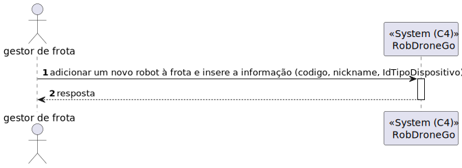
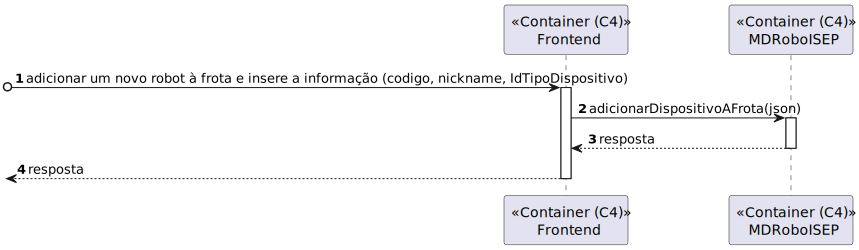
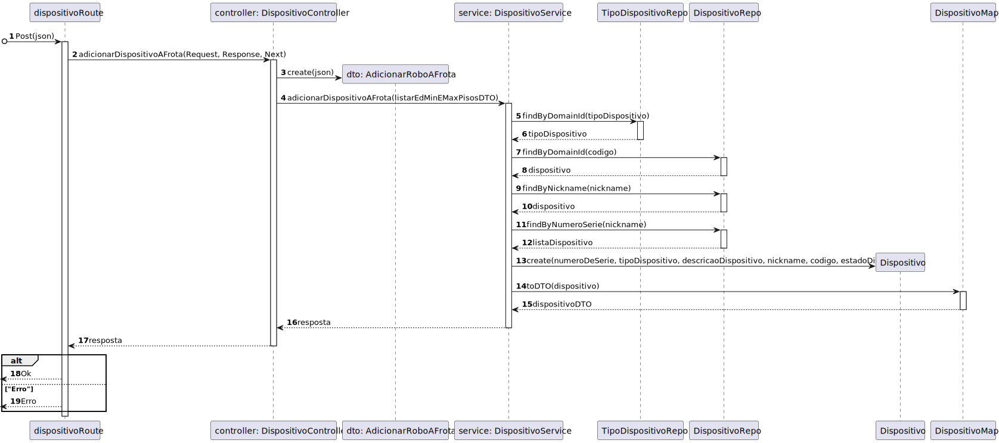

# US 360 - 	Como gestor de frota pretendo adicionar um novo robot à frota indicando o seu tipo, designação, etc.


## 1. Context

É a vez primeira que está a ser desenvolvida.
O gestor de frota quer adicionar um novo robot à frota.

## 2. Requirements

**Main actor**

* Gestor de frota

**Interested actors (and why)**

*  Gestor de frota- Quer adicionar um novo robot

**Pre conditions**

* Tem de existir tipo de dispositivos

**Post conditions**

* Tem de ser adicionado um robot à frota 

**Main scenario**
1. Adicionar um novo robot à frota e insere a informação (codigo, nickname, IdTipoDispositivo, descrição)
2. Sistema retorna um robot

**Other scenarios**

**a.** O sistema verifica se o Tipo de dispositivo existe
1. Avisa que o Tipo de dispositivo não existe
2. Termina a use case

## 3. Analysis

**Esclarecimentos do cliente:** </br>

> **Questão:** </br>
Caro cliente,</br>
Os atributos do robot têm algum tipo de formatação/restrição?</br>
Obrigado pela sua atenção,</br>
Grupo 3</br>
**Resposta:** </br>
bom dia,</br>
código identificativo, obrigatório, alfanumerico, max 30 caracteres, único no sistema</br>
nickname, obrigatório, obrigatório, alfanumerico, max 30 caracteres, único no sistema </br>
tipo de robot, obrigatório</br>
número de série, obrigatório, alfanumerico, max 50 caracteres, único para um dado tipo de robot</br>
descrição, opcional, alfanumerico, max. 250 caracteres</br>

> **Questão:** </br>
Boa tarde,</br>
Ao criar um novo robo, qual o estado dele por defeito, isto é, ativo ou inativo?</br>
Tendo em conta a US370 seria ativo por defeito certo?</br>
Obrigado</br>
**Resposta:** </br>
bom dia,</br>
ao criar um robot ele fica no estado ativo</br>


Relevant DM excerpt


## 4. Design

### 4.1. Nível 1

#### 4.1.1 Vista de processos



#### 4.1.2 Vista FÍsica

N/A (Não vai adicionar detalhes relevantes)

#### 4.1.3 Vista Lógica


#### 4.1.4 Vista de Implementação

N/A (Não vai adicionar detalhes relevantes)

#### 4.1.5 Vista de Cenarios


### 4.2 Nível 2

#### 4.2.1 Vista de processos



#### 4.2.2 Vista FÍsica


#### 4.2.3 Vista Lógica


#### 4.2.4 Vista de Implementação


### 4.3. Nível 3 

#### 4.3.1 Vista de processos




#### 4.3.2 Vista FÍsica

N/A (Não vai adicionar detalhes relevantes)

#### 4.3.3 Vista Lógica


#### 4.3.4 Vista de Implementação


### 4.4. Tests

**Test 1:** *Teste do DispositivoController*

```
 it('adicionarDispositivoAFrota retorna piso JSON', async function() {
        
        // Arrange
        let body = {
            "codigo": "as1",
            "descricaoDispositivo": "asdasdqwe123",
            "nickname": "ola",
            "tipoDispositivo": 1,
            "numeroSerie": "123456789"
        };
        let req: Partial<Request> = {};
        req.body = body;
        let res: Partial<Response> = {
            json: sinon.spy()
        };
        let next: Partial<NextFunction> = () => {};
        let resultado = {
            "codigo": "as1",
            "descricaoDispositivo": "asdasdqwe123",
            "nickname": "ola",
            "estado": true,
            "numeroSerie": "123456789"
        };
    
        let dispositivoServiceInstance = Container.get("DispositivoService");
        
        sinon.stub(dispositivoServiceInstance, 'adicionarDispositivoAFrota').returns(Promise.resolve(Result.ok<IDispositivoDTO>(resultado as IDispositivoDTO)));
        const pisoController = new DispositivoController(dispositivoServiceInstance as IDispositivoService);
        // Act
        await pisoController.adicionarDispositivoAFrota(<Request>req, <Response>res, <NextFunction>next);
        //Assert
        sinon.assert.calledOnce(res.json);
        sinon.assert.calledWith(res.json, sinon.match({
            codigo: "as1",
            descricaoDispositivo: "asdasdqwe123",
            nickname: "ola",
            estado: true,
            numeroSerie: "123456789"
        }));       
    });

```

**Test 2:** *Teste do DispositivoService*

```
  it('Tipo de dispositivo não existe', async () => {
        
        let body = {
            "codigo": "as1",
            "descricaoDispositivo": "asdasdqwe123",
            "nickname": "ola",
            "tipoDispositivo": 1,
            "numeroSerie": "123456789"
        };


        let dispositivoRepoInstance = Container.get("DispositivoRepo");
        let tipoDispositivoRepoInstance = Container.get("TipoDispositivoRepo");


        sinon.stub(tipoDispositivoRepoInstance, "findByDomainId").returns(Promise.resolve(null));
        const dispositivoService = new DispositivoService(tipoDispositivoRepoInstance as ITipoDispositivoRepo,dispositivoRepoInstance as IDispositivoRepo);
        const answer = await dispositivoService.adicionarDispositivoAFrota(body as IAdicionarRoboAFrotaDTO);
        expect(answer.errorValue()).to.equal("O tipo de dispositivo com o id 1 não existe");

    });
```

**Test 3:** *Teste do DispositivoRepo*
```
it('Save deve retornar dispositivo', async () => {

        const dispositivoPersistence = {
            codigo: "AS1",
            descricaoDispositivo: "AS1",
            estado: true,
            nickname: "ola",
            numeroSerie: "asas",
            tipoDeDispositivo: 1,
        } as IDispositivoPersistence;

        const dispositivoSchemaInstance = Container.get("DispositivoSchema");
        const tipoDispositivoRepoInstance = Container.get("TipoDispositivoRepo");
        sinon.stub(tipoDispositivoRepoInstance, "findByDomainId").returns( Promise.resolve(Container.get("tipoDispositivo")));

        const dispositivo = await DispositivoMap.toDomain(dispositivoPersistence);

        sinon.stub(dispositivoSchemaInstance, "findOne").returns(null);
        sinon.stub(dispositivoSchemaInstance, "create").returns(dispositivoPersistence as IDispositivoPersistence);
        const dispositivoRepo = new DispositivoRepo(dispositivoSchemaInstance as any);
        const answer = await dispositivoRepo.save(dispositivo);
        expect(answer.returnCodigoDispositivo()).to.equal(dispositivo.returnCodigoDispositivo());
        expect(answer.returnEstado()).to.equal(dispositivo.returnEstado());
        expect(answer.returnNickname()).to.equal(dispositivo.returnNickname());
        expect(answer.returnNumeroSerie()).to.equal(dispositivo.returnNumeroSerie());
        expect(answer.props.tipoDeDispositivo.returnIdTipoDispositivo()).to.equal(dispositivo.props.tipoDeDispositivo.returnIdTipoDispositivo());
        expect(answer.returnDescricaoDispositivo()).to.equal(dispositivo.returnDescricaoDispositivo());
    });
```

**Test 4:** *Teste do Nickname*
```
    it('Criação de uma nickname sem espaços e com valores alfanumericos tem sucesso', () => {
            const nickname = Nickname.create("Ronaldo12");
            expect(true).to.equal(nickname.isSuccess);
        });
```

**Test 5:** *Teste do DispositivoController + DispositivoService + DispositivoRepo*
```
it('PisoController + PisoService + PisoRepo integração test criar piso devolve piso', async function () {	
		// Arrange	
        
        let body = {
            "codigo": "as1",
            "descricaoDispositivo": "asdasdqwe123",
            "nickname": "ola",
            "tipoDispositivo": 1,
            "numeroSerie": "123456789"
        };
        let req: Partial<Request> = {};
        req.body = body;
        let res: Partial<Response> = {
            json: sinon.spy()
        };
        let next: Partial<NextFunction> = () => {};
        let resultado = {
            "codigo": "as1",
            "descricaoDispositivo": "asdasdqwe123",
            "nickname": "ola",
            "estado": true,
            "numeroSerie": "123456789"
        };
        const tipoDispositivoPersistence = {
            idTipoDispositivo : 1,
            tipoTarefa : ["Vigilancia"],
            marca : "as1",
            modelo : "as1",
        } as ITipoDispositivoPersistence;
        const dispositivoPersistence = {
            codigo: "as1",
            descricaoDispositivo: "asdasdqwe123",
            estado: true,
            nickname: "ola",
            numeroSerie: "123456789",
            tipoDeDispositivo: 1,
        } as IDispositivoPersistence;

        let dispositivoServiceInstance = Container.get("DispositivoService");
        const dispositivoServiceSpy = sinon.spy(dispositivoServiceInstance, 'adicionarDispositivoAFrota');
        const dispositivoController = new DispositivoController(dispositivoServiceInstance as IDispositivoService);

        let dispositivoSchemaInstance = Container.get("DispositivoSchema");
        let tipoDispositivoSchemaInstance = Container.get("TipoDispositivoSchema");
        
        sinon.stub(tipoDispositivoSchemaInstance, "findOne").returns(tipoDispositivoPersistence);

        sinon.stub(dispositivoSchemaInstance, "findOne").returns(Promise.resolve(null));
        sinon.stub(dispositivoSchemaInstance, "find").returns([]);
        sinon.stub(dispositivoSchemaInstance, "create").returns(Promise.resolve(dispositivoPersistence as IDispositivoPersistence));


        await dispositivoController.adicionarDispositivoAFrota(<Request>req, <Response>res, <NextFunction>next);
   
        sinon.assert.calledOnce(dispositivoServiceSpy);
        sinon.assert.calledWith(dispositivoServiceSpy,body as IAdicionarRoboAFrotaDTO);
        sinon.assert.calledWith(res.json, resultado as IDispositivoDTO)
    });
```


## 5. Observations
N/A