# Documentação de Análise e Design da User Story

- **ID da User Story**: 240 
- **Sprint**: A
- **Responsável**: David Dias

## Índice

1. [Descrição da User Story](#descrição-da-user-story)
2. [Questões relevantes ao cliente](#questões-ao-cliente)
3. [Criterios de Aceitação](#criterios-de-aceitação)  
4. [Requisitos](#requisitos)  
    4.1. [Funcionais](#funcionais)  
    4.2. [Não Funcionais](#não-funcionais)
5. [Padrões Utilizados](#padrões-utilizados)
6. [Design](#design)
7. [Código de Exemplo](#código-de-exemplo)
8. [Testes](#testes)

## Descrição da User Story

> Como um administrador de sistema da gestão do Frota, quero ser capaz inibir um robot.

## Questões ao Cliente

> Questão: Há a possibilidade de inibir um robo. No entanto, para além deste "estado" que outros estados pretende que existam? em funcionamento, ocupado, livre, a executar tarefa? Ou basta apenas inibido - desinibido?

> Resposta: Funcionalmente não existe esse conceito de "estado" que referes. poderá ser no entanto algo util em termos técnicos. De um ponto de vista funcional pretende-se que seja possivel inibir ou desinibr um robot e que essa informação seja devidamente utilizada nos restantes casos de uso. por exemplo, um robot inibido não pode executar tarefas.

## Criterios de Aceitação

- O sistema deve fornecer uma interface onde o administrador possa selecionar um robot e inibi-lo.
- O sistema deve validar se o robot existe e se está disponível para ser inibido.
- Uma vez inibido, o robot não pode ser selecionado para executar tarefas.

## Requisitos

### Ator principal

- Administrador de sistema da gestão do Frota

### Atores interessados

- Utilizadores do sistema

### Pré-condições

- Deve existir pelo menos um robot registado no sistema
- O robot deve estar disponível para ser inibido

### Pós-condições

- O robot deve ser inibido
- O robot não pode ser selecionado para executar tarefas

### Cenário de sucesso principal

1. O administrador seleciona um robot
2. O sistema valida se o robot existe e se está disponível para ser inibido
3. O sistema inibe o robot
4. O sistema informa o administrador que o robot foi inibido com sucesso

### Cenários alternativos

**2.a.** O administrador seleciona um robot que não existe no sistema

1. O sistema informa o administrador que o robot selecionado não existe no sistema

**2.b.** O administrador seleciona um robot que não está disponível para ser inibido

1. O sistema informa o administrador que o robot foi inibido com sucesso

**2.c.** O administrador seleciona um robot para inibir e ocorre um erro no sistema

1. Ocorre um erro no sistema
2. O sistema informa o administrador que ocorreu um erro

### Funcionais
- RF1: Implementar um método que permita a inibição de um robot

### Não Funcionais

- RFN1: O sistema deve ser capaz de processar a inibição de um robot em menos de 20 segundos, garantindo uma experiência de usuário ágil.

- RFN2: Apenas administradores autenticados devem ser capazes de inibir um robot

- RFN3: A interface para criar passagens deve ser intuitiva e requerer não mais do que três etapas para completar a ação.

- RFN4 O sistema tem que ser capaz de processar multiplas requisições de inibição de robots em simultâneo.

- RFN5 Todas as transações que envolvem a inibição de um robot devem ser registadas na base de dados.

- RFN6 A funcionalidade de inibição de robots deve ser acessível através de qualquer sistema operativo e browser moderno.

## Padrões Utilizados

### Padrões de Design e Princípios:
- SOLID: Os princípios SOLID serão seguidos para garantir um código orientado a objetos bem projetado e de fácil manutenção.

- GRASP: Os padrões GRASP serão aplicados para melhorar a coesão e reduzir o acoplamento entre os componentes do sistema.

- Gang of Four: Padrões de design clássicos como Factory serão considerados, conforme apropriado, para resolver problemas de design específicos.

### Arquitetura:
- Clean Architecture: Será adotada para separar as responsabilidades e tornar o sistema mais testável e manutenível.

- Onion Architecture: Utilizada em conjunto com a Clean Architecture para garantir que a lógica de domínio seja o centro do design do sistema.

- REST: O estilo arquitetural REST será adotado para expor uma API HTTP que permita a comunicação entre o frontend e o backend.

### Documentação e Modelagem:
- Modelo C4: Utilizado para a documentação arquitetural, facilitando a compreensão da estrutura e do comportamento do sistema tanto para as equipas técnicas quanto para as partes interessadas.

- UML: Utilizado para modelar o design do sistema e facilitar a comunicação.

## Design

A documentação foi estruturada em três níveis de granularidade e quatro vistas diferentes.

### Nivel de Granularidade 1:

#### Vista Lógica: 

Esta vista encontra-se localizada numa pasta mais abrangente, pois é comum a todas as User Stories. 

  
*Vista lógica nível 1 - Diagrama de classes* 

Para ver as imagens com mais detalhe consulte o ficheiro [Nível 1](../N1)


#### Vista de Processo: 

Nesta vista podemos ver a sequência que representa o processo de criação de uma passagem entre dois pisos de edifícios diferentes.

  
*Vista de Processos nível 1 - Diagrama de sequência*  

Para ver as imagens com mais detalhe consulte o ficheiro [Nível 1](N1)

#### Vista de Implementação: 

Esta vista é obviada no nível de granularidade 1 pois não é relevante para o design do sistema e não acrescenta valor à documentação.

#### Vista Física: 

Esta vista é obviada no nível de granularidade 1 pois não é relevante para o design do sistema e não acrescenta valor à documentação.

### Nivel de Granularidade 2:

#### Vista Lógica: 

Esta vista encontra-se localizada numa pasta mais abrangente, pois é comum a todas as User Stories. 

  
*Vista lógica nível 2 - Diagrama de classes* 

Para ver as imagens com mais detalhe consulte o ficheiro [Nível 2](../N2)

#### Vista de Processo: 

Nesta vista já encontramos mais informação relevante a esta US em específico, neste caso é a sequência que representa o processo de criação de uma passagem entre dois pisos de edifícios diferentes entre o sistema e a base de dados.

  
*Vista de Processos nível 1 - Diagrama de sequência*  

Para ver as imagens com mais detalhe consulte o ficheiro [Nível 2](N2)


#### Vista de Implementação: 

Esta vista encontra-se localizada numa pasta mais abrangente, pois é comum a todas as User Stories.

  
*Vista de Implementação nível 2 - Diagrama de pacotes*   

Para ver as imagens com mais detalhe consulte o ficheiro [Nível 2](N2)

#### Vista Física: 

Esta vista encontra-se localizada numa pasta mais abrangente, pois é comum a todas as User Stories. 

  
*Vista Física nível 2 - Diagrama de deployment*

Para ver as imagens com mais detalhe consulte o ficheiro [Nível 2](../../N2/VL.svg)

### Nivel de Granularidade 3:

#### Vista Lógica: 

Esta vista encontra-se localizada numa pasta mais abrangente, pois é comum a todas as User Stories. 

  
*Vista lógica nível 3 - Diagrama de classes* 

Para ver as imagens com mais detalhe consulte o ficheiro [Nível 3](/docs/Sprint_A/US_310/N3/)

#### Vista de Processo: 

Nesta vista já encontramos mais informação relevante a esta US em específico, neste caso é a sequência que representa o processo de criação de uma passagem entre dois pisos de edifícios diferentes entre os diferentes componentes do sistema e a base de dados.

  
*Vista de Processos nível 3 - Diagrama de sequência*  

Para ver as imagens com mais detalhe consulte o ficheiro [Nível 3](/docs/Sprint_A/US_370/N3/US_370_VP.svg)

#### Vista de Implementação: 

Esta vista encontra-se localizada numa pasta mais abrangente, pois é comum a todas as User Stories.

  
*Vista de Implementação nível 2 - Diagrama de pacotes*   

Para ver as imagens com mais detalhe consulte o ficheiro [Nível 3](/docs/Sprint_A/US_350/N3/)

#### Vista Física: 

Esta vista é obviada no nível de granularidade 3 pois não é relevante para o design do sistema e não acrescenta valor à documentação.

## Código de Exemplo

### Camada de Infraestrutura 

```typescript
//Código exemplo da camada de Infraestrutura (Route)

const route = Router();

export default (app: Router) => {
  app.use('/passagem', route);

  const ctrl = Container.get(config.controllers.passagem.name) as IPassagemController;

  route.put('/editarPassagens',
    celebrate({
      body: Joi.object({
        id: Joi.number().required(),
        codigoEdificioA: Joi.string().required(),
        codigoEdificioB: Joi.string().required(),
        numeroPisoA: Joi.number().required(),
        numeroPisoB: Joi.number().required(),
      })
    }),
    (req, res, next) => ctrl.editarPassagens(req, res, next));
}
```

### Camada de Interface

```typescript
//Código exemplo da camada de Interface (Controller)
  public async criarSala(req: Request, res: Response, next: NextFunction) {
    try{
      const salaOrError = await this.salaServiceInstance.criarSala(req.body as ISalaDTO) as Result<ISalaDTO>;
      if (salaOrError.isFailure) {
        let message = String(salaOrError.errorValue());
        if (message === "Edificio não existe" || message === "Piso não existe") {
          res.status(404);
          return res.json(salaOrError.errorValue());
        }
        return res.status(400).json(salaOrError.errorValue());
      }
      const salaDTO = salaOrError.getValue();
      res.status(201);
      return res.json( salaDTO );
    }catch(e){
      return next(e);
    }
  }
```

### Camada de Aplicação

```typescript
//Código exemplo da camada de AppService (Service)
    
public async criarSala(salaDTO: ISalaDTO): Promise<Result<ISalaDTO>> {
        try {
            const validacaoResultado = await this.validarDados(salaDTO);

            if (validacaoResultado.isFailure) {
                return Result.fail<ISalaDTO>(validacaoResultado.errorValue());
            }

            let {pontoA, pontoB, piso }
                = validacaoResultado.getValue();

            let listaPontosOrErr: any[] = [];
            listaPontosOrErr[0] = pontoA;
            listaPontosOrErr[1] = pontoB;

            const salaOrError = await this.criarObjetoSala(listaPontosOrErr, salaDTO.categoria, salaDTO.descricao, piso, salaDTO.id);
            if (salaOrError.isFailure) {
                return Result.fail<ISalaDTO>(salaOrError.errorValue());
            }

            let okouErro = await this.salvarDados(salaOrError.getValue());

            if (okouErro.isFailure) {
                return Result.fail<ISalaDTO>(okouErro.errorValue());
            }

            return Result.ok<ISalaDTO>(salaDTO);
        } catch (e) {
            throw e;
        }
    }
```

## Testes

> Só foram implementados testes sistémicos, para ver mais detalhes consulte o ficheiro [Test](/MDRoboISEP/tests/postman/SalaTest.postman_collection.json)
