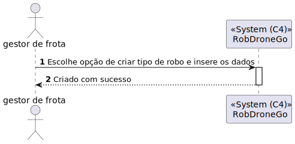
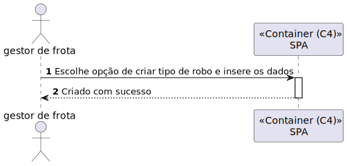
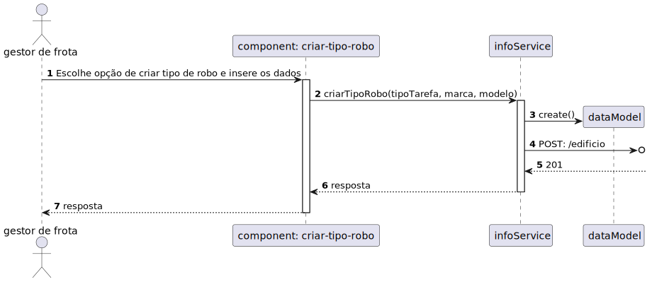

# 1000- Como gestor de Frota pretendo adicionar um novo tipo de robot indicando a sua designação e que tipos de tarefas pode executar da lista prédefinida de tarefas

## 1. Contexto

Esta US tem correspondência com a [US350](../../Sprint_A/US_350/US_350.md) do Sprint A.</br>
Neste Sprint, é pretendido o desenvolvimento do módulo da SPA (frontend) da US.

Esta US permite criar um tipo de Robot


## 2. Requisitos
* Como gestor de Campus pretendo criar um tipo de Robot

## 2. Análise

**Ator Principal**

* Gestor de frota

**Atores Interessados (e porquê?)**

* Gestor de frota

**Pré-condições**

* N/A

**Pós-condições**

* O Tipo de Robot é persistido

**Cenário Principal**

1. É inserida a informação sobre o Tipo de Robot (Tipo tarefa, marca, modelo)
2. O sistema informa do sucesso ou do insucesso
   
### Questões relevantes ao cliente

### Excerto Relevante do Domínio


## 3. Design
### 3.1.1 Vista Lógica
**Nível 1**


**Nível 2**


**Nível 3**


### 3.1.2. Vista de Processos

**Nível 1**



**Nível 2**



**Nível 3**


### 3.1.3 Vista de Implementação

**Nível 2**


**Nível 3**


### 3.1.4 Vista Física

**Nível 2**


### 3.1.5 Vista de Cenários
**Nível 1**


### 3.2. Testes

* Testes End to End
````
    it('Criar tipo de robot com sucesso', () => {
        cy.visit('/criarTipoRobo')
        cy.get('[name="marcaTipoRobo"]').type('marca');
        cy.get('[name="modeloTipoRobo"]').type('modelo');
        cy.get('.checkbox input[type="checkbox"]').each(($checkbox) => {
            cy.wrap($checkbox).check();
        });
        cy.get('button').click();
        cy.wait('@createTipoRobo').then((interception) => {
            expect(interception?.response?.statusCode).to.eq(201); // Adjust the status code as needed
        });
        cy.get('[name="app-message"]').invoke('text').then((text) => {
            const regex = /Tipo de Robot com id (\w+) criado com sucesso!/;
            const match = text.match(regex);
            if (match) {
              let id = match[1];
              cy.visit('/apagarTipoRobo');
              cy.get('[name="id"]').type(id);
              cy.get('button').click();
            } else {
              cy.log('Erro');
            }
        });
    })
````

* Testes ao Component
````
it('Método add chama o método criarTipoRobo do tipoRoboService', () => {
    const marca = "marca";
    const modelo = "modelo";
    const tipoTarefa = ["tipoTarefa1", "tipoTarefa2"];

    let tipoRoboService = TestBed.inject(TipoRoboService);
    spyOn(component['tipoRoboService'], 'criarTipoRobo');
    component.listaTipoTarefaSelecionados = tipoTarefa;
    component.add(marca, modelo);
    expect(tipoRoboService.criarTipoRobo).toHaveBeenCalledWith(tipoTarefa, marca, modelo);
  });
````
* Testes ao Service
````
  it('Método criarTipoRobo chama o método post do HttpClient', () => {
    const testData: TipoRobo = {idTipoDispositivo: 1, tipoTarefa: ["Tarefa"], marca: "marca", modelo: "modelo"};
    const testDataInput = {tipoTarefa: ["Tarefa"], marca: "marca", modelo: "modelo"}
    const postSpy = spyOn(httpClient, 'post').and.returnValue(of(testData));

    service.criarTipoRobo(testData.tipoTarefa, testData.marca, testData.modelo);
    
    expect(postSpy).toHaveBeenCalledWith('http://localhost:4000/api/tipoDispositivo', testDataInput, service.httpOptions);
  });

  it('Método criarTipoRobo com marca vazia não chama o método post do HttpClient', () => {
    const testData: TipoRobo = {idTipoDispositivo: 1, tipoTarefa: ["Tarefa"], marca: "", modelo: "modelo"};
    const postSpy = spyOn(httpClient, 'post').and.returnValue(of(testData));

    service.criarTipoRobo(testData.tipoTarefa, testData.marca, testData.modelo);
    
    expect(postSpy).not.toHaveBeenCalled();
  });

  it('Método criarTipoRobo com modelo vazio não chama o método post do HttpClient', () => {
    const testData: TipoRobo = {idTipoDispositivo: 1, tipoTarefa: ["Tarefa"], marca: "marca", modelo: ""};
    const postSpy = spyOn(httpClient, 'post').and.returnValue(of(testData));

    service.criarTipoRobo(testData.tipoTarefa, testData.marca, testData.modelo);
    
    expect(postSpy).not.toHaveBeenCalled();
  });

  it('Método criarTipoRobo com tipoTarefa vazio não chama o método post do HttpClient', () => {
    const testData: TipoRobo = {idTipoDispositivo: 1, tipoTarefa: [], marca: "marca", modelo: "modelo"};
    const postSpy = spyOn(httpClient, 'post').and.returnValue(of(testData));

    service.criarTipoRobo(testData.tipoTarefa, testData.marca, testData.modelo);
    
    expect(postSpy).not.toHaveBeenCalled();
  });
````


## 4. Observações
N/A