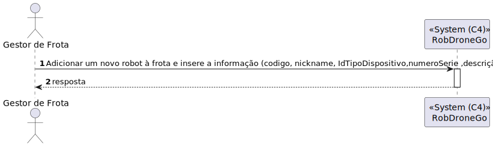

# US 1010 - Como gestor de Frota pretendo adicionar um novo robot à frota indicando o seu tipo, designação, etc.

## 1. Context

É a o desenvolvimento do front end da US360.
Como gestor de Frota pretendo adicionar um novo robot à frota indicando o seu tipo, designação, etc.

## 2. Requirements

**Main actor**

* gestor de frota

**Pre conditions**

* Tem de existir um tipo de dispositivo no sistema

**Post conditions**

* Deve ser adicionado robot à frota

**Main scenario**
1. Adicionar um novo robot à frota e insere a informação (codigo, nickname, IdTipoDispositivo, numeroSerie, descrição)
2. Sistema retorna um robot

**Other scenarios**

**a.** O sistema verifica se o Tipo de dispositivo existe
1. Avisa que o Tipo de dispositivo não existe
2. Termina a use case

## 3. Analysis

Terá de ser criado uma aplicação angular que permita o gestor de frota adicionar o robo

## 4. Design

### 4.1. Nível 1

#### 4.1.1 Vista de processos

#### 4.1.2 Vista FÍsica

N/A (Não vai adicionar detalhes relevantes)

#### 4.1.3 Vista Lógica

#### 4.1.4 Vista de Implementação

N/A (Não vai adicionar detalhes relevantes)

#### 4.1.4 Vista de Cenarios

### 4.2 Nível 2

#### 4.2.1 Vista de processos

#### 4.2.2 Vista FÍsica

#### 4.2.3 Vista Lógica

#### 4.2.4 Vista de Implementação

### 4.3. Nível 3 

#### 4.3.1 Vista de processos

#### 4.3.2 Vista FÍsica

N/A (Não vai adicionar detalhes relevantes)

#### 4.3.3 Vista Lógica

#### 4.3.4 Vista de Implementação

### 4.4. Tests

**Test 1:** **

## 5. Observations
N/A