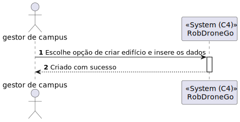
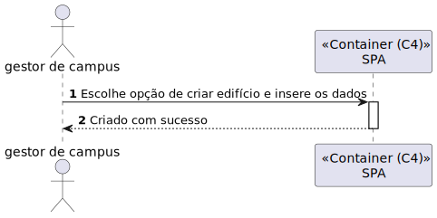
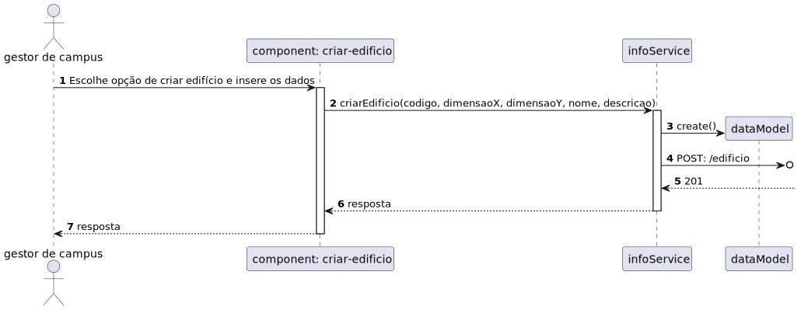

# 1050 - Como gestor de Campus pretendo criar um Edifício

## 1. Contexto


Esta US tem correspondência com a [US150](../../Sprint_A/US_150/US_150.md) do Sprint A.</br>
Neste Sprint, é pretendido o desenvolvimento do módulo da SPA (frontend) da US.

Esta US permite a criação de um Edifício.


## 2. Requisitos
* Como gestor de Campus pretendo criar um Edifício

## 2. Análise

**Ator Principal**

* Gestor de campus

**Atores Interessados (e porquê?)**

* Gestor de campus

**Pré-condições**

* N/A

**Pós-condições**

* O Edifício será presistido

**Cenário Principal**

1. É inserida a informação sobre o Edifício (Descrição, Nome, Código e Dimensão)
2. O sistema informa do sucesso ou do insucesso
   
### Questões relevantes ao cliente

### Excerto Relevante do Domínio


## 3. Design
### 3.1.1 Vista Lógica
**Nível 1**


**Nível 2**


**Nível 3**


### 3.1.2. Vista de Processos

**Nível 1**



**Nível 2**



**Nível 3**


### 3.1.3 Vista de Implementação

**Nível 2**


**Nível 3**


### 3.1.4 Vista Física

**Nível 2**


### 3.1.5 Vista de Cenários
**Nível 1**


### 3.2. Testes
* Teste End to End
````
    it('Criar edificio com sucesso', () => {
        cy.visit('/criarEdificio')
        cy.get('[name="codigo"]').type('T1');
        cy.get('[name="nomeEdificio"]').type('Nome1');
        cy.get('[name="descricaoEdificio"]').type('Descricao1');
        cy.get('[name="dimensaoX"]').type('3');
        cy.get('[name="dimensaoY"]').type('3');
        cy.get('button').click();
        cy.wait('@createEdificio');
        cy.get('[name="app-message"]').contains('Edificio com código: T1 criado com sucesso!');

    })
`````
* Teste ao component
`````
t('Método add chama o método criarEdificio do edificioService', () => {
    const cod = "cod";
    const dimensaoX = "1";
    const dimensaoY = "1";
    const nome = "nome";
    const descricao = "descricao";

    let edificioService = TestBed.inject(EdificioService);
    spyOn(component['edificioService'], 'criarEdificio');
    component.add(cod, dimensaoX, dimensaoY, nome, descricao);
    expect(edificioService.criarEdificio).toHaveBeenCalledWith(cod, dimensaoX, dimensaoY, nome, descricao);
  });
``````
* Teste ao service
``````
 it('Método criarEdificio chama o método post do HttpClient', () => {
    const testData: Edificio = {codigo: "cod", nome: "nome", descricao: "descricao",dimensaoX: 1, dimensaoY: 1};

    const postSpy = spyOn(httpClient, 'post').and.returnValue(of(testData));

    service.criarEdificio(testData.codigo, String(testData.dimensaoX), String(testData.dimensaoY),testData.nome, testData.descricao);
    
    expect(postSpy).toHaveBeenCalledWith('http://localhost:4000/api/edificio', testData, service.httpOptions);
  });

  it('Método criarEdificio com código vazio não chama o método post do HttpClient', () => {
    const testData: Edificio = {codigo: "", nome: "nome", descricao: "descricao",dimensaoX: 1, dimensaoY: 1};

    const postSpy = spyOn(httpClient, 'post').and.returnValue(of(testData));

    service.criarEdificio(testData.codigo, String(testData.dimensaoX), String(testData.dimensaoY),testData.nome, testData.descricao);
    
    expect(postSpy).not.toHaveBeenCalled();
  });
``````
## 4. Observações
N/A