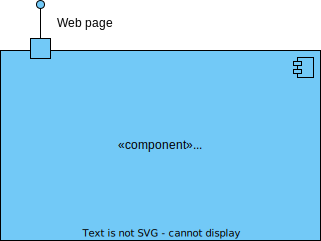
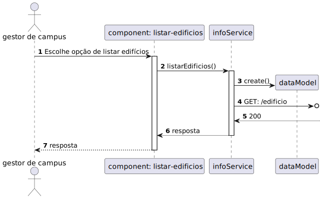

# 1060 - Como gestor de Campus pretendo listar Edifícios

## 1. Contexto

Esta US tem correspondência com a [US170](../../Sprint_A/US_170/US_170.md) do Sprint A.</br>
Neste Sprint, é pretendido o desenvolvimento do módulo da SPA (frontend) da US.

Esta US permite listar os Edifícios do sistema.


## 2. Requisitos
* 1060 - Como gestor de Campus pretendo listar Edifícios

## 2. Análise

**Ator Principal**

* Gestor de campus

**Atores Interessados (e porquê?)**

* Gestor de campus

**Pré-condições**

* Deverão haver edifícios persistidos

**Pós-condições**

* Os Edifícios serão listados

**Cenário Principal**

1. É requisitada a lista de todos os edifícios
2. O sistema lista todos os edifícios
   
### Questões relevantes ao cliente

* N/A

### Excerto Relevante do Domínio


## 3. Design
### 3.1.1 Vista Lógica
**Nível 1**




**Nível 2**


**Nível 3**


### 3.1.2. Vista de Processos

**Nível 1**


**Nível 2**


**Nível 3**


### 3.1.3 Vista de Implementação

**Nível 2**


**Nível 3**


### 3.1.4 Vista Física

**Nível 2**


### 3.1.5 Vista de Cenários
**Nível 1**


### 3.2. Testes
* Teste End to End
````
    it('Listar edificios com sucesso', () => {
        cy.visit('/listarEdificios')
        cy.wait('@getEdificio');
        cy.get('p-table tbody tr').contains('td', 'T1').parent('tr').within(() => {
            cy.get('td').eq(1).should('contain.text', 'Nome1');
            cy.get('td').eq(2).should('contain.text', 'Descricao1');
            cy.get('td').eq(3).should('contain.text', '3');
            cy.get('td').eq(4).should('contain.text', '3');
        });
    })
``````

* Testes ao component
`````
  it('Método ngOnInit chama o método listarEdificios', ()=>{
    const listaEdificios = [{
      codigo: "cod",
      nome: "nome",
      descricao: "descricao",
      dimensaoX: 1,
      dimensaoY: 1,
    }] as Edificio[];
    let edificioService = TestBed.inject(EdificioService);
    spyOn(component['edificioService'], 'listarEdificios').and.returnValue(of(listaEdificios));
    component.ngOnInit();
    expect(edificioService.listarEdificios).toHaveBeenCalled();
    expect(component.listaEdificios).toEqual(listaEdificios);
  });
``````
* Testes ao service
``````
  it ('Método listarEdificio chama o método get do HttpClient', () => {
    const testData: Edificio = {codigo: "cod", nome: "nome", descricao: "descricao",dimensaoX: 1, dimensaoY: 1};

    const edificioUrl: string = (service as any).edificioUrl; // service as any dá o valor da variável privada
                                                              //colocando a diretamente ao url não funciona

    const getSpy = spyOn(httpClient, 'get').and.returnValue(of(testData));

    service.listarEdificios();
    expect(getSpy).toHaveBeenCalledWith(edificioUrl, service.httpOptions);
  });
``````

## 4. Observações
N/A