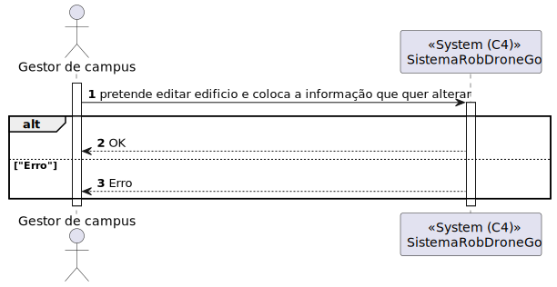
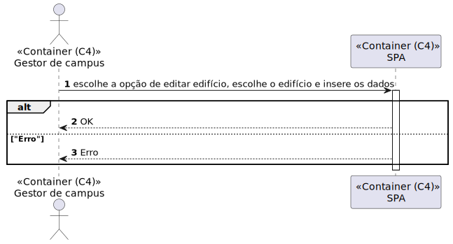
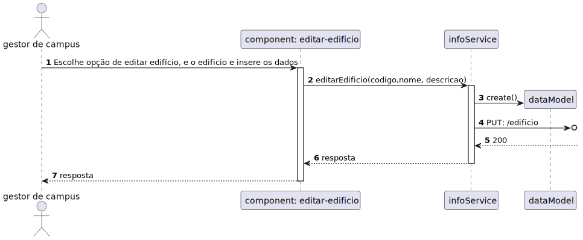

# 1070 - Como gestor de Campus pretendo editar a informação (total ou parcial) de Edifício

## 1. Contexto


Esta US tem correspondência com a [US160](../../Sprint_A/US_160/US_160.md) do Sprint A.</br>
Neste Sprint, é pretendido o desenvolvimento do módulo da SPA (frontend) da US.

Esta US permite a edição de um Edifício.

## 2. Requisitos
* 1070 - Como gestor de Campus pretendo editar a informação (total ou parcial) de Edifício

## 2. Análise

**Ator Principal**

* Gestor de campus

**Atores Interessados (e porquê?)**

* Gestor de campus

**Pré-condições**

* Já deverá existir um Edifício

**Pós-condições**

* O Edifício deve ser atualizado

**Cenário Principal**

1. Pretende editar Edifício e insere a informação pretendida
2. O sistema informa do sucesso ou do insucesso
   
### Questões relevantes ao cliente

* N/A

### Excerto Relevante do Domínio


## 3. Design
### 3.1.1 Vista Lógica
**Nível 1**


**Nível 2**


**Nível 3**


### 3.1.2. Vista de Processos

**Nível 1**



**Nível 2**



**Nível 3**


### 3.1.3 Vista de Implementação

**Nível 2**


**Nível 3**


### 3.1.4 Vista Física

**Nível 2**


### 3.1.5 Vista de Cenários
**Nível 1**


### 3.2. Testes
* Teste End to End
``````
    it('Editar edicio com sucesso', () => {
        cy.get('[name="codigo"]').select('T1');
        cy.get('[name="nomeEdificio"]').type('NomeDifrente');
        cy.get('[name="descricaoEdificio"]').type('DescricaoDiferente');
        cy.get('button').click();
        cy.wait('@editarEdificio');
        cy.get('[name="app-message"]').contains('Edificio com código: T1 editado com sucesso!');
    })
``````

* Testes ao Component
``````
  it('Método edit chama o método editarEdificio do edificioService', () => {
    const cod = "cod";
    const nome = "nome";
    const descricao = "descricao";

    let edificioService = TestBed.inject(EdificioService);
    spyOn(component['edificioService'], 'editarEdificio');
    component.edit(cod, nome, descricao);
    expect(edificioService.editarEdificio).toHaveBeenCalledWith(cod, nome, descricao);
  });

  it('Método ngOnInit chama o método listarCodEdificios do edificioService', () => {
    const listaCodEdificios = ["cod1", "cod2"];
    let edificioService = TestBed.inject(EdificioService);
    spyOn(component['edificioService'], 'listarCodEdificios').and.returnValue(of(listaCodEdificios));
    component.ngOnInit();
    expect(edificioService.listarCodEdificios).toHaveBeenCalled();
    expect(component.listaCodigos).toEqual(listaCodEdificios);
  });
``````

* Testes ao Service
``````
  it ('Método editarEdifício chama o método put do HttpClient', () => {
    const testData = {codigo: "cod", nome: "nome", descricao: "descricao"};

    const putSpy = spyOn(httpClient, 'put').and.returnValue(of(testData));

    service.editarEdificio(testData.codigo, testData.nome, testData.descricao);
    expect(putSpy).toHaveBeenCalledWith('http://localhost:4000/api/edificio', testData, service.httpOptions);
  });

  it ('Método editarEdificio com código vazio não chama o método put do HttpClient', () => {
    const testData = {codigo: "", nome: "nome", descricao: "descricao"};

    const putSpy = spyOn(httpClient, 'put').and.returnValue(of(testData));

    service.editarEdificio(testData.codigo, testData.nome, testData.descricao);
    expect(putSpy).not.toHaveBeenCalled();
  });

  it ('Método editarEdificio com nome vazio chama o método put do HttpClient, sem o nome', () => {
    const testDataInput = {codigo: "cod", nome: "", descricao: "descricao"};
    const testData = {codigo: "cod", descricao: "descricao"};
    const putSpy = spyOn(httpClient, 'put').and.returnValue(of(testData));

    service.editarEdificio(testDataInput.codigo, testDataInput.nome, testDataInput.descricao);
    expect(putSpy).toHaveBeenCalledWith('http://localhost:4000/api/edificio', testData, service.httpOptions);
  });

  it ('Método editarEdificio com descricao vazia chama o método put do HttpClient, sem a descircao', () => {
    const testDataInput = {codigo: "cod", nome: "nome", descricao: ""};
    const testData = {codigo: "cod", nome: "nome"};

    const putSpy = spyOn(httpClient, 'put').and.returnValue(of(testData));

    service.editarEdificio(testDataInput.codigo, testDataInput.nome, testDataInput.descricao);
    expect(putSpy).toHaveBeenCalledWith('http://localhost:4000/api/edificio', testData, service.httpOptions);
  });

  it ('Método editarEdificio com nome e descricao vazios chama o método put do HttpClient, sem o nome e a descricao', () => {
    const testDataInput = {codigo: "cod", nome: "", descricao: ""};
    const testData = {codigo: "cod"};

    const putSpy = spyOn(httpClient, 'put').and.returnValue(of(testData));

    service.editarEdificio(testDataInput.codigo, testDataInput.nome, testDataInput.descricao);
    expect(putSpy).not.toHaveBeenCalled();
  });
``````

## 4. Observações
N/A