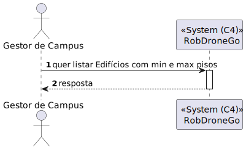
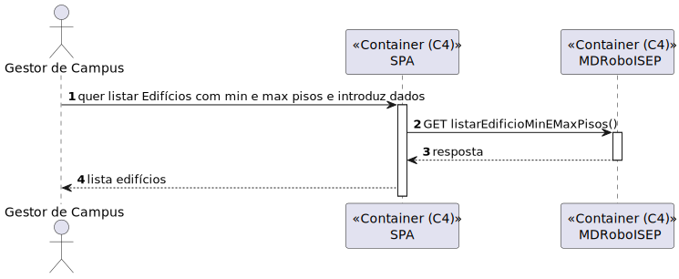
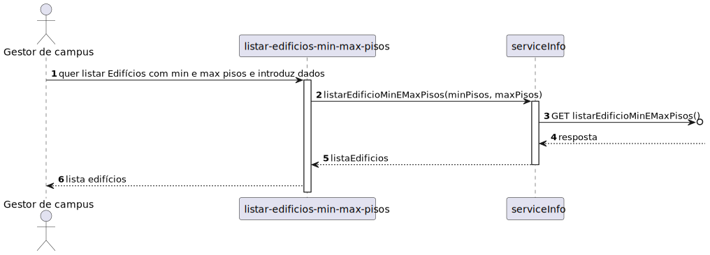

# US 1080 - Como gestor de Campus pretendo listar Edifícios com min e max de pisos

## 1. Context

Continuação da us 180.
O utilizador gestor de Campus quer listar Edifícios com min e max pisos

## 2. Requirements

**Main actor**

* gestor de Campus

**Interested actors (and why)**

* gestor de Campus - quer listar Edifícios com min e max pisos

**Pre conditions**

* Tem de existir edificios com pisos

**Post conditions**

* É devolvida uma lista de edificios

**Main scenario**
1. O gestor de campus quer listar Edifícios com min e max pisos e introduz dados
2. Sistema retorna uma lista de edificios

**Other scenarios**

**a.** O sistema diz que o não existem edificios com o numero de pisos pretendidos
1. O gestor de campus quer listar Edifícios com min e max pisos
2. Sistema retorna que não existem edificios com o numero de pisos pretendidos

## 3. Analysis

Terá de ser criado uma aplicação angular que permita o gestor de Campus listar Edificios com min e max de pisos

## 4. Design

### 4.1. Nível 1

#### 4.1.1 Vista de processos

#### 4.1.2 Vista FÍsica

N/A (Não vai adicionar detalhes relevantes)

#### 4.1.3 Vista Lógica

#### 4.1.4 Vista de Implementação

N/A (Não vai adicionar detalhes relevantes)

#### 4.1.5 Vista de Cenarios

### 4.2 Nível 2

#### 4.2.1 Vista de processos

#### 4.2.2 Vista FÍsica

#### 4.2.3 Vista Lógica

#### 4.2.4 Vista de Implementação

### 4.3. Nível 3 

#### 4.3.1 Vista de processos

#### 4.3.2 Vista FÍsica

N/A (Não vai adicionar detalhes relevantes)

#### 4.3.3 Vista Lógica

#### 4.3.4 Vista de Implementação

### 4.4. Tests

**Test 1:** **

## 5. Observations
N/A