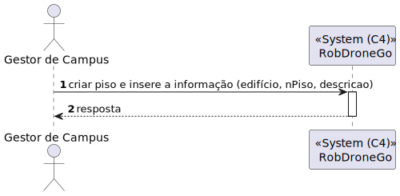
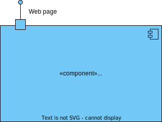
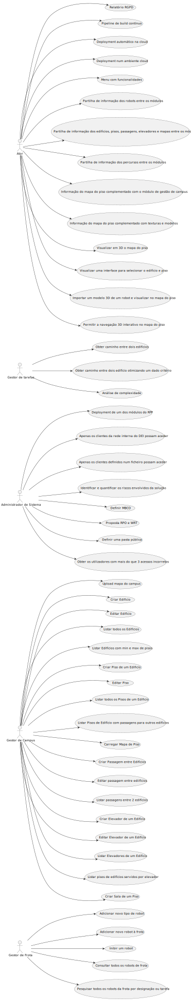
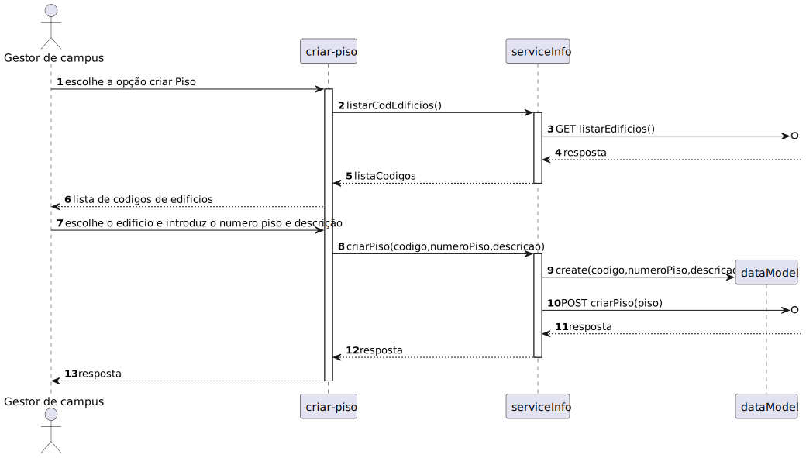

# US 1090 - Como gestor de Campus pretendo criar um Piso indicando [...]	

## 1. Context

Continuação da us 190.
O gestor de Campus quer criar um piso

## 2. Requirements

**Main actor**

* N/A

**Interested actors (and why)**

* N/A

**Pre conditions**

* O edifício tem de estar criado.

**Post conditions**

* O piso é criado

**Main scenario**
1. O gestor de Campus quer criar um piso
2. Sistema diz se o piso foi criado com sucesso

**Other scenarios**

**a.** O sistema diz que o piso ja existe
1. Avisa que o piso já existe
2. Termina a use case

**b.** O sistema diz que não existe o edificio
1. Avisa que o edifício não existe
2. Termina a use case

## 3. Analysis

Terá de ser criado uma aplicação angular que permita o gestor de Campus criar um piso

## 4. Design

### 4.1. Nível 1

#### 4.1.1 Vista de processos

#### 4.1.2 Vista FÍsica

N/A (Não vai adicionar detalhes relevantes)

#### 4.1.3 Vista Lógica

#### 4.1.4 Vista de Implementação

N/A (Não vai adicionar detalhes relevantes)

#### 4.1.4 Vista de Cenarios

### 4.2 Nível 2

#### 4.2.1 Vista de processos

#### 4.2.2 Vista FÍsica

#### 4.2.3 Vista Lógica

#### 4.2.4 Vista de Implementação

### 4.3. Nível 3 

#### 4.3.1 Vista de processos

#### 4.3.2 Vista FÍsica

N/A (Não vai adicionar detalhes relevantes)

#### 4.3.3 Vista Lógica

#### 4.3.4 Vista de Implementação

### 4.4. Tests

**Test 1:** **

## 5. Observations
N/A