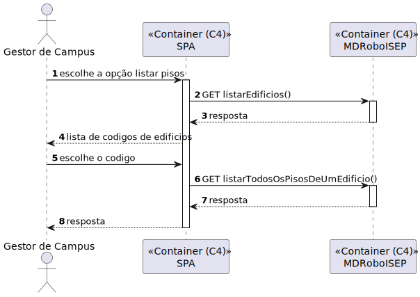

# US 1100 - Como gestor de Campus pretendo listar todos os Pisos de um Edifício

## 1. Context

Continuação da us 210.
O gestor de Campus quer listar todos os pisos de um edifício.

## 2. Requirements

**Main actor**

* gestor de Campus

**Interested actors (and why)**

* gestor de Campus - Quer listar os pisos de um edifício.

**Pre conditions**

* O pisos tem de estar criados.

**Post conditions**

* É apresentado uma lista de pisos de um edifício.

**Main scenario**
1. O gestor de Campus quer listar todos os pisos de um edifício
2. Sistema lista os pisos de um edifício

**Other scenarios**

**a.** O sistema diz que o edifício nao tem pisos
1. O gestor de Campus quer listar todos os pisos de um edifício
2. Sistema lista os pisos de um edifício

**b.** O sistema diz que não existe o edifício
1. O gestor de Campus quer listar todos os pisos de um edifício
2. Avisa que o edifício não existe

## 3. Analysis

Terá de ser criado uma aplicação angular que permita o gestor de Campus listar todos os pisos de um edifício

## 4. Design

### 4.1. Nível 1

#### 4.1.1 Vista de processos

#### 4.1.2 Vista FÍsica

N/A (Não vai adicionar detalhes relevantes)

#### 4.1.3 Vista Lógica

#### 4.1.4 Vista de Implementação

N/A (Não vai adicionar detalhes relevantes)

#### 4.1.4 Vista de Cenarios

### 4.2 Nível 2

#### 4.2.1 Vista de processos

#### 4.2.2 Vista FÍsica

#### 4.2.3 Vista Lógica

#### 4.2.4 Vista de Implementação

### 4.3. Nível 3 

#### 4.3.1 Vista de processos

#### 4.3.2 Vista FÍsica

N/A (Não vai adicionar detalhes relevantes)

#### 4.3.3 Vista Lógica

#### 4.3.4 Vista de Implementação

### 4.4. Tests

**Test 1:** **

## 5. Observations
N/A