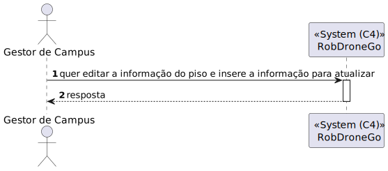

# US 1110 - Como gestor de Campus pretendo editar a informação (total ou parcial) de Piso	

## 1. Context

É a continuação da us 200
O gestor de campus quer editar a informação de um piso

## 2. Requirements

**Main actor**

* Gestor de Campus

**Interested actors (and why)**

* Gestor de Campus - Quer editar a informação de um piso

**Pre conditions**

* O piso tem de já estar criado

**Post conditions**

* O piso tem de ser alterado

**Main scenario**
1. O gestor de Campus quer editar a informação do piso e insere a informação para atualizar
2. Sistema diz se a operação foi um sucesso 

**Other scenarios**

**a.** O sistema verifica se o edifício não existe
1. O gestor de Campus quer editar a informação do piso e insere a informação para atualizar
2. Avisa que o edifício não existe

**b.** O sistema verifica se o piso não existe
1. O gestor de Campus quer editar a informação do piso e insere a informação para atualizar
2. Avisa que o piso não existe

## 3. Analysis

Terá de ser criado uma aplicação angular que permita o gestor de Campus editar um piso

## 4. Design

### 4.1. Nível 1

#### 4.1.1 Vista de processos

#### 4.1.2 Vista FÍsica

N/A (Não vai adicionar detalhes relevantes)

#### 4.1.3 Vista Lógica

#### 4.1.4 Vista de Implementação

N/A (Não vai adicionar detalhes relevantes)

#### 4.1.4 Vista de Cenarios

### 4.2 Nível 2

#### 4.2.1 Vista de processos

#### 4.2.2 Vista FÍsica

#### 4.2.3 Vista Lógica

#### 4.2.4 Vista de Implementação

### 4.3. Nível 3 

#### 4.3.1 Vista de processos

#### 4.3.2 Vista FÍsica

N/A (Não vai adicionar detalhes relevantes)

#### 4.3.3 Vista Lógica

#### 4.3.4 Vista de Implementação

### 4.4. Tests

**Test 1:** **

## 5. Observations
N/A