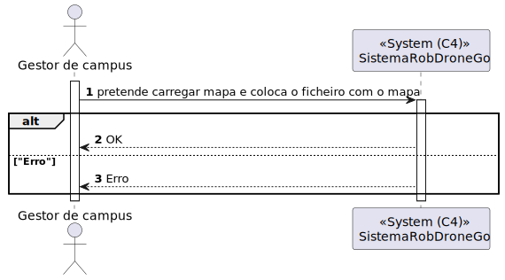

# 1120 - Como gestor de Campus pretendo carregar mapa de Piso de Edifício

## 1. Contexto


Esta US tem correspondência com a [US230](../../Sprint_A/US_230/US_230.md) do Sprint A.</br>
Neste Sprint, é pretendido o desenvolvimento do módulo da SPA (frontend) da US.

Esta US permite carregar um mapa de um piso com elementos que já existam no piso desejado, mas que não têm localização.
Sendo estes elementos salas, elevador e passagens.

## 2. Requisitos
* 1120 - Como gestor de Campus pretendo carregar mapa de Piso de Edifício

## 2. Análise

**Ator Principal**

* Gestor de campus

**Atores Interessados (e porquê?)**

* N/A

**Pré-condições**

* Os objetos já devem estar presistidos no sistema para o piso que deseja carregar

**Pós-condições**

* O mapa do piso será persistido

**Cenário Principal**

1. O gestor de campus insere um JSON com as informções do piso
2. O sistema informa do sucesso ou do insucesso
   
### Questões relevantes ao cliente


### Excerto Relevante do Domínio


## 3. Design
### 3.1.1 Vista Lógica
**Nível 1**


**Nível 2**


**Nível 3**


### 3.1.2. Vista de Processos

**Nível 1**



**Nível 2**


**Nível 3**


### 3.1.3 Vista de Implementação

**Nível 2**


**Nível 3**


### 3.1.4 Vista Física

**Nível 2**


### 3.1.5 Vista de Cenários
**Nível 1**


### 3.2. Testes
* Testes ao service
``````
it('Método carregarMapa chama o método patch do HttpClient', () => {
    const testData: CarregarMapa = {
      codigoEdificio: "cod",
      numeroPiso: 1,
    } as CarregarMapa;

    const patchSpy = spyOn(httpClient, 'patch').and.returnValue(of(testData));
    service.carregarMapa(testData);
    expect(patchSpy).toHaveBeenCalledWith('http://localhost:4000/api/mapa', testData, service.httpOptions);
  });

  it('Método exportarMapa chama o método get do HttpClient', () => {
    let testData : ExportarMapa = {
      texturaChao: "texturaChao",
      texturaParede: "texturaParede",
      modeloPorta: "modelo",
      modeloElevador: "modelo",
      codigoEdificio: "cod1",
      numeroPiso : 1,
      matriz : [["Norte","Norte"],["Oeste","Oeste"]],
      elevador: {
          xCoord: 1,
          yCoord: 1,
          orientacao: "Norte"
      },
      passagens : [{
          id: 1,
          abcissaA: 1,
          ordenadaA: 2,
          abcissaB: 1,
          ordenadaB: 2,
          orientacao: "Norte"
      }],
      portas : [{
          abcissa : 1,
          ordenada: 1,
          orientacao: "Norte"
      }],
      posicaoInicialRobo : {
          x: 1,
          y: 2,
      }
    };

    let params = new HttpParams().set('codEdificio', testData.codigoEdificio);
    params = params.append('numPiso', testData.numeroPiso.toString());

    const getSpy = spyOn(httpClient, 'get').and.returnValue(of(testData));
    service.exportarMapa(testData.codigoEdificio, testData.numeroPiso);
    expect(getSpy).toHaveBeenCalledWith("http://localhost:4000/api/mapa", {params: params, headers: service.httpOptions.headers});
  });
``````


## 4. Observations
N/A