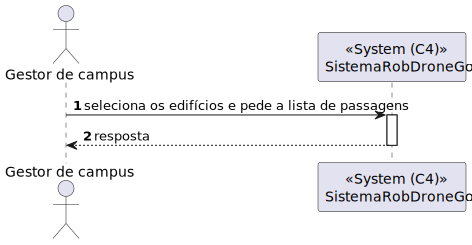
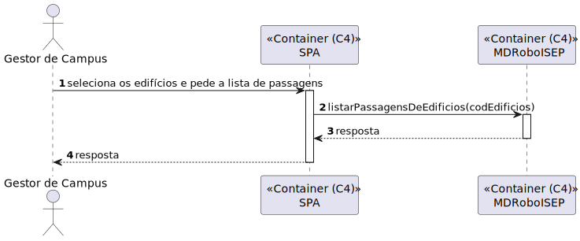
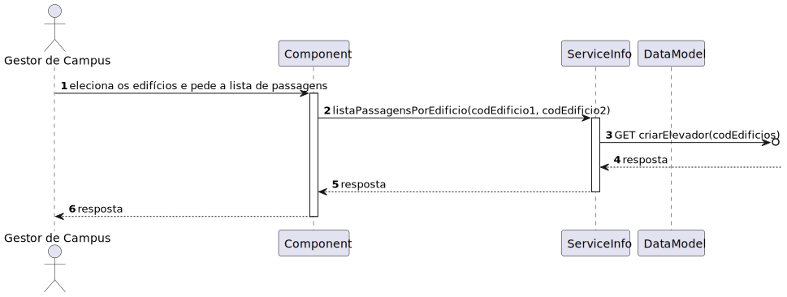

# US 1190 - Como gestor de Campus pretendo listar Passagens entre 2 Edifícios 	

## 1. Contexto
Esta US tem correspondência com a [US260](../../Sprint_A/US_260/us_260.md) do Sprint A. 
Neste Sprint, é pretendido o desenvolvimento do módulo da SPA (frontend) da US.

## 2. Requisitos

**Ator principal**
* Gestor de Campus

**Atores interessados (e porquê)**
* Gestor de campus - deseja criar, editar e listar passagens entre edifícios

**Condições anteriores**
* Deve existir pelo menos uma passagem no sistema 

**Condições posteriores**
N/A

**Cenário principal**
1. Sistema recebe um pedido com o par códigos dos edifícios
2. Sistema devolve a lista de passagens entre os dois edifício

**Outros cenários**

**1.a.** Sistema recebe um pedido sem o par de códigos dos edifícios
1. Sistema devolve a lista de passagens entre todos edifício

**1.b.** Sistema recebe um pedido com código(s) inválido(s)
1. Sistema notifica que este problema ocorreu
2. O UC termina.

**Requisitos especiais**
N/A

## 3. Análise

Excerto do modelo de domínio relevante

**Esclarecimentos do cliente:**  

Não existem esclarecimentos relevantes

## 4. Design

### 4.1 Nível 1

#### 4.1.1 Vista Lógica

#### 4.1.2 Vista Processos

#### 4.1.3 Vista Física
N/A (não vai adicionar detalhes relevantes)
#### 4.1.4 Vista Implementação
N/A (não vai adicionar detalhes relevantes)
#### 4.1.5 Vista Cenários

### 4.2 Nível 2

#### 4.2.1 Vista Lógica

#### 4.2.2 Vista Processos

#### 4.2.3 Vista Física

#### 4.2.4 Vista Implementação

#### 4.2.5 Vista Cenários
N/A (não vai adicionar detalhes relevantes)

### 4.3 Nível 3

#### 4.3.1 Vista Lógica

#### 4.3.2 Vista Processos

#### 4.3.3 Vista Física
N/A (não vai adicionar detalhes relevantes)
#### 4.3.4 Vista Implementação

#### 4.3.5 Vista Cenários
N/A (não vai adicionar detalhes relevantes)

### 4.4. Testes

**Teste 1:** *(...)*

## 5. Observações
N/A