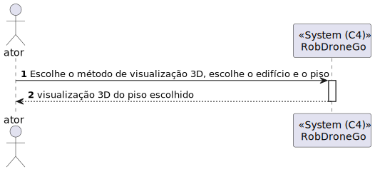
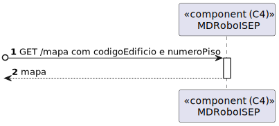
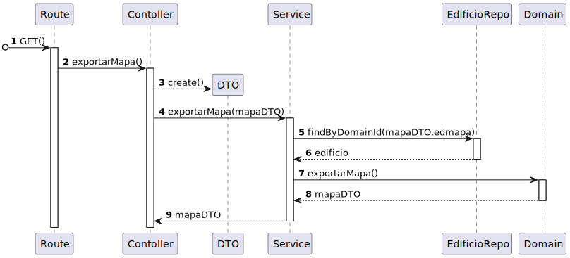
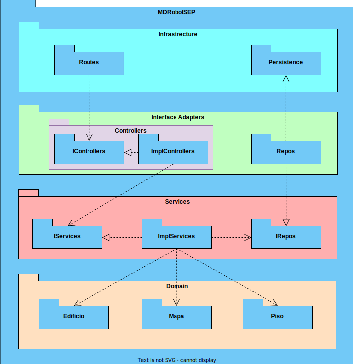

# 601 - O formato base do mapa que descreve a planta de um piso de um edifício do campus (um ficheiro/piso/edifício) deve ser complementado com informação do módulo de gestão de campus

## 1. Contexto

Esta é a primeira vez que esta US está a ser desenvolvida.

## 2. Requisitos
* O formato base do mapa que descreve a planta de um piso de um edifício do campus (um ficheiro/piso/edifício) deve ser complementado com informação do módulo de gestão de campus
* O ficheiro JSON importado do módulo de gestão de campus deve ser baseado no ficheiro JSON do projeto “Thumb Raiser” de SGRAI

## 2. Análise

**Ator Principal**

* Qualquer utilizador que tenha acesso ao sistema

**Pré-condições**

* O mapa do piso do edifício requsitado já deve ter alguma informação

**Pós-condições**

* O ficheiro que descreve a planta do piso deve ter a informação de gestão de campus

**Cenário Principal**

1. É requisitado um mapa de um piso de um certo edifício
2. O mapa é retornado com todas as informações do módulo de gestão de campus
   
### Questões relevantes ao cliente

### Excerto Relevante do Domínio

## 3. Design
### 3.1.1 Vista Lógica
**Nível 1**

**Nível 2**

**Nível 3**

### 3.1.2. Vista de Processos

**Nível 1**

**Nível 2**

**Nível 3**

### 3.1.3 Vista de Implementação

**Nível 2**

**Nível 3**

### 3.1.4 Vista Física

**Nível 2**

### 3.1.5 Vista de Cenários
**Nível 1**

### 3.2. Testes

## 5. Observations
N/A