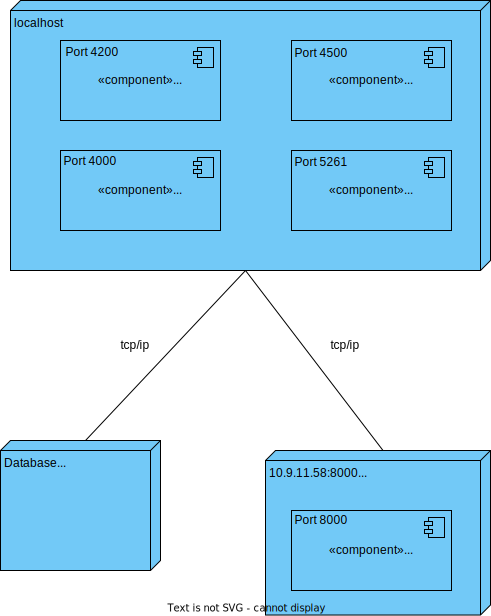

# US 100.2 - Como utente do sistema pretendo retificar/alterar os meus dados - Backend

## 1. Contexto
É a primeira vez que esta US foi atribuída.  
Esta US vai permitir ao utente alterar os seus dados pessoais
Esta US corresponde ao frontend da [US_100.2](../US_100.2/US_100.2.md)

## 2. Requisitos

**Ator principal**
* Utente

**Atores interessados (e porquê)**
* Utente - pretende alterar os seus dados

**Condições anteriores**
N/A

**Condições posteriores**
* A alteração dos dados deve ser persistida no sistema

**Cenário principal**
1. O sistema recebe a informação que o utente deseja alterar
2. Sistema informa o sucesso da operação

**Outros cenários**

**2.a.** O sistema verifica um dos parâmetros não é válido
1. Sistema notifica que este problema ocorreu
2. O UC termina.

**Requisitos especiais** 
N/A

## 3. Análise

Excerto do modelo de domínio relevante

**Esclarecimentos do cliente:**  

> **Pergunta** 
> Boa noite Caro Cliente,  
> Que dados pessoais é que o utente pode alterar? 
> Obrigado. 
> Grupo 75  
> **Resposta** 
> bom dia, todos à exceção do email que serve para identificar o cliente.  

> **Pergunta** 
> Boa tarde. 
> Bom dia, A password do utilizador é expectável poder ser alterada neste caso de uso? Ou isso seria algo a fazer noutra funcionalidade do software?
> (...)  
> **Resposta** 
> Boa tarde, a alteração de password faz parte de outro conjunto de casos de uso. Neste caso de uso apenas ratificam os dados pessoais do utente

## 4. Design

### 4.1 Nível 1

#### 4.1.1 Vista Lógica

#### 4.1.2 Vista Processos

#### 4.1.3 Vista Física
N/A (não vai adicionar detalhes relevantes)
#### 4.1.4 Vista Implementação
N/A (não vai adicionar detalhes relevantes)
#### 4.1.5 Vista Cenários

### 4.2 Nível 2

#### 4.2.1 Vista Lógica

#### 4.2.2 Vista Processos

#### 4.2.3 Vista Física

#### 4.2.4 Vista Implementação

#### 4.2.5 Vista Cenários
N/A (não vai adicionar detalhes relevantes)

### 4.3 Nível 3

#### 4.3.1 Vista Lógica

#### 4.3.2 Vista Processos

#### 4.3.3 Vista Física
N/A (não vai adicionar detalhes relevantes)
#### 4.3.4 Vista Implementação

#### 4.3.5 Vista Cenários
N/A (não vai adicionar detalhes relevantes)

### 4.4. Testes

**Teste 1:** Serviço chama o HttpClient e manda um pedido put com a informação desejada 
**Teste 2:** Componente chama o método do serviço com a informação desejada 
(...)

## 5. Observações
N/A