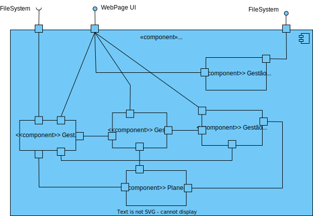

# 110.1 - Como utente do sistema pretendo uma cópia dos meus dados pessoais (FRONTEND)

## 1. Contexto

É a primeira vez que esta US está a ser desenvolvida.
Esta US é o desenvolvimento do frontend do requesito 110.
Esta US permite exportar um ficheiro com os dados pessoais gravados de um determinado utente.

## 2. Requisitos
* Como utente do sistema pretendo uma cópia dos meus dados pessoais

## 2. Análise

**Ator Principal**

* Utente

**Atores Interessados (e porquê?)**

* Utente

**Pré-condições**

* N/A

**Pós-condições**

* Um ficheiro deve ter sido exportado com os dados do utente.

**Cenário Principal**

1. O utente requesita uma cópia dos seus dados.
2. O sistema retorna os seus dados.
   
### Questões relevantes ao cliente

>**Aluno:**</br>Bom dia,</br>
Gostaria de saber como a cópia dos dados pessoais deve ser feita.
</br>
Cumprimentos,
</br>
Marco Andrade</br></br>
**Cliente:**</br>
boa tarde,</br>
deve ser gerado um ficheiro json com a informação que o sistema guardou sobre a pessoa.


## 3. Design
### 3.1.1 Vista Lógica
**Nível 1**


**Nível 2**



**Nível 3**


### 3.1.2. Vista de Processos

**Nível 1**


**Nível 2**


**Nível 3**


### 3.1.3 Vista de Implementação

**Nível 2**


**Nível 3**


### 3.1.4 Vista Física

**Nível 2**


### 3.1.5 Vista de Cenários
**Nível 1**


### 3.2. Testes
* Teste End to End
````
````
* Testes ao component
````
````
* Testes ao serviço
````
````
## 4. Observações
N/A