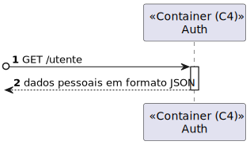

# 110.2 - Como utente do sistema pretendo uma cópia dos meus dados pessoais (Backend)

## 1. Contexto

É a primeira vez que esta US está a ser desenvolvida.
Esta US é o desenvolvimento do backend do requesito 110.
Esta US permite exportar um ficheiro com os dados pessoais gravados de um determinado utente.

## 2. Requisitos
* Como utente do sistema pretendo uma cópia dos meus dados pessoais

## 2. Análise

**Ator Principal**

* Utente

**Atores Interessados (e porquê?)**

* Utente

**Pré-condições**

* N/A

**Pós-condições**

* Um ficheiro deve ter sido exportado com os dados do utente.

**Cenário Principal**

1. O utente requesita uma cópia dos seus dados.
2. O sistema retorna os seus dados.
   
### Questões relevantes ao cliente

>**Aluno:**</br>Bom dia,</br>
Gostaria de saber como a cópia dos dados pessoais deve ser feita.
</br>
Cumprimentos,
</br>
Marco Andrade</br></br>
**Cliente:**</br>
boa tarde,</br>
deve ser gerado um ficheiro json com a informação que o sistema guardou sobre a pessoa.


## 3. Design
### 3.1.1 Vista Lógica
**Nível 1**


**Nível 2**


**Nível 3**


### 3.1.2. Vista de Processos

**Nível 1**


**Nível 2**



**Nível 3**


### 3.1.3 Vista de Implementação

**Nível 2**


**Nível 3**


### 3.1.4 Vista Física

**Nível 2**


### 3.1.5 Vista de Cenários
**Nível 1**


### 3.2. Testes
* Testes ao controller
````
it('CopiaDadosPessoais tem Sucesso', async () => {
        let req: Partial<Request> = {};
        
        let token = jwt.sign({
            id: 123,
            email: "marco@isep.ipp.pt",
            role: "utente",
            firstName: "nome1",
            lastName: "nome2",
            exp: 2524608000000,
          },
          config.jwtSecret,
        );

        let dto = {
            name : "nome1",
            email : "marco@isep.ipp.pt",
            telefone : "914231321",
            nif : "321123567"
        };

        req.headers = { "authorization": "Bearer " + token };

        let res: Partial<Response> = {
            status: sinon.spy(),
            json: sinon.spy()
        };
        let next: Partial<NextFunction> = () => {};


        let userServiceInstance = Container.get("UserService");
        let authServiceInstance = Container.get("AuthService");
        sinon.stub(userServiceInstance, "copiaDadosPessoais").returns(Result.ok<IDadosPessoaisDTO>(dto as IDadosPessoaisDTO));
        sinon.stub(authServiceInstance, "checkAuth").returns(Result.ok<void>());

        const userController = new UserController(userServiceInstance as IUserService, authServiceInstance as IAuthService);

        await userController.copiaDadosPessoais(<Request>req, <Response>res, <NextFunction>next);

        sinon.assert.calledOnce(res.status as sinon.SinonSpy);
        sinon.assert.calledWith(res.status as sinon.SinonSpy, 200);
        sinon.assert.calledOnce(res.json as sinon.SinonSpy);
        sinon.assert.calledWith(res.json as sinon.SinonSpy, dto);
    });

    it('CopiaDadosPessoais falha se user não existir', async () => {
        let req: Partial<Request> = {};
        
        let token = jwt.sign({
            id: 123,
            email: "marco@isep.ipp.pt",
            role: "utente",
            firstName: "nome1",
            lastName: "nome2",
            exp: 2524608000000,
          },
          config.jwtSecret,
        );

        req.headers = { "authorization": "Bearer " + token };

        let res: Partial<Response> = {
            status: sinon.spy(),
            json: sinon.spy()
        };
        let next: Partial<NextFunction> = () => {};


        let userServiceInstance = Container.get("UserService");
        let authServiceInstance = Container.get("AuthService");
        sinon.stub(userServiceInstance, "copiaDadosPessoais").returns(Result.fail<IDadosPessoaisDTO>("Não existe um utilizador com este email"));
        sinon.stub(authServiceInstance, "checkAuth").returns(Result.ok<void>());

        const userController = new UserController(userServiceInstance as IUserService, authServiceInstance as IAuthService);

        await userController.copiaDadosPessoais(<Request>req, <Response>res, <NextFunction>next);

        sinon.assert.calledOnce(res.status as sinon.SinonSpy);
        sinon.assert.calledWith(res.status as sinon.SinonSpy, 400);
        sinon.assert.calledOnce(res.json as sinon.SinonSpy);
        sinon.assert.calledWith(res.json as sinon.SinonSpy, "Não existe um utilizador com este email");
    });
````
* Testes ao serviço
````
it ('copiaDadosPessoais tem sucesso se utilizador existir', async () => {
        const userRepoInstance = Container.get("UserRepo");
        let email = "marco@isep.ipp.pt";
        let userDTO = {
            name: "Marco Antonio",
            email: email,
            telefone: "914231321",
            nif: "321123567"
        } as IDadosPessoaisDTO;
        let nif : string = "";
        if( userDTO.nif != undefined){
            nif = userDTO.nif;
        }
        const hashedPassword = await UserPassword.create({ value: "Password10@" })
        const user = User.create({
            name: UserName.create(userDTO.name).getValue(),
            telefone: UserTelefone.create(userDTO.telefone).getValue(),
            nif: UserNumeroContribuinte.create(nif).getValue(),
            password: hashedPassword.getValue(),
            role: Role.create("utente").getValue(),
            estado: UserEstado.create("pendente").getValue()
        }, UserEmail.create(email).getValue());
        sinon.stub(userRepoInstance, "findByEmail").returns(Promise.resolve(user.getValue()));
        const service = new UserService(userRepoInstance as IUserRepo);
        const answer = await service.copiaDadosPessoais(email);
        expect(answer.getValue()).to.deep.equal(userDTO);
    });

    it ('copiaDadosPessoais falha se utilizador não existir', async () => {
        const userRepoInstance = Container.get("UserRepo");
        let email = "marco@isep.ipp.pt";
        sinon.stub(userRepoInstance, "findByEmail").returns(Promise.resolve(null));
        const service = new UserService(userRepoInstance as IUserRepo);
        const answer = await service.copiaDadosPessoais(email);
        expect(answer.errorValue()).to.equal("Não existe um utilizador com este email");
    });
````
* Teste de integração
````
    it('userController + userService + authservice + user copiaDadosPessoais tem sucesso', async () => {

        let req: Partial<Request> = {};
        
        let token = jwt.sign({
            id: 123,
            email: "marco@isep.ipp.pt",
            role: "utente",
            firstName: "nome1",
            lastName: "nome2",
            exp: 2524608000000,
          },
          config.jwtSecret,
        );

        req.headers = { "authorization": "Bearer " + token };

        let res: Partial<Response> = {
            status: sinon.spy(),
            json: sinon.spy()
        };
        let next: Partial<NextFunction> = () => {};

        const hashedPassword = await UserPassword.create({ value: "Password10@" })
       
        const user = User.create({
            name: UserName.create("Marco Antonio").getValue(),
            telefone: UserTelefone.create("914231321").getValue(),
            nif: UserNumeroContribuinte.create("321123567").getValue(),
            password: hashedPassword.getValue(),
            role: Role.create("utente").getValue(),
            estado: UserEstado.create("pendente").getValue()
        }, UserEmail.create("marco@isep.ipp.pt").getValue());

        let dto = {
            name : "Marco Antonio",
            email : "marco@isep.ipp.pt",
            telefone : "914231321",
            nif : "321123567"
        };

        let authServiceInstance = Container.get("AuthService");

        let userService = Container.get("UserService");
        const userServiceSpy = sinon.spy(userService, 'copiaDadosPessoais');
        let userRepoInstance = Container.get("UserRepo");

        sinon.stub(userRepoInstance, "findByEmail").returns(Promise.resolve(user.getValue()));
        
        const userController = new UserController(userService as IUserService, authServiceInstance as IAuthService);
        
        await userController.copiaDadosPessoais(<Request>req, <Response>res, <NextFunction>next);

        sinon.assert.calledOnce(res.status as sinon.SinonSpy);
        sinon.assert.calledWith(res.status as sinon.SinonSpy, 200);
        sinon.assert.calledOnce(userServiceSpy);
        sinon.assert.calledWith(userServiceSpy, "marco@isep.ipp.pt");
        sinon.assert.calledOnce(res.json as sinon.SinonSpy);
        sinon.assert.calledWith(res.json as sinon.SinonSpy, dto);
        
    });
````
## 4. Observações
N/A