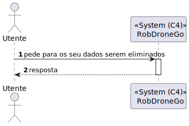
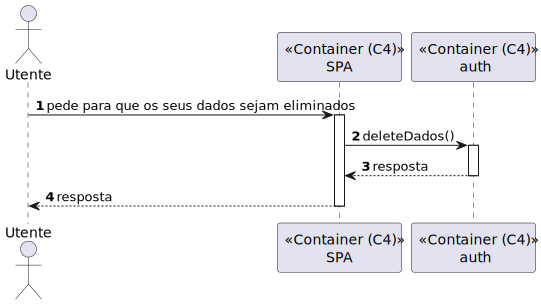
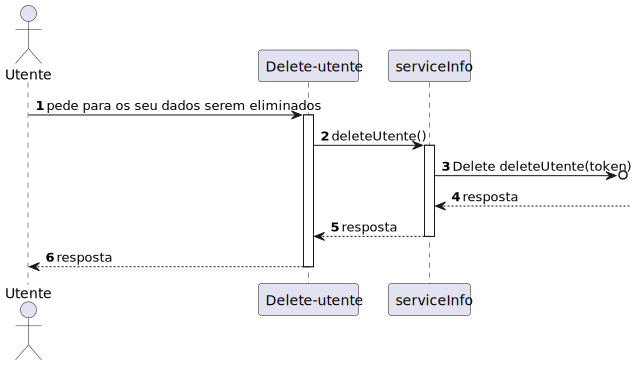

# US 120.1 - Como utente do sistema pretendo cancelar a minha conta garantindo que os meus dados são apagados - Frontend

## 1. Context

Como utente do sistema pretendo cancelar a minha conta garantindo que os meus dados são apagados

## 2. Requirements

**Main actor**

* utente do sistema

**Interested actors (and why)**

* utente do sistema - quer que os seus dados sejam eliminados          

**Post conditions**

*  utente deixa de estar registado no sistema e a sua informação é apagada 

**Main scenario**

1. O utente pede para os seu dados serem eliminados
2. Sistema diz se a operação foi um sucesso
 
 

## 3. Analysis

Nesta Us será necessario haver a interface grafica em SPA que possibilita a eliminação do utente e as informações relacionadas

## 4. Design

### 4.1. Nível 1

#### 4.1.1 Vista de processos

#### 4.1.2 Vista FÍsica

N/A (Não vai adicionar detalhes relevantes)

#### 4.1.3 Vista Lógica

#### 4.1.4 Vista de Implementação

N/A (Não vai adicionar detalhes relevantes)

#### 4.1.4 Vista de Cenarios

### 4.2 Nível 2

#### 4.2.1 Vista de processos

#### 4.2.2 Vista FÍsica

#### 4.2.3 Vista Lógica

#### 4.2.4 Vista de Implementação

### 4.3. Nível 3 

#### 4.3.1 Vista de processos

#### 4.3.2 Vista FÍsica

N/A (Não vai adicionar detalhes relevantes)

#### 4.3.3 Vista Lógica

#### 4.3.4 Vista de Implementação

## 5. Observations
N/A