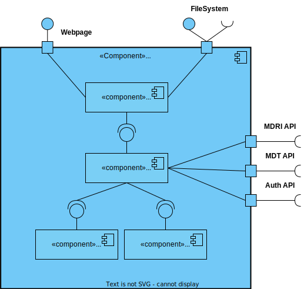
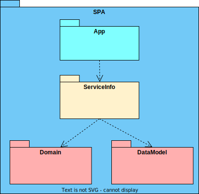

# US 1300.1 - Como utilizador, quero fazer login

## 1. Contexto
É a primeira vez que esta US foi atribuída.  
Esta US vai permitir a um utilizador dar login no sistema.

## 2. Requisitos

**Ator principal**
* Utilizador do Sistema (Utente, admin, gestores)

**Atores interessados (e porquê)**
* Utilizador do Sistema - pretende dar login para aceder às funcionalidades que lhe correspondem.

**Condições anteriores**
O utilizador deve estar registado no sistema

**Condições posteriores**
* Deve ser guardado um token válido para aquele utilizador caso o login seja válido

**Cenário principal**
1. O sistema recebe a informação de login
2. Sistema retorna o token para assinar os pedidos do utilizador

**Outros cenários**

**2.a.** O sistema verifica o login não é válido
1. Sistema notifica que este problema ocorreu
2. O UC termina.

**Requisitos especiais** 
N/A

## 3. Análise

Excerto do modelo de domínio relevante

**Esclarecimentos do cliente:**  
Não foi encontrado nenhum esclarecimento relevante

## 4. Design

### 4.1 Nível 1

#### 4.1.1 Vista Lógica

#### 4.1.2 Vista Processos

#### 4.1.3 Vista Física
N/A (não vai adicionar detalhes relevantes)
#### 4.1.4 Vista Implementação
N/A (não vai adicionar detalhes relevantes)
#### 4.1.5 Vista Cenários

### 4.2 Nível 2

#### 4.2.1 Vista Lógica

#### 4.2.2 Vista Processos

#### 4.2.3 Vista Física

#### 4.2.4 Vista Implementação

#### 4.2.5 Vista Cenários
N/A (não vai adicionar detalhes relevantes)

### 4.3 Nível 3

#### 4.3.1 Vista Lógica

#### 4.3.2 Vista Processos

#### 4.3.3 Vista Física
N/A (não vai adicionar detalhes relevantes)
#### 4.3.4 Vista Implementação

#### 4.3.5 Vista Cenários
N/A (não vai adicionar detalhes relevantes)

### 4.4. Testes

**Teste 1:** Para credenciais válidas, é recebido um token válido 
(...)

## 5. Observações
N/A