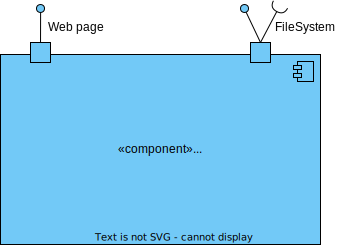
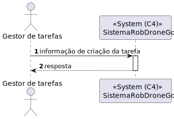
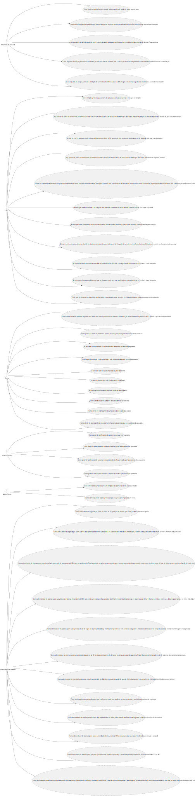
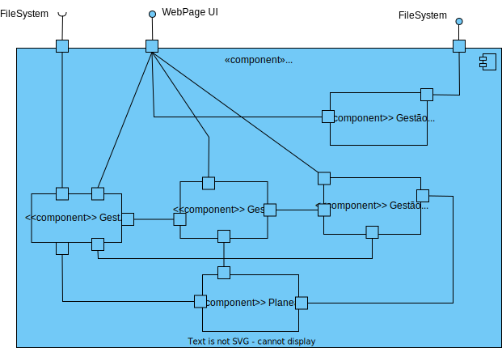
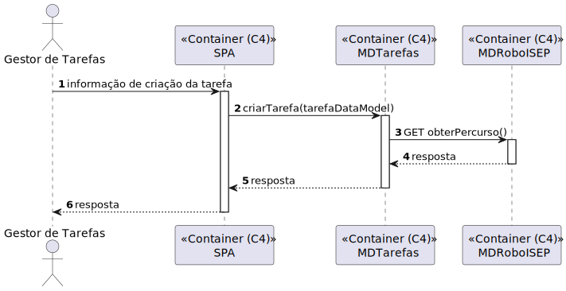
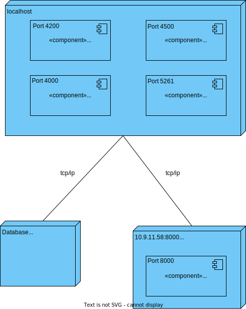
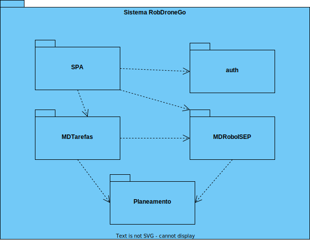
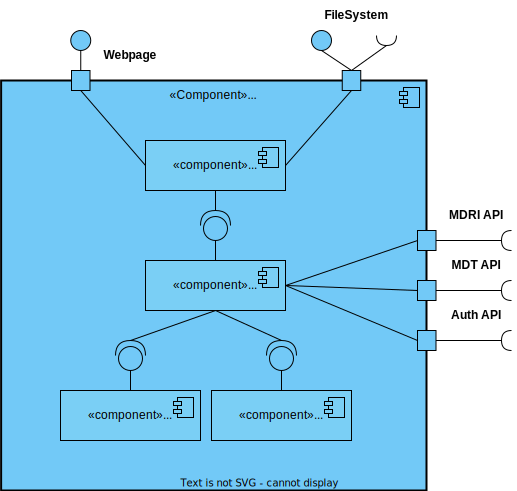
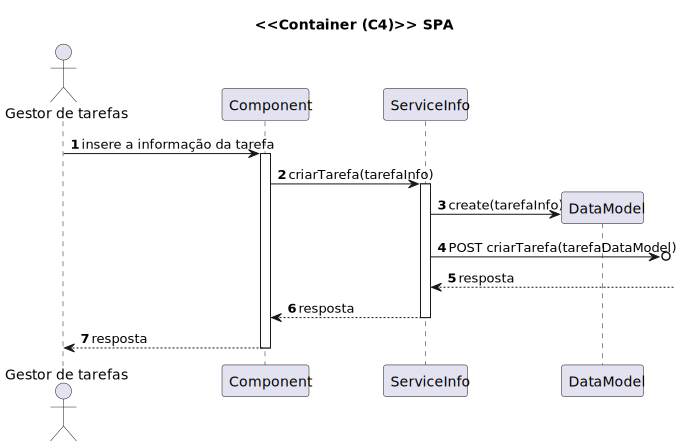
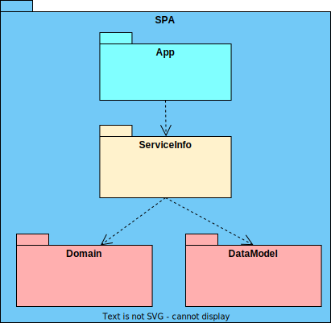

# US 460.1 - Como utente do sistema pretendo requisitar uma tarefa indicando os parâmetros necessários à sua execução, nomeadamente o ponto inicial e o término e qual a tarefa pretendida - Frontend

## 1. Contexto
É a primeira vez que esta US foi atribuída.  
Esta US vai permitir requisitar uma tarefa. Corresponde ao do frontend da [US460.2](../US_460.2/US_460.2.md).

## 2. Requisitos

**Ator principal**
* Utente

**Atores interessados (e porquê)**
* Utente - pretende requisitar uma tarefa
* Gestor de tarefas - pretende aprovar/recusar e listar tarefas

**Condições anteriores**
N/A

**Condições posteriores**
* A tarefa deve ser persistida no sistema

**Cenário principal**
1. O sistema recebe a informação necessária para criar uma tarefa
2. Sistema informa o sucesso da operação

**Outros cenários**

**2.a.** O sistema verifica um dos parâmetros não é válido
1. Sistema notifica que este problema ocorreu
2. O UC termina.

**Requisitos especiais** 
N/A

## 3. Análise

Excerto do modelo de domínio relevante

**Esclarecimentos do cliente:**  
Nenhum esclarecimento relevante foi encontrado

## 4. Design

### 4.1 Nível 1

#### 4.1.1 Vista Lógica

#### 4.1.2 Vista Processos

#### 4.1.3 Vista Física
N/A (não vai adicionar detalhes relevantes)
#### 4.1.4 Vista Implementação
N/A (não vai adicionar detalhes relevantes)
#### 4.1.5 Vista Cenários

### 4.2 Nível 2

#### 4.2.1 Vista Lógica

#### 4.2.2 Vista Processos

#### 4.2.3 Vista Física

#### 4.2.4 Vista Implementação

#### 4.2.5 Vista Cenários
N/A (não vai adicionar detalhes relevantes)

### 4.3 Nível 3

#### 4.3.1 Vista Lógica

#### 4.3.2 Vista Processos

#### 4.3.3 Vista Física
N/A (não vai adicionar detalhes relevantes)
#### 4.3.4 Vista Implementação

#### 4.3.5 Vista Cenários
N/A (não vai adicionar detalhes relevantes)

### 4.4. Testes

**Teste 1:** Verificar que o método criarTarefa faz um post para o MDT caso os parametros sejam válidos,
(...)

## 5. Observações
N/A