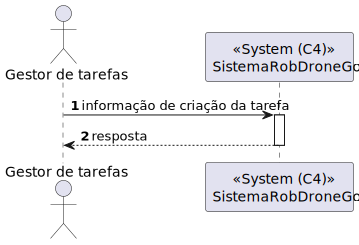
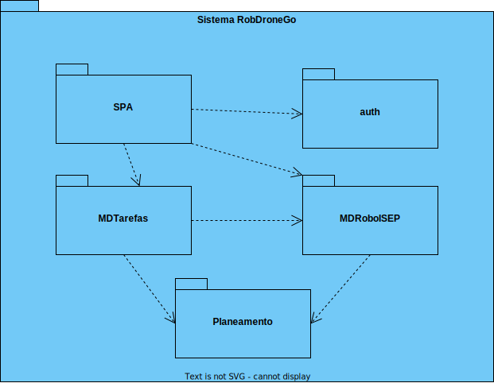

# US 460.2 - Como utente do sistema pretendo requisitar uma tarefa indicando os parâmetros necessários à sua execução, nomeadamente o ponto inicial e o término e qual a tarefa pretendida - Backend

## 1. Contexto
É a primeira vez que esta US foi atribuída.  
Esta US vai permitir requisitar uma tarefa.

## 2. Requisitos

**Ator principal**
* Utente

**Atores interessados (e porquê)**
* Utente - pretende requisitar uma tarefa
* Gestor de tarefas - pretende aprovar/recusar e listar tarefas

**Condições anteriores**
N/A

**Condições posteriores**
* A tarefa deve ser persistida no sistema

**Cenário principal**
1. O sistema recebe a informação necessária para criar uma tarefa
2. Sistema informa o sucesso da operação

**Outros cenários**

**2.a.** O sistema verifica um dos parâmetros não é válido
1. Sistema notifica que este problema ocorreu
2. O UC termina.

**Requisitos especiais** 
N/A

## 3. Análise

Excerto do modelo de domínio relevante

**Esclarecimentos do cliente:**  

> **Pergunta** 
> Bom dia, caro cliente. 
> Gostávamos de saber se a descrição de entrega deve ter algum limite de caracteres?  
> Com os melhores cumprimentos, 
> Grupo 50  
> **Resposta** 
> boa tarde, para a descrição devem limitar a 1000 caracteres alfanumericos  

> **Pergunta** 
> Boa tarde. 
> Relativamente ao 'Código de Confirmação', mencionado em https://moodle.isep.ipp.pt/mod/forum/discuss.php?d=25045#p31683, gostava de perceber se este código segue algum formato específico. Além disso, o código será introduzido pelo utilizador que está a requisitar a tarefa, ou deverá ser gerado automaticamente pelo sistema?
> (...)  
> **Resposta** 
> boa tarde,
> o código de confirmação é introduzido pelo requisitante. é um número entre 4 e 6 digitos

> **Pergunta** 
> Bom dia estimando cliente,  
> A minha dúvida é em relação às tarefas e às suas definições.  
> Existem diferentes tipos de tarefas, por isso, cada uma terá os seus atributos. No entanto, que atributos definem uma tarefa em geral? Apenas a sua designação? 
> Em relação às tarefas existentes (vigilância de um piso e transporte de um objeto) existem algum requerimento especial? Para além da especificação do piso na vigilância e especificação do objeto e local de recolha e entrega no caso do transporte. 
> Obrigado em avanço.  
> **Resposta**   
> Boa tarde,
> de momento todos os robots da frota apenas suportam estes dois tipos de tarefas. a existirem novos tipos de tarefas será necessáiro desenvolvimento especifico para tal. Em consequência não existem "tarefas em geral"  
> As tarefas de vigilância caracterizam-se por indicar qual o edificio e piso(s) que se pretende vigiar bem como o número de contacto em caso de incidente. tipicamente o segurança irá requisitar que um robot "dê uma volta pelos pisos X, Y e Z do edificio N". Caso o robot detete alguma situação anómala, o robot irá enviar um SMS para o contacto indicado 
> As tarefas de "piclup & delivery" caracterizam-se por indicar qual a sala que se pretende de pickup e qual a sala de delivery, bem como um nome e um contacto para pickup e outro para delivery. deve também ser indicado um código de confirmação que a pessoa que receberá deverá introduzir no painel do robot. adicionalmente deve ser indicada uma descrição da entrega, ex., "Marcadores de cor vermelha (1x) e azul (2x)" 

## 4. Design

### 4.1 Nível 1

#### 4.1.1 Vista Lógica

#### 4.1.2 Vista Processos

#### 4.1.3 Vista Física
N/A (não vai adicionar detalhes relevantes)
#### 4.1.4 Vista Implementação
N/A (não vai adicionar detalhes relevantes)
#### 4.1.5 Vista Cenários

### 4.2 Nível 2

#### 4.2.1 Vista Lógica

#### 4.2.2 Vista Processos

#### 4.2.3 Vista Física

#### 4.2.4 Vista Implementação

#### 4.2.5 Vista Cenários
N/A (não vai adicionar detalhes relevantes)

### 4.3 Nível 3

#### 4.3.1 Vista Lógica

#### 4.3.2 Vista Processos

#### 4.3.3 Vista Física
N/A (não vai adicionar detalhes relevantes)
#### 4.3.4 Vista Implementação

#### 4.3.5 Vista Cenários
N/A (não vai adicionar detalhes relevantes)

### 4.4. Testes

**Teste 1:** O código de confirmação tem de ter entre 4 a 6 dígitos 
**Teste 2:** A descrição tem de ter até 1000 carateres alfanuméricos (podem conter espaços) 
**Teste 3:** Nº de telefone deve ter 9 dígitos 
(...)

## 5. Observações
N/A