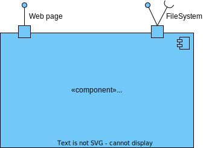
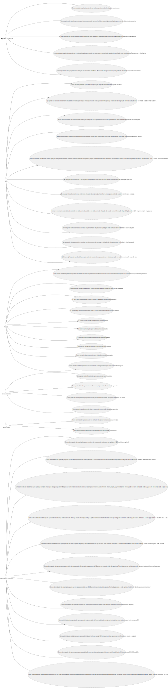

# US 480.2 - Como gestor de tarefas pretendo consultar as requisições de tarefas ainda não aprovadas [Backend]

## 1. Contexto
É a primeira vez que esta US foi atribuída.

Esta US vai permitir consultar as requisições de tarefas ainda não aprovadas.

## 2. Requisitos

**Ator principal**
* Gestor de tarefas

## 3. Análise

**Esclarecimentos do cliente:**
>**Aluno** 
Boa tarde,
 
Queríamos esclarecer as diferenças entre US470, US480 e US490. 
Na US480 é pedido para consultar as requisições de tarefas ainda não aprovadas 
Na US490 é pedido para pesquisar as requisições de tarefas por estado, por tipo de dispositivo, ou utente. 
A partir desta informação, podem haver diferentes interpretações. Uma das interpretações possíveis é que a listagem da US490 engloba a listagem que precisa de ser desenvolvida na US480, já que na tabela da US490 é possível filtrar os requisitos de tarefas por tarefas ainda não aprovadas. Essa filtragem daria a tabela que é pedida na US480.
 
Com base nesta resposta (https://moodle.isep.ipp.pt/mod/forum/discuss.php?d=26304#p33367) entendemos que irão haver duas tabelas. Uma exclusiva para aprovar ou reprovar tarefas que ainda não foram aprovadas, com os botões "aprovar" e "não aprovar" para cada tarefa, e outra apenas para listar e filtrar todas as tarefas e os vários conceitos relacionados.
 
Pedíamos que esclarecesse o número de tabelas que pretende que existam, as suas diferenças, e quais permitem a aprovação ou reprovação das tarefas.
 
Cumprimentos, 
G59
  
**Cliente** 
Bom dia 
Sao duas opções distintas. Uma apenas para aprovar ou ecusar as tarefas pendentes de decisão. 
A outra opção é para consulta de todas as tarefas do sistema, inclusive histórico.

## 4. Design
**Nível 1**

**Nível 2**

**Nível 3**

### 3.1.2. Vista de Processos

**Nível 1**

**Nível 2**

**Nível 3**

### 3.1.3 Vista de Implementação

**Nível 2**

**Nível 3**

### 3.1.4 Vista Física

**Nível 2**

### 3.1.5 Vista de Cenários
**Nível 1**

### 4.1. Testes

* Testes de Serviço e controller

## 5. Observações
N/A