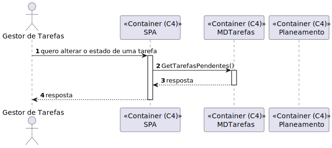

# 500.2 - Como gestor de tarefas pretendo obter a sequencia de execução das tarefas aprovadas - Frontend

## 1. Context

É a vez primeira que está a ser desenvolvida.
Como gestor de tarefas pretendo obter a sequencia de execução das tarefas aprovadas

## 2. Requirements

**Main actor**

* Gestor de tarefa

**Interested actors (and why)**

* Gestor de Tarefa         

**Post conditions**

* Obtenho a lista de execução das tarefas aprovadas e elas passam para planeadas 

**Main scenario**

1. Pede para ser apresentada a lista de execução de tarefas de acordo com um algoritmo
2. Sistema retorna lista das tarefas planeadas por ordem de execução
 

## 3. Analysis

**Esclarecimentos do cliente:**  

**Questão:**  

Boa tarde, 
Em relação a este requisito gostariamos de saber como é feita a atribuição do robot ao pedido de tarefa. É suposto ser o gestor de tarefas, quando for a aprovar a requisição é lhe pedido para associar o robot? 
Cumprimentos, 
G68

**Resposta:**  

bom dia, 
como já referido anteriormente o módulo de planeamento deverá ser o responsavel pela atribuição das tarefas aos diferentes robots e subsequente sequenciação das mesmas. 
O algoritmo genético que vos foi fornecido como exemplo efetua o sequenciamento de tarefas para um "executor". Para simplificação é aceite que seja atribuido um robot, de forma automatica, ex., round robin, ou de forma manual pelo gestor de tarefas, quando a requisição é aprovada. 
o caso de uso 500 " 
Como gestor de tarefas pretendo obter a sequencia de execução das tarefas aprovadas 
deve mostrar a sequencia de todas as tarefas aprovadas, por exemplo: 
robot A: [t1, t4, t6] 
robot B: [t2, t3] 
robot C: [t5, t7, t8] 

## 4. Design

### 4.1. Nível 1

#### 4.1.1 Vista de processos

#### 4.1.2 Vista FÍsica

N/A (Não vai adicionar detalhes relevantes)

#### 4.1.3 Vista Lógica

#### 4.1.4 Vista de Implementação

N/A (Não vai adicionar detalhes relevantes)

#### 4.1.4 Vista de Cenarios

### 4.2 Nível 2

#### 4.2.1 Vista de processos

#### 4.2.2 Vista FÍsica

#### 4.2.3 Vista Lógica

#### 4.2.4 Vista de Implementação

### 4.3. Nível 3 

#### 4.3.1 Vista de processos

#### 4.3.2 Vista FÍsica

N/A (Não vai adicionar detalhes relevantes)

#### 4.3.3 Vista Lógica

#### 4.3.4 Vista de Implementação

## 5. Observations
N/A